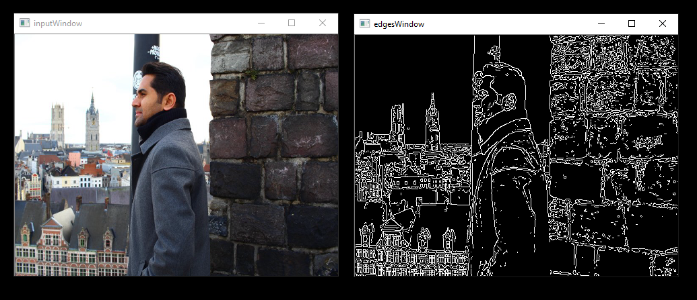

[](https://opensource.org/licenses/MIT)
[](https://travis-ci.org/GPUOpen-ProfessionalCompute-Libraries/MIVisionX)

# MIVisionX

MIVisionX toolkit is a comprehensive computer vision and machine intelligence libraries, utilities and applications bundled into a single toolkit.

* [AMD OpenVX](#amd-openvx)
* [AMD OpenVX Extensions](#amd-openvx-extensions)
  * [Loom 360 Video Stitch Library](amd_openvx_extensions/amd_loomsl#radeon-loom-stitching-library-vx_loomsl)
  * [Neural Net Library](amd_openvx_extensions/amd_nn#openvx-neural-network-extension-library-vx_nn)
  * [OpenCV Extension](amd_openvx_extensions/amd_opencv#amd-opencv-extension)
  * [WinML Extension](amd_openvx_extensions/amd_winml#amd-winml-extension)
* [Applications](#applications)
* [Neural Net Model Compiler & Optimizer](#neural-net-model-compiler--optimizer)
* [Samples](samples#samples)
* [Toolkit](#toolkit)
* [Utilities](#utilities)
  * [Inference Generator](utilities/inference_generator#inference-generator)
  * [Loom Shell](utilities/loom_shell#radeon-loomshell)
  * [RunCL](utilities/runcl#amd-runcl)
  * [RunVX](utilities/runvx#amd-runvx)
* [Prerequisites](#prerequisites)
* [Build & Install MIVisionX](#build--install-mivisionx)
* [Verify the Installation](#verify-the-installation)
* [Docker](#docker)
* [Release Notes](#release-notes)

## AMD OpenVX
AMD OpenVX ([amd_openvx](amd_openvx#amd-openvx-amd_openvx)) is a highly optimized open source implementation of the <a href="https://www.khronos.org/openvx/" target="_blank">Khronos OpenVX</a> computer vision specification. It allows for rapid prototyping as well as fast execution on a wide range of computer hardware, including small embedded x86 CPUs and large workstation discrete GPUs.

## AMD OpenVX Extensions
The OpenVX framework provides a mechanism to add new vision functions to OpenVX by 3rd party vendors. This project has below OpenVX [modules](amd_openvx_extensions#amd-openvx-extensions-amd_openvx_extensions) and utilities to extend [amd_openvx](amd_openvx#amd-openvx-amd_openvx) project, which contains the AMD OpenVX Core Engine.

* [amd_loomsl](amd_openvx_extensions/amd_loomsl#radeon-loom-stitching-library-vx_loomsl): AMD Radeon LOOM stitching library for live 360 degree video applications
* [amd_nn](amd_openvx_extensions/amd_nn#openvx-neural-network-extension-library-vx_nn): OpenVX neural network module
* [amd_opencv](amd_openvx_extensions/amd_opencv#amd-module-for-opencv-interop-from-openvx-vx_opencv): OpenVX module that implements a mechanism to access OpenCV functionality as OpenVX kernels
* [amd_winml](amd_openvx_extensions/amd_winml#amd-winml-extension): WinML extension will allow developers to import a pre-trained ONNX model into an OpenVX graph and add hundreds of different pre & post processing `vision`/`generic`/`user-defined` functions, available in OpenVX and OpenCV interop, to the input and output of the neural net model. This will allow developers to build an end to end application for inference.

## Applications
MIVisionX has a number of [applications](apps#applications) built on top of OpenVX modules, it uses AMD optimized libraries to build applications which can be used to prototype or used as models to develop a product.  

* [Cloud Inference Application](apps/cloud_inference#cloud-inference-application): This sample application does inference using a client-server system.
* [Digit Test](apps/DGtest#amd-dgtest): This sample application is used to recognize hand written digits.
* [MIVisionX OpenVX Classsification](apps#mivisionx-openvx-classsification): This sample application shows how to run supported pre-trained caffe models with MIVisionX RunTime.
* [MIVisionX WinML Classification](apps#mivisionx-winml-classification): This sample application shows how to run supported ONNX models with MIVisionX RunTime on Windows.
* [MIVisionX WinML YoloV2](apps#mivisionx-winml-yolov2): This sample application shows how to run tiny yolov2(20 classes) with MIVisionX RunTime on Windows.
* [External Applications](apps#external-application)

## Neural Net Model Compiler & Optimizer

<p align="center"></p>

Neural Net Model Compiler & Optimizer ([model_compiler](model_compiler#neural-net-model-compiler--optimizer)) converts pre-trained neural net models to MIVisionX runtime code for optimized inference.

## Toolkit

[MIVisionX Toolkit](toolkit#mivisionx-toolkit), is a comprehensive set of help tools for neural net creation, development, training and deployment. The Toolkit provides you with help tools to design, develop, quantize, prune, retrain, and infer your neural network work in any framework. The Toolkit is designed to help you deploy your work to any AMD or 3rd party hardware, from embedded to servers.

MIVisionX provides you with tools for accomplishing your tasks throughout the whole neural net life-cycle, from creating a model to deploying them for your target platforms.

## Utilities
* [inference_generator](utilities/inference_generator#inference-generator): generate inference library from pre-trained CAFFE models
* [loom_shell](utilities/loom_shell/README.md#radeon-loomsh): an interpreter to prototype 360 degree video stitching applications using a script
* [RunVX](utilities/runvx/README.md#amd-runvx): command-line utility to execute OpenVX graph described in GDF text file
* [RunCL](utilities/runcl/README.md#amd-runcl): command-line utility to build, execute, and debug OpenCL programs

## Prerequisites
* CPU: SSE4.1 or above CPU, 64-bit
* GPU: [GFX7 or above](https://rocm.github.io/hardware.html) [optional]
* APU: Carrizo or above [optional]

**Note:** Some modules in MIVisionX can be build for CPU only. To take advantage of advanced features and modules we recommend using AMD GPUs or AMD APUs.

### Windows
* Windows 10
* Windows SDK
* Visual Studio 2017
* Install the latest drivers and [OpenCL SDK](https://github.com/GPUOpen-LibrariesAndSDKs/OCL-SDK/releases/tag/1.0)
* [OpenCV 3.4](https://github.com/opencv/opencv/releases/tag/3.4.0)
  * Set `OpenCV_DIR` environment variable to `OpenCV/build` folder
  * Add `%OpenCV_DIR%\x64\vc14\bin` or `%OpenCV_DIR%\x64\vc15\bin` to your `PATH`

### Linux
* Install [ROCm](https://rocm.github.io/ROCmInstall.html) 
* ROCm CMake, MIOpenGEMM & MIOpen for Neural Net Extensions (vx_nn)
* CMake 2.8 or newer [download](http://cmake.org/download/)
* Qt Creator for [Cloud Inference Client](apps/cloud_inference/client_app/README.md)
* [Protobuf](https://github.com/google/protobuf) for inference generator & model compiler
  * install `libprotobuf-dev` and `protobuf-compiler` needed for vx_nn
* [OpenCV 3.4](https://github.com/opencv/opencv/releases/tag/3.4.0)
  * Set `OpenCV_DIR` environment variable to `OpenCV/build` folder
  
#### Prerequisites setup script for Linux - `MIVisionX-setup.py`

For convenience of the developer, we here provide the setup script which will install all the dependencies required by this project.

**MIVisionX-setup.py** builds all the prerequisites required by MIVisionX. The setup script creates a deps folder and installs all the prerequisites, this script only needs to be executed once. If directory option is not given, the script will install deps folder in the home directory(~/) by default, else in the user specified location.

##### Prerequisites for running the script
1. Ubuntu `16.04`/`18.04` or CentOS `7.5`/`7.6`
2. [ROCm supported hardware](https://rocm.github.io/hardware.html)
3. [ROCm](https://github.com/RadeonOpenCompute/ROCm#installing-from-amd-rocm-repositories)

**usage:**
````
python MIVisionX-setup.py --directory [setup directory - optional]
                          --installer [Package management tool - optional (default:apt-get) [options: Ubuntu:apt-get;CentOS:yum]]
                          --miopen    [MIOpen Version - optional (default:1.7.1)]      
````
**Note:** use `--installer yum` for CentOS

##### Refer to [Wiki](https://github.com/GPUOpen-ProfessionalCompute-Libraries/MIVisionX/wiki/Suggested-development-workflow) page for developer instructions.

## Build & Install MIVisionX

### Windows

#### Using .msi packages

* [MIVisionX-installer.msi](https://github.com/GPUOpen-ProfessionalCompute-Libraries/MIVisionX/releases): MIVisionX
* [MIVisionX_WinML-installer.msi](https://github.com/GPUOpen-ProfessionalCompute-Libraries/MIVisionX/releases): MIVisionX for WinML

#### Using `Visual Studio 2017` on 64-bit `Windows 10`
* Install [OpenCL SDK](https://github.com/GPUOpen-LibrariesAndSDKs/OCL-SDK/releases/tag/1.0)
* Install [OpenCV](https://github.com/opencv/opencv/releases/tag/3.4.0) with/without [contrib](https://github.com/opencv/opencv_contrib) to support camera capture, image display, & opencv extensions
  * Set `OpenCV_DIR` environment variable to `OpenCV/build` folder
  * Add `%OpenCV_DIR%\x64\vc14\bin` or `%OpenCV_DIR%\x64\vc15\bin` to your `PATH`
* Use `MIVisionX.sln` to build for x64 platform

**NOTE:** vx_nn is not supported on Windows in this release

### Linux

#### Using `apt-get`/`yum`

##### Prerequisites
1. Ubuntu `16.04`/`18.04` or CentOS `7.5`/`7.6`
2. [ROCm supported hardware](https://rocm.github.io/hardware.html)
3. [ROCm](https://github.com/RadeonOpenCompute/ROCm#installing-from-amd-rocm-repositories)

###### Ubuntu
````
sudo apt-get install mivisionx
````
###### CentOS
````
sudo yum install mivisionx
````
 **Note:**
  * vx_winml is not supported on linux
  * source code will not available with apt-get/yum install
  * executables placed in `/opt/rocm/mivisionx/bin` and libraries in `/opt/rocm/mivisionx/lib`
  * OpenVX and module header files into `/opt/rocm/mivisionx/include`
  * model compiler, toolkit, & samples placed in `/opt/rocm/mivisionx`

#### Using `MIVisionX-setup.py` and `CMake` on Linux (Ubuntu `16.04`/`18.04` or CentOS `7.5`/`7.6`) with ROCm
* Install [ROCm](https://rocm.github.io/ROCmInstall.html)
* Use the below commands to setup and build MIVisionX
````
git clone https://github.com/GPUOpen-ProfessionalCompute-Libraries/MIVisionX.git
cd MIVisionX
````
````
python MIVisionX-setup.py --directory [setup directory - optional]
                          --installer [Package management tool - optional (default:apt-get) [options: Ubuntu:apt-get;CentOS:yum]]
                          --miopen    [MIOpen Version - optional (default:1.7.1)]      
````
**Note:** Use `--installer yum` for CentOS
````
mkdir build
cd build
cmake ../
make -j8
sudo make install
````
  **Note:**
   * vx_winml is not supported on linux
   * the installer will copy all executables into `/opt/rocm/mivisionx/bin` and libraries into `/opt/rocm/mivisionx/lib`
   * the installer also copies all the OpenVX and module header files into `/opt/rocm/mivisionx/include` folder

#### Using `CMake` on Linux (Ubuntu `16.04`/`18.04` or CentOS `7.5`/`7.6`) with ROCm
* Install [ROCm](https://rocm.github.io/ROCmInstall.html)
* git clone, build and install other ROCm projects (using `cmake` and `% make install`) in the below order for vx_nn.
  * [rocm-cmake](https://github.com/RadeonOpenCompute/rocm-cmake)
  * [MIOpenGEMM](https://github.com/ROCmSoftwarePlatform/MIOpenGEMM)
  * [MIOpen](https://github.com/ROCmSoftwarePlatform/MIOpen) -- make sure to use `-DMIOPEN_BACKEND=OpenCL` option with cmake
* install [protobuf](https://github.com/protocolbuffers/protobuf/releases/tag/v3.5.2)
* install [OpenCV](https://github.com/opencv/opencv/releases/tag/3.3.0)
* build and install (using `cmake` and `% make install`)
  * executables will be placed in `bin` folder
  * libraries will be placed in `lib` folder
  * the installer will copy all executables into `/opt/rocm/mivisionx/bin` and libraries into `/opt/rocm/mivisionx/lib`
  * the installer also copies all the OpenVX and OpenVX module header files into `/opt/rocm/mivisionx/include` folder
* add the installed library path to LD_LIBRARY_PATH environment variable (default `/opt/rocm/mivisionx/lib`)
* add the installed executable path to PATH environment variable (default `/opt/rocm/mivisionx/bin`)

##### Build `annInferenceApp` using `Qt Creator`
* build [annInferenceApp.pro](apps/cloud_inference/client_app/annInferenceApp.pro) using Qt Creator
* or use [annInferenceApp.py](apps/cloud_inference/client_app/annInferenceApp.py) for simple tests

## Verify the Installation

### Linux
* The installer will copy all executables into `/opt/rocm/mivisionx/bin` and libraries into `/opt/rocm/mivisionx/lib`
* The installer also copies all the OpenVX and OpenVX module header files into `/opt/rocm/mivisionx/include` folder
* Apps, Samples, Documents, Model Compiler and Toolkit are placed into `/opt/rocm/mivisionx`
* Run samples to verify the installation
  * **Canny Edge Detection**
  
  <p align="center"></p>
  
  ````
  export PATH=$PATH:/opt/rocm/mivisionx/bin
  export LD_LIBRARY_PATH=$LD_LIBRARY_PATH:/opt/rocm/mivisionx/lib
  runvx /opt/rocm/mivisionx/samples/gdf/canny.gdf 
  ````
**Note:** More samples are available [here](samples#samples)
       
## Docker

MIVisionX provides developers with docker images for Ubuntu 16.04, Ubuntu 18.04, CentOS 7.5, & CentOS 7.6. Using docker images developers can quickly prototype and build applications without having to be locked into a single system setup or lose valuable time figuring out the dependencies of the underlying software.

### MIVisionX Docker
* [Ubuntu 16.04](https://hub.docker.com/r/mivisionx/ubuntu-16.04)
* [Ubuntu 18.04](https://hub.docker.com/r/mivisionx/ubuntu-18.04)
* [CentOS 7.5](https://hub.docker.com/r/mivisionx/centos-7.5)
* [CentOS 7.6](https://hub.docker.com/r/mivisionx/centos-7.6)

### Docker Workflow Sample on Ubuntu 16.04

#### Prerequisites
* Ubuntu `16.04`
* [rocm supported hardware](https://rocm.github.io/hardware.html)

#### Workflow
* Step 1 - *Install rocm-dkms*
````
sudo apt update
sudo apt dist-upgrade
sudo apt install libnuma-dev
sudo reboot
````
````
wget -qO - http://repo.radeon.com/rocm/apt/debian/rocm.gpg.key | sudo apt-key add -
echo 'deb [arch=amd64] http://repo.radeon.com/rocm/apt/debian/ xenial main' | sudo tee /etc/apt/sources.list.d/rocm.list
sudo apt update
sudo apt install rocm-dkms
sudo reboot
````

* Step 2 - *Setup Docker*
````
sudo apt-get install curl
sudo curl -fsSL https://download.docker.com/linux/ubuntu/gpg | sudo apt-key add -
sudo add-apt-repository "deb [arch=amd64] https://download.docker.com/linux/ubuntu $(lsb_release -cs) stable"
sudo apt-get update
apt-cache policy docker-ce
sudo apt-get install -y docker-ce
sudo systemctl status docker
````

* Step 3 - *Get Docker Image*
````
sudo docker pull mivisionx/ubuntu-16.04
````

* Step 4 - *Run the docker image*
````
sudo docker run -it --device=/dev/kfd --device=/dev/dri --cap-add=SYS_RAWIO --device=/dev/mem --group-add video --network host mivisionx/ubuntu-16.04
````
  * Optional: Map localhost directory on the docker image
    * option to map the localhost directory with trained caffe models to be accessed on the docker image.
    * usage: -v {LOCAL_HOST_DIRECTORY_PATH}:{DOCKER_DIRECTORY_PATH} 
````
sudo docker run -it -v /home/:/root/hostDrive/ --device=/dev/kfd --device=/dev/dri --cap-add=SYS_RAWIO --device=/dev/mem --group-add video --network host mivisionx/ubuntu-16.04
````

## Release Notes

### Known issues
* Package (.deb & .rpm) install requires OpenCV v3.4.0 to execute AMD OpenCV extensions

### Tested configurations
* Windows 10
* Linux: Ubuntu - `16.04`/`18.04` & CentOS - `7.5`/`7.6`
* ROCm: rocm-dkms - `2.2.31`
* rocm-cmake - [github master:ac45c6e](https://github.com/RadeonOpenCompute/rocm-cmake/tree/master)
* MIOpenGEMM - [1.1.5](https://github.com/ROCmSoftwarePlatform/MIOpenGEMM/releases/tag/1.1.5)
* MIOpen - [1.7.1](https://github.com/ROCmSoftwarePlatform/MIOpen/releases/tag/1.7.1)
* Protobuf - [V3.5.2](https://github.com/protocolbuffers/protobuf/releases/tag/v3.5.2)
* OpenCV - [3.4.0](https://github.com/opencv/opencv/releases/tag/3.4.0)
* Dependencies for all the above packages
