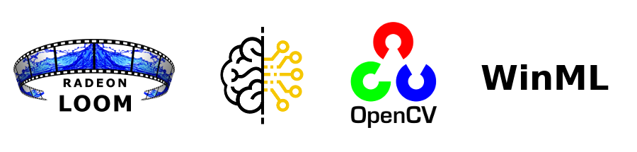
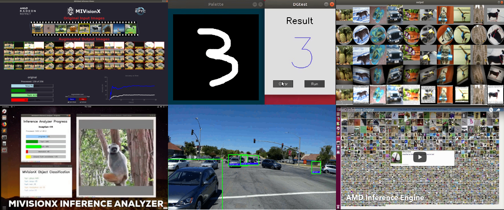

[](https://opensource.org/licenses/MIT)
[](https://gpuopen-professionalcompute-libraries.github.io/MIVisionX/)
[](https://travis-ci.com/GPUOpen-ProfessionalCompute-Libraries/MIVisionX)

<p align="center"></p>

MIVisionX toolkit is a set of comprehensive computer vision and machine intelligence libraries, utilities, and applications bundled into a single toolkit. AMD MIVisionX delivers highly optimized conformant open-source implementation of the <a href="https://www.khronos.org/openvx/" target="_blank">Khronos OpenVX&trade;</a> and OpenVX&trade; Extensions along with Convolution Neural Net Model Compiler & Optimizer supporting <a href="https://onnx.ai/" target="_blank">ONNX</a>, and <a href="https://www.khronos.org/nnef" target="_blank">Khronos NNEF&trade;</a> exchange formats. The toolkit allows for rapid prototyping and deployment of optimized computer vision and machine learning inference workloads on a wide range of computer hardware, including small embedded x86 CPUs, APUs, discrete GPUs, and heterogeneous servers.

#### Latest Release

[](https://github.com/GPUOpen-ProfessionalCompute-Libraries/MIVisionX/releases)

## Table of Contents
- [Table of Contents](#table-of-contents)
- [AMD OpenVX&trade;](#amd-openvx)
- [AMD OpenVX&trade; Extensions](#amd-openvx-extensions)
- [Applications](#applications)
- [Neural Net Model Compiler & Optimizer](#neural-net-model-compiler--optimizer)
- [rocAL](#rocal)
- [Toolkit](#toolkit)
- [Utilities](#utilities)
- [Prerequisites](#prerequisites)
  - [Hardware](#hardware)
  - [Operating System](#operating-system)
    - [Windows](#windows)
    - [macOS](#macos)
    - [Linux](#linux)
      - [Prerequisites setup script for Linux - `MIVisionX-setup.py`](#prerequisites-setup-script-for-linux---mivisionx-setuppy)
        - [Prerequisites for running the script](#prerequisites-for-running-the-script)
- [Build & Install MIVisionX](#build--install-mivisionx)
  - [Windows](#windows-1)
    - [Using .msi packages](#using-msi-packages)
    - [Using `Visual Studio`](#using-visual-studio)
  - [macOS](#macos-1)
  - [Linux](#linux-1)
    - [Using `apt-get` / `yum`](#using-apt-get--yum)
    - [Using `MIVisionX-setup.py`](#using-mivisionx-setuppy)
- [Verify the Installation](#verify-the-installation)
  - [Linux / macOS](#linux--macos)
  - [Windows](#windows-2)
- [Docker](#docker)
  - [MIVisionX Docker](#mivisionx-docker)
  - [Docker Workflow Sample on Ubuntu `20.04`](#docker-workflow-sample-on-ubuntu-2004)
    - [Prerequisites](#prerequisites-1)
    - [Workflow](#workflow)
- [Technical Support](#technical-support)
- [Release Notes](#release-notes)
  - [Latest Release](#latest-release-1)
  - [Changelog](#changelog)
  - [Tested configurations](#tested-configurations)
  - [Known issues](#known-issues)
- [MIVisionX Dependency Map](#mivisionx-dependency-map)

## AMD OpenVX&trade;

<p align="center"></p>

[AMD OpenVX&trade;](amd_openvx#amd-openvx-amd_openvx) is a highly optimized conformant open source implementation of the <a href="https://www.khronos.org/registry/OpenVX/specs/1.3/html/OpenVX_Specification_1_3.html" target="_blank">Khronos OpenVX&trade; 1.3</a> computer vision specification. It allows for rapid prototyping as well as fast execution on a wide range of computer hardware, including small embedded x86 CPUs and large workstation discrete GPUs.

<a href="https://www.khronos.org/registry/OpenVX/specs/1.0.1/html/index.html" target="_blank">Khronos OpenVX&trade; 1.0.1</a> conformant implementation is available in [MIVisionX Lite](https://github.com/GPUOpen-ProfessionalCompute-Libraries/MIVisionX/tree/openvx-1.0.1)

## AMD OpenVX&trade; Extensions

The OpenVX framework provides a mechanism to add new vision functionality to OpenVX by vendors. This project has below mentioned OpenVX [modules](amd_openvx_extensions#amd-openvx-extensions-amd_openvx_extensions) and utilities to extend [amd_openvx](amd_openvx#amd-openvx-amd_openvx), which contains the AMD OpenVX&trade; Core Engine.

<p align="center"></p>

* [amd_loomsl](amd_openvx_extensions/amd_loomsl): AMD Radeon Loom stitching library for live 360 degree video applications
* [amd_media](amd_openvx_extensions/amd_media): `vx_amd_media` is an OpenVX AMD media extension module for encode and decode
* [amd_migraphx](amd_openvx_extensions/amd_migraphx): amd_migraphx extension integrates the <a href="https://github.com/ROCmSoftwarePlatform/AMDMIGraphX#amd-migraphx" target="_blank"> AMD's MIGraphx </a> into an OpenVX graph. This extension allows developers to combine the vision funcions in OpenVX with the MIGraphX and build an end-to-end application for inference.
* [amd_nn](amd_openvx_extensions/amd_nn#openvx-neural-network-extension-library-vx_nn): OpenVX neural network module
* [amd_opencv](amd_openvx_extensions/amd_opencv#amd-module-for-opencv-interop-from-openvx-vx_opencv): OpenVX module that implements a mechanism to access OpenCV functionality as OpenVX kernels
* [amd_rpp](amd_openvx_extensions/amd_rpp): OpenVX extension providing an interface to some of the [RPP](https://github.com/GPUOpen-ProfessionalCompute-Libraries/rpp)'s (Radeon Performance Primitives) functions. This extension is used to enable [rocAL](rocAL/README.md) to perform image augmentation.
* [amd_winml](amd_openvx_extensions/amd_winml#amd-winml-extension): WinML extension will allow developers to import a pre-trained ONNX model into an OpenVX graph and add hundreds of different pre & post processing `vision` / `generic` / `user-defined` functions, available in OpenVX and OpenCV interop, to the input and output of the neural net model. This will allow developers to build an end to end application for inference.

## Applications

MIVisionX has several [applications](apps#applications) built on top of OpenVX modules, it uses AMD optimized libraries to build applications that can be used to prototype or use as a model to develop products.

<p align="center"></p>

* [Bubble Pop](apps/bubble_pop#vx-bubble-pop-sample): This sample application creates bubbles and donuts to pop using OpenVX & OpenCV functionality.
* [Cloud Inference Application](apps/cloud_inference#cloud-inference-application): This sample application does inference using a client-server system.
* [Digit Test](apps/dg_test#amd-dgtest): This sample application is used to recognize hand written digits.
* [Image Augmentation](apps/image_augmentation#image-augmentation-application): This sample application demonstrates the basic usage of rocAL's C API to load JPEG images from the disk and modify them in different possible ways and displays the output images.
* [MIVisionX Inference Analyzer](apps/mivisionx_inference_analyzer#mivisionx-python-inference-analyzer): This sample application uses pre-trained `ONNX` / `NNEF` / `Caffe` models to analyze and summarize images.
* [MIVisionX OpenVX Classsification](apps#mivisionx-openvx-classsification): This sample application shows how to run supported pre-trained caffe models with MIVisionX RunTime.
* [MIVisionX Validation Tool](apps/mivisionx_validation_tool#mivisionx-python-ml-model-validation-tool): This sample application uses pre-trained `ONNX` / `NNEF` / `Caffe` models to analyze, summarize and validate models.
* [MIVisionX WinML Classification](apps#mivisionx-winml-classification): This sample application shows how to run supported ONNX models with MIVisionX RunTime on Windows.
* [MIVisionX WinML YoloV2](apps#mivisionx-winml-yolov2): This sample application shows how to run tiny yolov2(20 classes) with MIVisionX RunTime on Windows.
* [Optical Flow](apps/optical_flow#openvx-samples): This sample application creates an OpenVX graph to run Optical Flow on a video/live.
* [External Applications](apps#external-application)

## Neural Net Model Compiler & Optimizer

<p align="center"></p>

[Neural Net Model Compiler & Optimizer](model_compiler#neural-net-model-compiler--optimizer) converts pre-trained neural net models to MIVisionX runtime code for optimized inference.

## rocAL

The ROCm Augmentation Library - [rocAL](rocAL/README.md) is designed to efficiently decode and process images and videos from a variety of storage formats and modify them through a processing graph programmable by the user.

## Toolkit

[MIVisionX Toolkit](toolkit), is a comprehensive set of helpful tools for neural net creation, development, training, and deployment. The Toolkit provides you with helpful tools to design, develop, quantize, prune, retrain, and infer your neural network work in any framework. The Toolkit is designed to help you deploy your work to any AMD or 3rd party hardware, from embedded to servers.

MIVisionX provides you with tools for accomplishing your tasks throughout the whole neural net life-cycle, from creating a model to deploying them for your target platforms.

## Utilities

* [inference_generator](utilities/inference_generator#inference-generator): generate inference library from pre-trained CAFFE models
* [loom_shell](utilities/loom_shell/README.md#radeon-loomsh): an interpreter to prototype 360 degree video stitching applications using a script
* [RunVX](utilities/runvx/README.md#amd-runvx): command-line utility to execute OpenVX graph described in GDF text file
* [RunCL](utilities/runcl/README.md#amd-runcl): command-line utility to build, execute, and debug OpenCL programs

## Prerequisites

### Hardware

* **CPU**: [AMD64](https://docs.amd.com/bundle/Hardware_and_Software_Reference_Guide/page/Hardware_and_Software_Support.html)
* **GPU**: [AMD Radeon&trade; Graphics](https://docs.amd.com/bundle/Hardware_and_Software_Reference_Guide/page/Hardware_and_Software_Support.html) [optional]
* **APU**: [AMD Radeon&trade; `Mobile`/`Embedded`](https://docs.amd.com/bundle/Hardware_and_Software_Reference_Guide/page/Hardware_and_Software_Support.html) [optional]

  **Note:** Some modules in MIVisionX can be built for `CPU ONLY`. To take advantage of `Advanced Features And Modules` we recommend using `AMD GPUs` or `AMD APUs`.

### Operating System

#### Windows

* Windows `10` / `11`
* Windows SDK
* Visual Studio 2019 or later
* Install the latest AMD [drivers](https://www.amd.com/en/support)
* Install [OpenCL SDK](https://github.com/GPUOpen-LibrariesAndSDKs/OCL-SDK/releases/tag/1.0)
* Install [OpenCV 4.5.5](https://github.com/opencv/opencv/releases/tag/4.5.5)
  + Set `OpenCV_DIR` environment variable to `OpenCV/build` folder
  + Add `%OpenCV_DIR%\x64\vc14\bin` or `%OpenCV_DIR%\x64\vc15\bin` to your `PATH`

#### macOS

* Install [Homebrew](https://brew.sh)
* Install [CMake](https://cmake.org)
* Install OpenCV `3`/`4`

  **Note:** macOS [build instructions](https://github.com/GPUOpen-ProfessionalCompute-Libraries/MIVisionX/wiki/macOS#macos-build-instructions)

#### Linux

* Linux distribution
  + **Ubuntu** - `20.04` / `22.04`
  + **CentOS** - `7` / `8`
* Install [ROCm](https://docs.amd.com)
* CMake 3.0 or later
* ROCm CMake, MIOpenGEMM & MIOpen for `Neural Net Extensions` ([vx_nn](amd_openvx_extensions/amd_nn#openvx-neural-network-extension-library-vx_nn))
* Qt Creator for [Cloud Inference Client](apps/cloud_inference/client_app/README.md)
* [Protobuf](https://github.com/google/protobuf) for inference generator & model compiler
  + install `libprotobuf-dev` and `protobuf-compiler` needed for vx_nn
* [OpenCV 4.5.5](https://github.com/opencv/opencv/releases/tag/4.5.5)
  + Set `OpenCV_DIR` environment variable to `OpenCV/build` folder
* [FFMPEG n4.4.2](https://github.com/FFmpeg/FFmpeg/releases/tag/n4.4.2)
  + FFMPEG is required for amd_media & mv_deploy modules
* [rocAL](rocAL#prerequisites) Prerequisites

##### Prerequisites setup script for Linux - `MIVisionX-setup.py`

For the convenience of the developer, we here provide the setup script which will install all the dependencies required by this project.

  **NOTE:** This script only needs to be executed once.

###### Prerequisites for running the script

* Linux distribution
  + Ubuntu - `20.04` / `22.04`
  + CentOS - `7` / `8`
* [ROCm supported hardware](https://docs.amd.com)
* [ROCm](https://docs.amd.com)

  **usage:**

  ```
  python MIVisionX-setup.py --directory [setup directory - optional (default:~/)]
                            --opencv    [OpenCV Version - optional (default:4.5.5)]
                            --protobuf  [ProtoBuf Version - optional (default:3.12.4)]
                            --rpp       [RPP Version - optional (default:0.98)]
                            --ffmpeg    [FFMPEG V4.4.2 Installation - optional (default:no) [options:yes/no]]
                            --rocal     [MIVisionX rocAL Dependency Install - optional (default:yes) [options:yes/no]]
                            --neural_net[MIVisionX Neural Net Dependency Install - optional (default:yes) [options:yes/no]]
                            --reinstall [Remove previous setup and reinstall (default:no)[options:yes/no]]
                            --backend   [MIVisionX Dependency Backend - optional (default:HIP) [options:OCL/HIP]]
                            --rocm_path [ROCm Installation Path - optional (default:/opt/rocm) - ROCm Installation Required]
  ```
    **Note:**
    * **ROCm upgrade** with `sudo apt upgrade` requires the setup script **rerun**.
    * use `X Window` / `X11` for [remote GUI app control](https://github.com/GPUOpen-ProfessionalCompute-Libraries/MIVisionX/wiki/X-Window-forwarding)

## Build & Install MIVisionX

### Windows

#### Using .msi packages

* [MIVisionX-installer.msi](https://github.com/GPUOpen-ProfessionalCompute-Libraries/MIVisionX/releases): MIVisionX
* [MIVisionX_WinML-installer.msi](https://github.com/GPUOpen-ProfessionalCompute-Libraries/MIVisionX/releases): MIVisionX for WinML

#### Using `Visual Studio`

* Install [Windows Prerequisites](#windows)
* Use `MIVisionX.sln` to build for x64 platform

  **NOTE:** `vx_nn` is not supported on `Windows` in this release

### macOS

macOS [build instructions](https://github.com/GPUOpen-ProfessionalCompute-Libraries/MIVisionX/wiki/macOS#macos-build-instructions)

### Linux

#### Using `apt-get` / `yum`

* [ROCm supported hardware](https://docs.amd.com)
* Install [ROCm](https://docs.amd.com)
* On `Ubuntu`
  ```
  sudo apt-get install mivisionx
  ```
* On `CentOS`
  ```
  sudo yum install mivisionx
  ```

  **Note:**
  * `vx_winml` is not supported on `Linux`
  * source code will not available with `apt-get` / `yum` install
  * the installer will copy
    + Executables into `/opt/rocm/bin`
    + Libraries into `/opt/rocm/lib`
    + OpenVX and module header files into `/opt/rocm/include/mivisionx`
    + Model compiler, & toolkit folders into `/opt/rocm/libexec/mivisionx`
    + Apps, & samples folder into `/opt/rocm/share/mivisionx`
    + Docs folder into `/opt/rocm/share/doc/mivisionx`
  * Package (.deb & .rpm) install requires `OpenCV v3+` to execute `AMD OpenCV extensions`

#### Using `MIVisionX-setup.py`

* Install [ROCm](https://rocmdocs.amd.com/en/latest/Installation_Guide/Installation-Guide.html)
* Use the below commands to set up and build MIVisionX

  ```
  git clone https://github.com/GPUOpen-ProfessionalCompute-Libraries/MIVisionX.git
  cd MIVisionX
  ```

  **Note:** MIVisionX has support for two GPU backends: **OPENCL** and **HIP**:

  + Instructions for building MIVisionX with the **HIP** GPU backend (i.e., default GPU backend):

    + run the setup script to install all the dependencies required by the **HIP** GPU backend:
    ```
    python MIVisionX-setup.py
    ```

    + run the below commands to build MIVisionX with the **HIP** GPU backend:
    ```
    mkdir build-hip
    cd build-hip
    cmake ../
    make -j8
    sudo make install
    ```

  + Instructions for building MIVisionX with **OPENCL** GPU backend:

    + run the setup script to install all the dependencies required by the **OPENCL** GPU backend:
    ```
    python MIVisionX-setup.py --reinstall yes --backend OCL
    ```

    + run the below commands to build MIVisionX with the **OPENCL** GPU backend:
    ```
    mkdir build-ocl
    cd build-ocl
    cmake -DBACKEND=OPENCL ../
    make -j8
    sudo make install
    ```

  **Note:**
  + MIVisionX cannot be installed for both GPU backends in the same default folder (i.e., /opt/rocm/)
  if an app interested in installing MIVisionX with both GPU backends, then add **-DCMAKE_INSTALL_PREFIX** in the cmake
  commands to install MIVisionX with OPENCL and HIP backends into two separate custom folders.
  + vx_winml is not supported on Linux

## Verify the Installation

### Linux / macOS

* The installer will copy
  + Executables into `/opt/rocm/bin`
  + Libraries into `/opt/rocm/lib`
  + OpenVX and OpenVX module header files into `/opt/rocm/include/mivisionx`
  + Apps, & Samples folder into `/opt/rocm/share/mivisionx`
  + Documents folder into `/opt/rocm/share/doc/mivisionx`
  + Model Compiler, and Toolkit folder into `/opt/rocm/libexec/mivisionx`
* Run the below sample to verify the installation

  **Canny Edge Detection**

  <p align="center"></p>

  ```
  export PATH=$PATH:/opt/rocm/bin
  export LD_LIBRARY_PATH=$LD_LIBRARY_PATH:/opt/rocm/lib
  runvx /opt/rocm/share/mivisionx/samples/gdf/canny.gdf
  ```
  **Note:** More samples are available [here](samples#samples)

  **Note:** For `macOS` use `export DYLD_LIBRARY_PATH=$DYLD_LIBRARY_PATH:/opt/rocm/lib`

### Windows

* MIVisionX.sln builds the libraries & executables in the folder `MIVisionX/x64`
* Use RunVX to test the build

  ```
  ./runvx.exe PATH_TO/MIVisionX/samples/gdf/skintonedetect.gdf
  ```

## Docker

MIVisionX provides developers with docker images for **Ubuntu** `20.04` and **CentOS** `7` / `8`. Using docker images developers can quickly prototype and build applications without having to be locked into a single system setup or lose valuable time figuring out the dependencies of the underlying software.

Docker files to build MIVisionX containers are [available](docker#mivisionx-docker)

### MIVisionX Docker

* [Ubuntu 20.04](https://hub.docker.com/r/mivisionx/ubuntu-20.04)
* [CentOS 7](https://hub.docker.com/r/mivisionx/centos-7)
* [CentOS 8](https://hub.docker.com/r/mivisionx/centos-8)

### Docker Workflow Sample on Ubuntu `20.04`

#### Prerequisites

* Ubuntu `20.04`/`22.04`
* [rocm supported hardware](https://docs.amd.com)

#### Workflow

* Step 1 - *Install rocm-dkms*

```
sudo apt update -y
sudo apt dist-upgrade -y
sudo apt install libnuma-dev wget
sudo reboot
```

```
wget https://repo.radeon.com/amdgpu-install/21.50/ubuntu/focal/amdgpu-install_21.50.50000-1_all.deb
sudo apt-get install -y ./amdgpu-install_21.50.50000-1_all.deb
sudo apt-get update -y
sudo amdgpu-install -y --usecase=rocm
sudo reboot
```

* Step 2 - *Setup Docker*

```
sudo apt-get install curl
sudo curl -fsSL https://download.docker.com/linux/ubuntu/gpg | sudo apt-key add -
sudo add-apt-repository "deb [arch=amd64] https://download.docker.com/linux/ubuntu $(lsb_release -cs) stable"
sudo apt-get update
apt-cache policy docker-ce
sudo apt-get install -y docker-ce
sudo systemctl status docker
```

* Step 3 - *Get Docker Image*

```
sudo docker pull mivisionx/ubuntu-20.04
```

* Step 4 - *Run the docker image*

```
sudo docker run -it --device=/dev/kfd --device=/dev/dri --cap-add=SYS_RAWIO --device=/dev/mem --group-add video --network host mivisionx/ubuntu-20.04:latest
```
  **Note:**
  * Map host directory on the docker image

    + map the localhost directory to be accessed on the docker image.
    + use `-v` option with docker run command: `-v {LOCAL_HOST_DIRECTORY_PATH}:{DOCKER_DIRECTORY_PATH}`
    + usage:
    ```
    sudo docker run -it -v /home/:/root/hostDrive/ --device=/dev/kfd --device=/dev/dri --cap-add=SYS_RAWIO --device=/dev/mem --group-add video --network host mivisionx/ubuntu-20.04:latest
    ```

  * Display option with docker
    + Using host display
    ```
    xhost +local:root
    sudo docker run -it --device=/dev/kfd --device=/dev/dri --cap-add=SYS_RAWIO --device=/dev/mem --group-add video --network host --env DISPLAY=unix$DISPLAY --privileged --volume $XAUTH:/root/.Xauthority --volume /tmp/.X11-unix/:/tmp/.X11-unix mivisionx/ubuntu-20.04:latest
    ```

    + Test display with MIVisionX sample
    ```
    export PATH=$PATH:/opt/rocm/bin
    export LD_LIBRARY_PATH=$LD_LIBRARY_PATH:/opt/rocm/lib
    runvx /opt/rocm/share/mivisionx/samples/gdf/canny.gdf
    ```

## Technical Support

Please email `mivisionx.support@amd.com` for questions, and feedback on MIVisionX.

Please submit your feature requests, and bug reports on the [GitHub issues](https://github.com/GPUOpen-ProfessionalCompute-Libraries/MIVisionX/issues) page.

## Release Notes

### Latest Release

[](https://github.com/GPUOpen-ProfessionalCompute-Libraries/MIVisionX/releases)

### Changelog

Review all notable [changes](CHANGELOG.md#changelog) with the latest release

### Tested configurations

* Windows `10` / `11`
* Linux distribution
  + Ubuntu - `20.04` / `22.04`
  + CentOS - `7` / `8`
  + SLES - `15-SP2`
* ROCm: rocm-core - `5.3.0.50300-63`
* miopen-hip - `2.18.0.50300-63`
* miopen-opencl - `2.18.0.50300-63`
* migraphx - `2.3.0.50300-63`
* Protobuf - [V3.12.4](https://github.com/protocolbuffers/protobuf/releases/tag/v3.12.4)
* OpenCV - [4.5.5](https://github.com/opencv/opencv/releases/tag/4.5.5)
* RPP - [0.98](https://github.com/GPUOpen-ProfessionalCompute-Libraries/rpp/releases/tag/0.98)
* FFMPEG - [n4.4.2](https://github.com/FFmpeg/FFmpeg/releases/tag/n4.4.2)
* Dependencies for all the above packages
* MIVisionX Setup Script - `V2.3.9`

### Known issues

* Package install requires **OpenCV** `V-4.5.X` to execute `AMD OpenCV extensions`

## MIVisionX Dependency Map

**Docker Image:** `sudo docker build -f docker/ubuntu20/{DOCKER_LEVEL_FILE_NAME}.dockerfile -t {mivisionx-level-NUMBER} .`

-  `new component added to the level`
-  `existing component from the previous level`

| Build Level | MIVisionX Dependencies                             | Modules                                                                   | Libraries and Executables                                                                                                                                                                                                                                                                                                                                                                                                                                                                                                                                                                                                                                                                                                                                                                                                                                                                                                                                                                                                                                                                                                                                                                                                                                                                        | Docker Tag                                                                                                                                                                                                     |
| ----------- | -------------------------------------------------- | ------------------------------------------------------------------------- | ------------------------------------------------------------------------------------------------------------------------------------------------------------------------------------------------------------------------------------------------------------------------------------------------------------------------------------------------------------------------------------------------------------------------------------------------------------------------------------------------------------------------------------------------------------------------------------------------------------------------------------------------------------------------------------------------------------------------------------------------------------------------------------------------------------------------------------------------------------------------------------------------------------------------------------------------------------------------------------------------------------------------------------------------------------------------------------------------------------------------------------------------------------------------------------------------------------------------------------------------------------------------------------------------ | -------------------------------------------------------------------------------------------------------------------------------------------------------------------------------------------------------------- |
| `Level_1`   | cmake <br> gcc <br> g++                            | amd_openvx  <br> utilities                                                |  `libopenvx.so` - OpenVX&trade; Lib - CPU <br>  `libvxu.so` - OpenVX&trade; immediate node Lib - CPU <br>  `runvx` - OpenVX&trade; Graph Executor - CPU with Display OFF                                                                                                                                                                                                                                                                                                                                                                                                                                                                                                                                                                                                                                                                                                                                                                                                                                                                                                                                                                                                 | [](https://hub.docker.com/repository/docker/kiritigowda/ubuntu-18.04) |
| `Level_2`   | ROCm OpenCL <br> +Level 1                          | amd_openvx <br> amd_openvx_extensions <br> utilities                      |  `libopenvx.so`  - OpenVX&trade; Lib - CPU/GPU <br>  `libvxu.so` - OpenVX&trade; immediate node Lib - CPU/GPU <br>  `libvx_loomsl.so` - Loom 360 Stitch Lib <br>  `loom_shell` - 360 Stitch App <br>  `runcl` - OpenCL&trade; program debug App <br>  `runvx` - OpenVX&trade; Graph Executor - Display OFF                                                                                                                                                                                                                                                                                                                                                                                                                                                                                                                                                                                                                                                                                                                                       | [](https://hub.docker.com/repository/docker/kiritigowda/ubuntu-18.04) |
| `Level_3`   | OpenCV <br> FFMPEG <br> +Level 2                   | amd_openvx <br> amd_openvx_extensions <br> utilities                      |  `libopenvx.so`  - OpenVX&trade; Lib <br>  `libvxu.so` - OpenVX&trade; immediate node Lib <br>  `libvx_loomsl.so` - Loom 360 Stitch Lib <br>  `loom_shell` - 360 Stitch App <br>  `runcl` - OpenCL&trade; program debug App <br>  `libvx_amd_media.so` - OpenVX&trade; Media Extension <br>  `libvx_opencv.so` - OpenVX&trade; OpenCV InterOp Extension <br>  `mv_compile` - Neural Net Model Compile <br>  `runvx` - OpenVX&trade; Graph Executor - Display ON                                                                                                                                                                                                                                                                                                                                                                                                                                                               | [](https://hub.docker.com/repository/docker/kiritigowda/ubuntu-18.04) |
| `Level_4`   | MIOpenGEMM <br> MIOpen <br> ProtoBuf <br> +Level 3 | amd_openvx <br>  amd_openvx_extensions <br> apps <br> utilities           |  `libopenvx.so`  - OpenVX&trade; Lib <br>  `libvxu.so` - OpenVX&trade; immediate node Lib <br>  `libvx_loomsl.so` - Loom 360 Stitch Lib <br>  `loom_shell` - 360 Stitch App <br>  `libvx_amd_media.so` - OpenVX&trade; Media Extension <br>  `libvx_opencv.so` - OpenVX&trade; OpenCV InterOp Extension <br>  `mv_compile` - Neural Net Model Compile <br>  `runcl` - OpenCL&trade; program debug App <br>  `runvx` - OpenVX&trade; Graph Executor - Display ON <br>  `libvx_nn.so` - OpenVX&trade; Neural Net Extension <br>  `inference_server_app` - Cloud Inference App                                                                                                                                                                                                                                                                       | [](https://hub.docker.com/repository/docker/kiritigowda/ubuntu-18.04) |
| `Level_5`   | AMD_RPP <br> rocAL deps <br> +Level 4              | amd_openvx <br> amd_openvx_extensions <br> apps <br> rocAL <br> utilities |  `libopenvx.so`  - OpenVX&trade; Lib <br>  `libvxu.so` - OpenVX&trade; immediate node Lib <br>  `libvx_loomsl.so` - Loom 360 Stitch Lib <br>  `loom_shell` - 360 Stitch App <br>  `libvx_amd_media.so` - OpenVX&trade; Media Extension <br>  `libvx_opencv.so` - OpenVX&trade; OpenCV InterOp Extension <br>  `mv_compile` - Neural Net Model Compile <br>  `runcl` - OpenCL&trade; program debug App <br>  `runvx` - OpenVX&trade; Graph Executor - Display ON <br>   `libvx_nn.so` - OpenVX&trade; Neural Net Extension <br>   `inference_server_app` - Cloud Inference App <br>  `libvx_rpp.so` - OpenVX&trade; RPP Extension <br>  `librocal.so` - Radeon Augmentation Library <br>  `rocal_pybind.so` - rocAL Pybind Lib | [](https://hub.docker.com/repository/docker/kiritigowda/ubuntu-18.04) |

**NOTE:** OpenVX and the OpenVX logo are trademarks of the Khronos Group Inc.