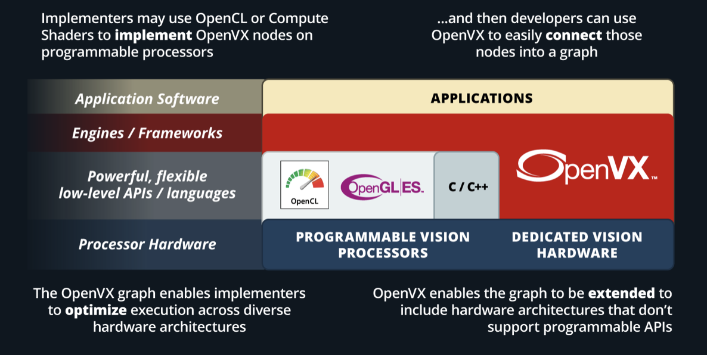

# Khronos OpenVX API - Current Version `1.3`

* Khronos [OpenVX](https://www.khronos.org/openvx/) API offers a set of optimized primitives for low-level image processing, computer vision, and neural net operators. The API provides a simple method to write optimized code that is portable across multiple hardware vendors and platforms.

* OpenVX allows for resource and execution abstractions, which enable hardware vendors to optimize their implementation for their platform. Performance portability across CPUs, GPUs, and special-function hardware are one of the design goals of the OpenVX specification.

* OpenVX is used to build, verify, and coordinate computer vision and neural network graph executions. The graph abstraction enables OpenVX implementation to optimize execution for the underlying hardware.  Using optimized OpenVX conformant implementation, software developers can spend more time on algorithmic innovations without worrying about the performance and portability of their applications.

* The standard defines graph conventions and execution semantics to address the needs of the developers. The advantage of the graphical interface is the ability of the underlying conformant implementation to optimize the whole graph pipeline instead of specific functions.

* OpenVX specification also defines the VXU or the immediate function library. VXU operators allow developers to use all the OpenVX operators as a directly callable C function without creating a graph first.

* Applications built using the VXU library do not benefit from the optimizations enabled by graph execution. The VXU library can be the simplest way to use OpenVX and is the first step in porting existing vision applications.

## AMD OpenVX&trade;

* AMD OpenVX&trade; is a highly optimized conformant open-source implementation of the [Khronos OpenVX 1.3](https://www.khronos.org/registry/OpenVX/specs/1.3/html/OpenVX_Specification_1_3.html) computer vision specification. It allows for rapid prototyping as well as fast execution on a wide range of computer hardware, including small embedded `AMD64` CPUs and large workstation discrete GPUs.

### AMD OpenVX&trade; - Vision Feature Set Conformant Implementation

The Vision Conformance Feature Set includes all the functions and objects in the `Base Feature Set`, plus the vision data objects and vision functions.

#### The Base Feature Set

The purpose is to define a minimal subset of OpenVX features that enable the construction and execution of OpenVX graphs, but it does not contain any specific vision-processing operations.

**Basic Framework Objects**
<table>
  <tr>
    <th>vx_reference</th>
    <th>vx_context</th> 
    <th>vx_graph</th>
    <th>vx_kernel</th>
  </tr>
  <tr>
    <th>vx_node</th>
    <th>vx_parameter</th> 
    <th>vx_meta_format</th>
    <th>vx_delay</th>
  </tr>
</table>

**Note:** Details about [Framework Objects](https://www.khronos.org/registry/OpenVX/specs/1.3/html/OpenVX_Specification_1_3.html#sec_framework_objects)

#### The Vision Conformance Feature Set

To provide a basic set of vision processing functions. This set of functions is roughly equivalent to the set of functions available in version 1.1 of the OpenVX specification. In addition to the framework objects included in the Base Feature Set, the Vision Conformance Feature Set includes a set of data objects that the Vision functions operate upon and produce.

**Vision Conformance Data Objects**
<table>
  <tr>
    <th>vx_array</th>
    <th>vx_convolution</th> 
    <th>vx_distribution</th>
    <th>vx_image</th>
  </tr>
  <tr>
    <th>vx_lut</th>
    <th>vx_matrix</th> 
    <th>vx_pyramid</th>
    <th>vx_remap</th>
  </tr>
  <tr>
    <th>vx_scalar</th>
    <th>vx_threshold</th> 
    <th>vx_object_array</th>
    <th>&nbsp; </th>
  </tr>
</table>

**NOTE:** Details about [Data Objects](https://www.khronos.org/registry/OpenVX/specs/1.3/html/OpenVX_Specification_1_3.html#sec_data_objects)

**Vision Conformance Functions**
<table>
  <tr>
    <th>AbsDiff</th>
    <th>Add</th> 
    <th>And</th>
    <th>Box3x3</th>
    <th>CannyEdgeDetector</th>
    <th>ChannelCombine</th>
  </tr>
  <tr>
    <th>ChannelExtract</th>
    <th>ColorConvert</th> 
    <th>ConvertDepth</th>
    <th>Convolve</th>
    <th>Dilate3x3</th>
    <th>EqualizeHist</th>
  </tr>
  <tr>
    <th>Erode3x3</th>
    <th>FastCorners</th> 
    <th>Gaussian3x3</th>
    <th>GaussianPyramid</th>
    <th>HarrisCorners</th>
    <th>HalfScaleGaussian</th>
  </tr>
  <tr>
    <th>Histogram</th>
    <th>IntegralImage</th> 
    <th>LaplacianPyramid</th>
    <th>LaplacianReconstruct</th>
    <th>Magnitude</th>
    <th>MeanStdDev</th>
  </tr>
  <tr>
    <th>Median3x3</th>
    <th>MinMaxLoc</th> 
    <th>Multiply</th>
    <th>NonLinearFilter</th>
    <th>Not</th>
    <th>OpticalFlowPyrLK</th>
  </tr>
  <tr>
    <th>Or</th>
    <th>Phase</th> 
    <th>Remap</th>
    <th>ScaleImage</th>
    <th>Sobel3x3</th>
    <th>Subtract</th>
  </tr>
  <tr>
    <th>TableLookup</th>
    <th>Threshold</th> 
    <th>WarpAffine</th>
    <th>WarpPerspective</th>
    <th>WeightedAverage</th>
    <th>Xor</th>
  </tr>
</table>

**Note:** Details about [Functions](https://www.khronos.org/registry/OpenVX/specs/1.3/html/OpenVX_Specification_1_3.html#group_vision_functions)

### AMD OpenVX&trade; - Features

* The code is highly optimized for both x86 CPU and OpenCL/HIP for GPU
* Supported hardware spans the range from low power embedded APUs, laptops, desktops, and workstation graphics
* Supports `Windows` , `Linux` , and `macOS`
* Includes a “graph optimizer” that looks at the entire processing pipeline and removes/replaces/merges functions to improve performance and minimize bandwidth at runtime 
* Scripting support with [RunVX](../utilities/runvx/README.md) allows for rapid prototyping, without re-compiling at production performance levels

**NOTE:** The amd_openvx project consists of the following components: [AMD OpenVX&trade; Library](openvx/README.md)

**NOTE:** The OpenVX framework provides a mechanism to add new vision functions to OpenVX by 3rd party vendors. Look into amd_openvx_extensions for additional OpenVX modules and utilities.

#### AMD OpenVX&trade; - Extensions
  * **vx_loomsl**: Radeon LOOM stitching library for live 360-degree video applications
  * **vx_nn**: OpenVX neural network module that was built on top of [MIOpen](https://github.com/ROCmSoftwarePlatform/MIOpen)
  * **vx_opencv**: OpenVX module that implemented a mechanism to access OpenCV functionality as OpenVX kernels
  * **vx_rpp**: OpenVX extension providing an interface to some of the Radeon Performance Primitives ([RPP](https://github.com/GPUOpen-ProfessionalCompute-Libraries/rpp)) functions. This extension is used to enable [rocAL](../rocAL/README.md) to perform image augmentation.
  * **vx_winml**: OpenVX module that implemented a mechanism to access Windows Machine Learning(WinML) functionality as OpenVX kernels

## Pre-requisites

* **CPU**: [AMD64](https://docs.amd.com/bundle/Hardware_and_Software_Reference_Guide/page/Hardware_and_Software_Support.html)
* **GPU**: [AMD Radeon&trade; Graphics](https://docs.amd.com/bundle/Hardware_and_Software_Reference_Guide/page/Hardware_and_Software_Support.html) [optional]
  + Windows: install the latest drivers and OpenCL SDK [download](https://github.com/GPUOpen-LibrariesAndSDKs/OCL-SDK/releases)
  + Linux: install [ROCm](https://rocm.github.io/ROCmInstall.html)
* **APU**: [AMD Radeon&trade; `Mobile`/`Embedded`](https://docs.amd.com/bundle/Hardware_and_Software_Reference_Guide/page/Hardware_and_Software_Support.html) [optional]

## Build Instructions

Build this project to generate AMD OpenVX&trade; library 

* Refer to [openvx/include/VX](openvx/include/VX) for Khronos OpenVX standard header files.
* Refer to [openvx/include/vx_ext_amd.h](openvx/include/vx_ext_amd.h) for vendor extensions in AMD OpenVX&trade; library

### Build using `Visual Studio`

* Install OpenCV with/without contrib [download](https://github.com/opencv/opencv/releases) for RunVX tool to support camera capture and image display (optional)
  + OpenCV_DIR environment variable should point to OpenCV/build folder
* Use amd_openvx/amd_openvx.sln to build for x64 platform
* If AMD GPU (or OpenCL) is not available, set build flag `ENABLE_OPENCL=0`in openvx/openvx.vcxproj and runvx/runvx.vcxproj

**Note:** AMD GPU `HIP` backend is not supported on Windows 

### Build using CMake

* Install CMake 3.0 or later
* Use CMake to configure and generate Makefile

**NOTE:** OpenVX and the OpenVX logo are trademarks of the Khronos Group Inc.
