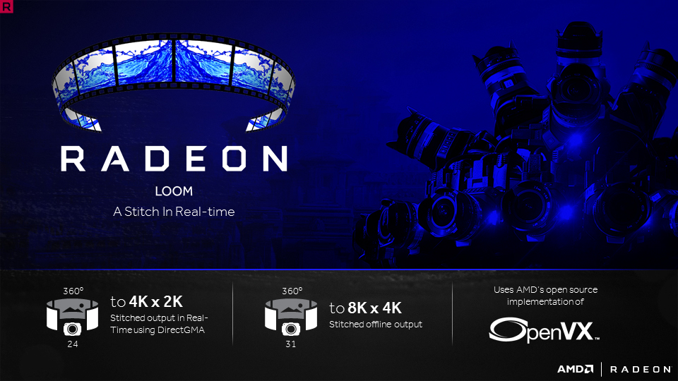

# AMD OpenVX Extensions

The OpenVX framework provides a mechanism to add new vision functions to OpenVX by 3rd party vendors. This project has below OpenVX modules and utilities to extend [AMD OpenVX](../amd_openvx#amd-openvx-amd_openvx) (amd_openvx) project, which contains the AMD OpenVX Core Engine.

* [amd_loomsl](amd_loomsl): AMD Radeon LOOM stitching library for live 360-degree video applications

* [amd_media](amd_media): `vx_amd_media` is an OpenVX AMD media extension module. This module has mainly two OpenVX extension nodes. `com.amd.amd_media.decode` node for video/jpeg decoding and `com.amd.amd_media.encode` node for video encoding

* [amd_nn](amd_nn#openvx-neural-network-extension-library-vx_nn): OpenVX neural network module. Learn more about neural net workflow in [Neural Net Model Compiler & Optimizer](../model_compiler#neural-net-model-compiler--optimizer)

* [amd_opencv](amd_opencv#amd-opencv-extension): OpenVX module that implements a mechanism to access OpenCV functionality as OpenVX kernels

* [amd_rpp](amd_openvx_extensions/amd_rpp): OpenVX extension providing an interface to some of the Radeon Performance Primitives ([RPP](https://github.com/GPUOpen-ProfessionalCompute-Libraries/rpp)) functions. This extension is used to enable [rocAL](../rocAL/README.md) to perform image augmentation.

* [amd_winml](amd_winml#amd-winml-extension): WinML extension will allow developers to import a pre-trained ONNX model into an OpenVX graph and add hundreds of different pre & post processing `vision` / `generic` / `user-defined` functions, available in OpenVX and OpenCV interop, to the input and output of the neural net model. This will allow developers to build an end to end application for inference.

