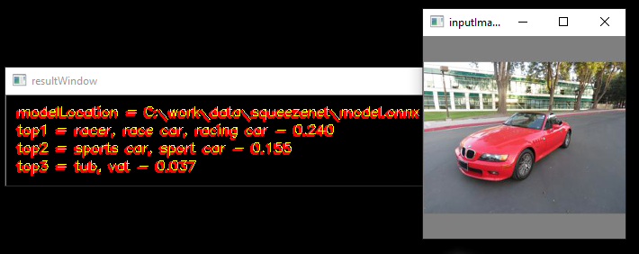
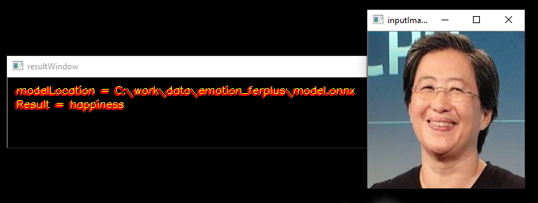
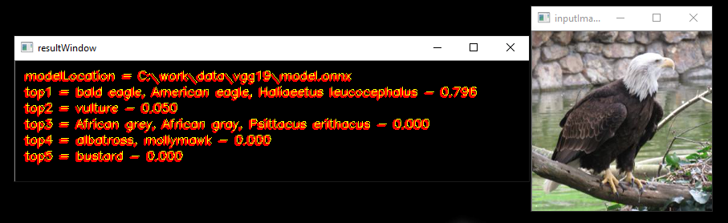

# Samples

Get ONNX models from [ONNX Model Zoo](https://github.com/onnx/models)

## Sample - SqueezeNet

* Download the [SqueezeNet](https://s3.amazonaws.com/download.onnx/models/opset_8/squeezenet.tar.gz) ONNX Model
* Use [Netron](https://lutzroeder.github.io/netron/) to open the model.onnx
	* Look at Model Properties to find Input & Output Tensor Name (data_0 - input; softmaxout_1 - output)
	* Look at output tensor dimensions (n,c,h,w  - [1,1000,1,1] for softmaxout_1)
* Use the label file - [data\Labels.txt](data/Labels.txt) and sample image - data\car.JPEG to run samples

### winML-image.gdf - Single Image Inference

This sample is in [Graph Description Format](../../../utilities/runvx#amd-runvx) (gdf)

<p align="center"></p>

#### usage
````
runvx.exe -v winML-image.gdf
````

**NOTE:**
Make the below changes in the `winML-image.gdf` file to run the inference

* Add full path to the data\car.JPEG image provided in this folder in line 11
````
read input_image FULL_PATH_TO\data\car.JPEG
````

* Add full path to the SqueezeNet ONNX model downloaded in line 21
````
data modelLocation = scalar:STRING,FULL_PATH_TO\squeezenet\model.onnx:view,resultWindow
````

* Add full path to the [data\Labels.txt](data/Labels.txt) provided in this folder in line 34
````
data labelLocation = scalar:STRING,FULL_PATH_TO\data\Labels.txt
````

### winML-live.gdf - Live Inference using a camera

This sample is in [Graph Description Format](../../../utilities/runvx#amd-runvx) (gdf)

#### usage
````
runvx.exe -frames:LIVE winML-live.gdf
````

**NOTE:**
Make the below changes in the `winML-live.gdf` file to run the inference

* Add full path to the SqueezeNet ONNX model downloaded in line 16
````
data modelLocation = scalar:STRING,FULL_PATH_TO\squeezenet\model.onnx:view,resultWindow
````

* Add full path to the [data\Labels.txt](data/Labels.txt) provided in this folder in line 25
````
data labelLocation = scalar:STRING,FULL_PATH_TO\data\Labels.txt
````

### winML-Live-MultipleModels.gdf - Live Inference using a camera

This sample is in [Graph Description Format](../../../utilities/runvx#amd-runvx) (gdf)

#### usage
````
runvx.exe -frames:LIVE winML-Live-MultipleModels.gdf
````

**NOTE:**
Make the below changes in the `winML-Live-MultipleModels.gdf` file to run the inference

* Add full path to the VGG19 ONNX model downloaded in line 17
````
data modelLocation_vgg = scalar:STRING,FULL_PATH_TO\vgg19\model.onnx:view,resultWindow
````

* Add full path to the SqueezeNet ONNX model downloaded in line 31
````
data modelLocation_squeezenet = scalar:STRING,FULL_PATH_TO\squeezenet\model.onnx:view,resultWindow
````

* Add full path to the [data\Labels.txt](data/Labels.txt) provided in this folder in line 44
````
data labelLocation = scalar:STRING,FULL_PATH_TO\data\Labels.txt
````

## Sample - FER+ Emotion Recognition

* Download the [FER+ Emotion Recognition](https://onnxzoo.blob.core.windows.net/models/opset_8/emotion_ferplus/emotion_ferplus.tar.gz) ONNX Model
* Use [Netron](https://lutzroeder.github.io/netron/) to open the model.onnx
	* Look at Model Properties to find Input & Output Tensor Name (Input3 - input; Plus692_Output_0 - output)
	* Look at output tensor dimensions (n,c,h,w  - [1,8] for Plus692_Output_0)
* Use the label file - [data/emotions.txt](data/emotions.txt) to run sample

This sample is in [Graph Description Format](../../../utilities/runvx#amd-runvx) (gdf)

<p align="center"></p>

#### usage
````
runvx.exe -frames:LIVE winML-live-emotions.gdf
````

**NOTE:**
Make the below changes in the `winML-live-emotions.gdf` file to run the inference

* Add full path to the FER+ Emotion Recognition ONNX model downloaded in line 16
````
data modelLocation = scalar:STRING,FULL_PATH_TO\emotion_ferplus\model.onnx:view,inputImageWindow
````

* Add full path to the data\emotions.txt provided in this folder in line 25
````
data labelLocation = scalar:STRING,FULL_PATH_TO\data\emotions.txt
````

## Sample - VGG19

* Download the [VGG-19](https://s3.amazonaws.com/download.onnx/models/opset_8/vgg19.tar.gz) ONNX Model
* Use [Netron](https://lutzroeder.github.io/netron/) to open the model.onnx
	* Look at Model Properties to find Input & Output Tensor Name (data_0 - input; prob_1 - output)
	* Look at output tensor dimensions (n,c,h,w  - [1,1000] for prob_1)
* Use the label file - [data/Labels.txt](data/Labels.txt) to run sample

This sample is in [Graph Description Format](../../../utilities/runvx#amd-runvx) (gdf)

<p align="center"></p>

#### usage
````
runvx.exe -v winML-image-vgg19.gdf
````

**NOTE:**
Make the below changes in the `winML-live-vgg19.gdf` file to run the inference

* Add full path to the data\bird.JPEG image provided in this folder in line 11
````
read input_image FULL_PATH_TO\data\bird.JPEG
````

* Add full path to the VGG 19 ONNX model downloaded in line 21
````
data modelLocation = scalar:STRING,FULL_PATH_TO\vgg19\model.onnx:view,resultWindow
````

* Add full path to the [data\Labels.txt](data\Labels.txt) provided in this folder in line 33
````
data labelLocation = scalar:STRING,FULL_PATH_TO\data\Labels.txt
````
````
