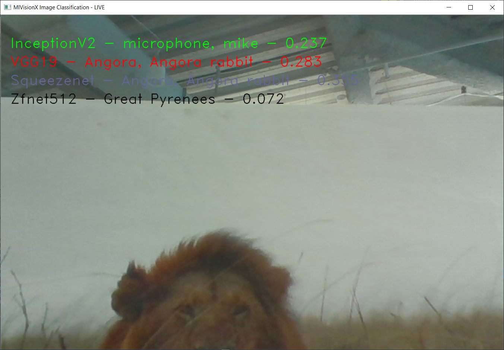

# Applications

MIVisionX has a number of applications built on top of OpenVX modules, it uses AMD optimized libraries to build applications which can be used to prototype or used as models to develop a product.

## Cloud Application

## DG Test

A simple application used to recognize hand written digits using openvx.

  
  
  

## MIVisionX WinML Image Classification
This application shows how to [run supported ONNX models](https://github.com/LakshmiKumar23/MIVisionX/blob/lk/winml_classiifer/apps/mivisonx_winml_classifier/README.md#image-clasiification-using-amd-winml-extension) with MIVisionX RunTime:

  

## MIVisionX WinML YoloV2

  

## External Application
* [MIVisionX-Classifier](https://github.com/kiritigowda/MIVisionX-Classifier) - This application runs know CNN image classifiers on live/pre-recorded video stream.
* [YOLOv2](https://github.com/kiritigowda/YoloV2NCS) - Run tiny yolov2 (20 classes) with AMD's MIVisionX
* [Traffic Vision](https://github.com/srohit0/trafficVision#traffic-vision) - This app detects cars/buses in a live traffic at a phenomenal 50 frames/sec with HD resolution (1920x1080) using deep learning network Yolo-V2. The model unsed in the app is optimized for inferencing performnce on AMD-GPUs using MIVisionX toolkit.
