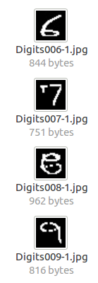
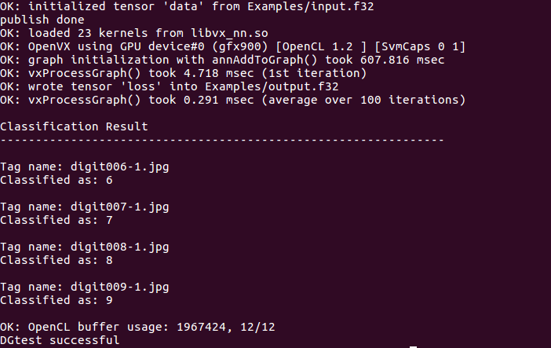

# Applications

MIVisionX has a number of applications built on top of OpenVX and its modules, it uses AMD optimized libraries to build applications which can be used as prototypes or used as models to develop products.

## Cloud Application
This sample [application](./cloud_inference#cloud-inference-application) does inference using a client-server system.

## DG Test
This sample [application](./dg_test#amd-dgtest) is used to recognize hand written digits.

  
  
  

## MIVisionX OpenVX Classsification
This sample [application](./mivisionx_openvx_classifier/README.md) shows how to run supported pre-trained caffe models with MIVisionX RunTime.

 

## MIVisionX WinML Classification
This sample [application](./mivisionx_winml_classifier/README.md) shows how to run supported ONNX models with MIVisionX RunTime on Windows.

  

## MIVisionX WinML YoloV2
This sample [application](./mivisionx_winml_yolov2#yolov2-using-amd-winml-extension) shows how to run tiny yolov2(20 classes) with MIVisionX RunTime on Windows.

  

## External Application

* [MIVisionX-Classifier](https://github.com/kiritigowda/MIVisionX-Classifier) - This application runs know CNN image classifiers on live/pre-recorded video stream.
* [YOLOv2](https://github.com/kiritigowda/YoloV2NCS) - Run tiny yolov2 (20 classes) with AMD's MIVisionX
* [Traffic Vision](https://github.com/srohit0/trafficVision#traffic-vision) - This app detects cars/buses in a live traffic at a phenomenal 50 frames/sec with HD resolution (1920x1080) using deep learning network Yolo-V2. The model used in the app is optimized for inferencing performnce on AMD-GPUs using MIVisionX toolkit.
