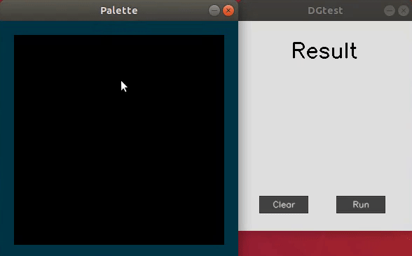
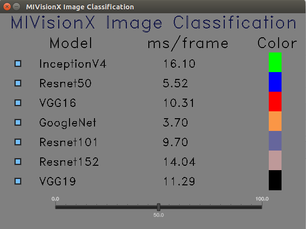
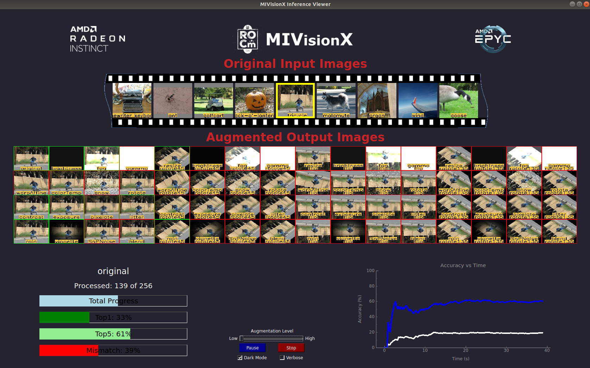
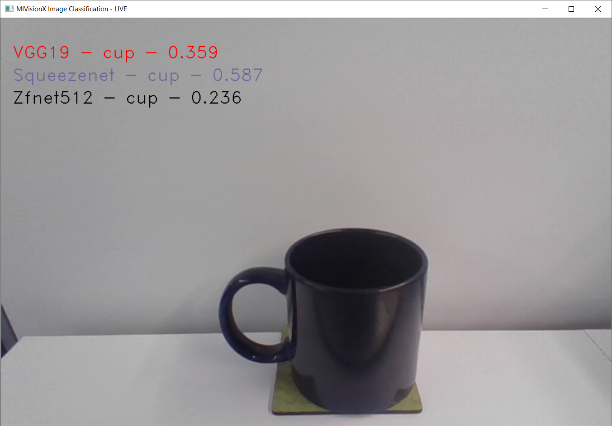
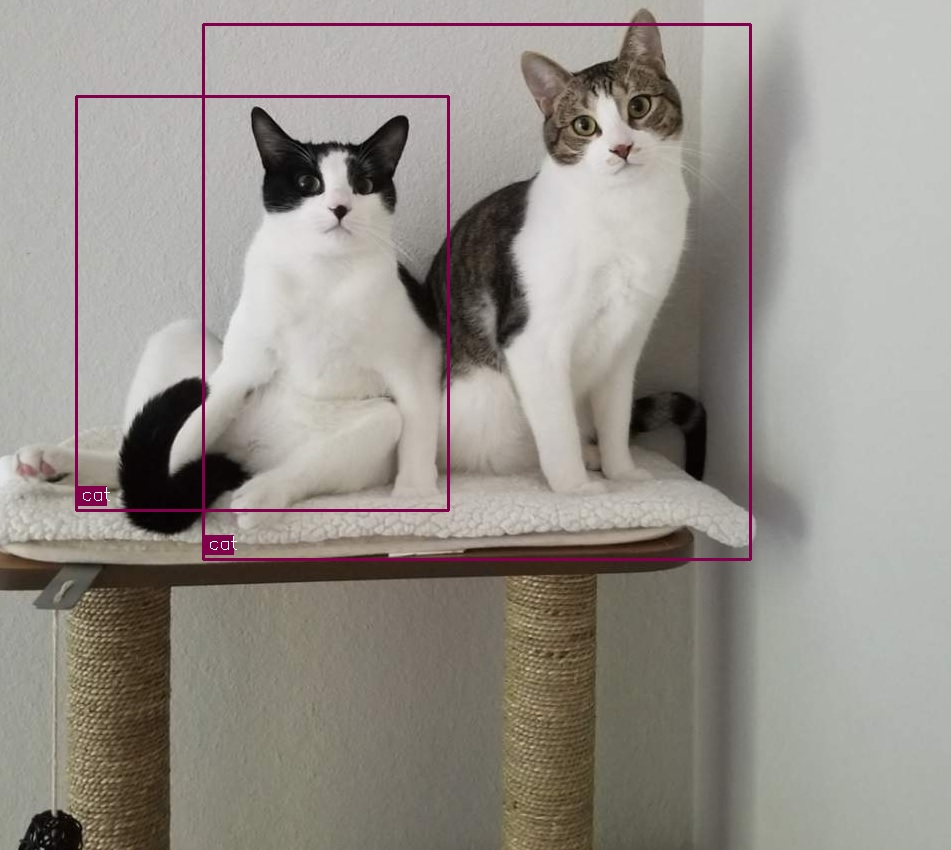

# Applications

MIVisionX has several applications built on top of OpenVX and its modules, it uses AMD optimized libraries to build applications that can be used as prototypes or used as models to develop products.

## Bubble Pop

This sample [application](./bubble_pop) creates bubbles and donuts to pop using OpenVX & OpenCV functionality.

  

## Cloud Application

This sample [application](./cloud_inference#cloud-inference-application) does inference using a client-server system.

 

## DG Test

This sample [application](./dg_test#amd-dgtest) is used to recognize hand written digits.

  

## Image Augmentation

This sample [application](./image_augmentation#image-augmentation-application) demonstrates the basic usage of rocAL's C API to load JPEG images from the disk and modify them in different possible ways and displays the output images.

  

# MIVisionX Inference Analyzer

[MIVisionX Inference Analyzer Application](./mivisionx_inference_analyzer#mivisionx-python-inference-analyzer) using pre-trained `ONNX` / `NNEF` / `Caffe` models to analyze and summarize images.

## MIVisionX OpenVX Classsification

This sample [application](./mivisionx_openvx_classifier/README.md) shows how to run supported pre-trained caffe models with MIVisionX RunTime.

 

# MIVisionX Validation Tool

[MIVisionX ML Model Validation Tool](./mivisionx_validation_tool#mivisionx-python-ml-model-validation-tool) using pre-trained `ONNX` / `NNEF` / `Caffe` models to analyze, summarize, & validate.

## MIVisionX WinML Classification

This sample [application](./mivisionx_winml_classifier/README.md) shows how to run supported ONNX models with MIVisionX RunTime on Windows.

  

## MIVisionX WinML YoloV2

This sample [application](./mivisionx_winml_yolov2#yolov2-using-amd-winml-extension) shows how to run tiny yolov2(20 classes) with MIVisionX RunTime on Windows.

  

## External Application

* [MIVisionX-Classifier](https://github.com/kiritigowda/MIVisionX-Classifier) - This application runs know CNN image classifiers on live/pre-recorded video stream.

* [YOLOv2](https://github.com/kiritigowda/YoloV2NCS) - Run tiny yolov2 (20 classes) with AMD's MIVisionX

* [Traffic Vision](https://github.com/srohit0/trafficVision#traffic-vision) - This app detects cars/buses in live traffic at a phenomenal 50 frames/sec with HD resolution (1920x1080) using deep learning network Yolo-V2. The model used in the app is optimized for inferencing performance on AMD-GPUs using the MIVisionX toolkit.

  

* [RGBDSLAMv2-MIVisionX](https://github.com/ICURO-AI-LAB/RGBDSLAMv2-MIVisionX) - This is an implementation of RGBDSLAM_V2 that utilizes AMD MIVisionX for feature detection and ROCm OpenCL for offloading computations to Radeon GPUs. This application is used to create 3D maps using RGB-D Cameras.
