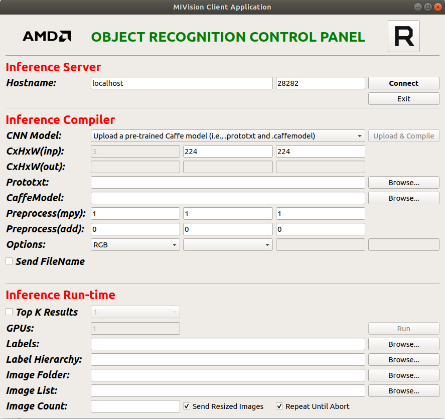
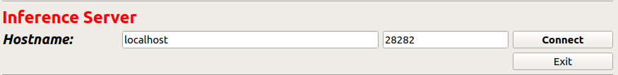
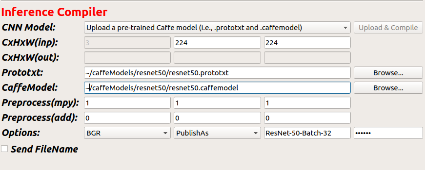
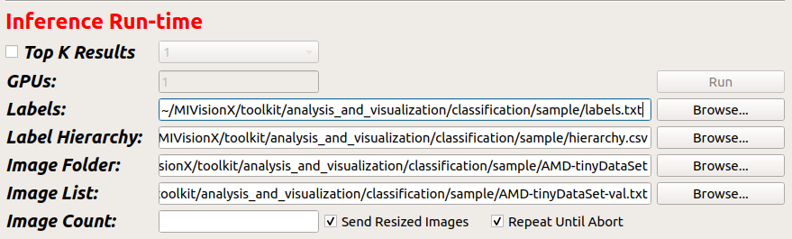

# Cloud Inference Application

Inference Application Development Workflow |  Sample Cloud Inference Application
:-------------------------:|:-------------------------:
[](https://github.com/GPUOpen-ProfessionalCompute-Libraries/amdovx-modules/wiki#neural-network-inference-workflow-for-caffe-users)  |  [](https://github.com/GPUOpen-ProfessionalCompute-Libraries/amdovx-modules/wiki#getting-started-with-neural-network-inference-sample)


## Cloud Inference Engine

The cloud inference app is designed as a server and a client inference modules, where a single or multiple clients can send the server continuous stream of images for inference. The server module processes the requests of the clients and returns the results of the inference back to the client to be displayed. The server and client modules can be launched on the same machine and connected through localhost or launched on different machines and connected over the network.

## Inference Server Application - inference_server_app

The server application is built along with MIVisionX and placed in `/opt/rocm/mivisionx/bin` when MIVisionX is installed. The server application has a command line interface.

usage:
```
inference_server_app  [-p port - default 26262] 
                      [-b default-batch-size - default 32]
                      [-gpu <comma-separated-list-of-GPUs>]
                      [-q <max-pending-batches>]
                      [-fp16 <0/1> - default 0]
                      [-w <server-work-folder>]
                      [-s <local-shadow-folder-full-path>]
                      [-n <model-compiler-path>]
                      [-t num_cpu_dec_threads<2-64>]
```

## Client Application - client_app

The client app needs to be built by the user using QT Creator. The client application has a GUI interface to connect with the server.

<p align="center"></p>

## Running the Cloud Inference

**Step 1** - Launch **Inference Server Application** - this app is built and installed with the MIVisionX. You can launch the server using the following commands
````
export PATH=$PATH:/opt/rocm/mivisionx/bin
export LD_LIBRARY_PATH=$LD_LIBRARY_PATH:/opt/rocm/mivisionx/lib
inference_server_app
````
* Expected output
```
./inference_server_app 
INFO: using OpenCL platform#0 with 1 GPU devices ...
INFO: listening on port 28282 for annInferenceApp connections ...
```

**Step 2** - Launch **Inference Client Application** - The client application needs to be built and launched using QT Creator. 

  * The Client Application is available at MIVisionX/apps/cloud_inference/client_app folder. 

  * Open annInferenceApp.pro with the QTCreator and build the client application. Once the client is built, launch the application. Below is the image of the client application

<p align="center"></p>

**Step 3** - Connect Server and Client - After launching the server and client applications on the system, you can connect them using the default port. The server and client could also be launched on two different machines.

<p align="center"></p>

**Step 4** - Upload PreTrained Caffe Model - Once the connection is established, load the caffe model and prototxt to the server using the client application. 

The client application section Inference Compiler needs to be completed as shown in the below example.

<p align="center"></p>

  * CNN Model: upload or select preloaded models. (User needs to save models are preloaded on the server)
  * CxHxW(inp): enter the height and width of the input images to the model
  * Prototxt: give the location of the model .prototxt
  * CaffeModel: give the location of the pretrained caffe model .caffemodel
  * Options: BGR/RGB - model trained with RGB or BGR images
  * Publishas: Model Name 
  * password: radeon ( To load the models to the server)

**Step 5** - Load Image DataBase - Now you can run a simple test inference using the AMD-tinyDataSet provided in this project within the MIVisionX/toolkit/analysis_and_visualization/classification/sample folder. 

The client application section Inference Run-time needs the labels.txt, the AMD-tinyDataSet folder location, & AMD-tinyDataSet-val.txt provided in the sampleDataSet folder.

<p align="center"></p>

  * Labels: location to MIVisionX/toolkit/analysis_and_visualization/classification/sample/labels.txt
  * Image Folder: location to MIVisionX/toolkit/analysis_and_visualization/classification/sample/AMD-tinyDataSet folder
  * Image List: location to MIVisionX/toolkit/analysis_and_visualization/classification/sample/AMD-tinyDataSet-val.txt (image validation text)

**Step 6** - Run Inference - Once all the required fields are completed on the client app the run button will turn green. You can now run the inference.
