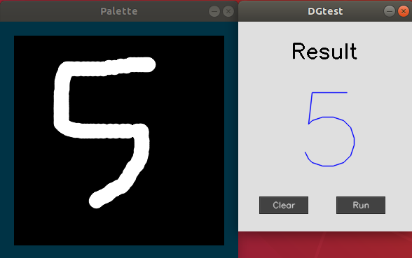

# MIVisionX DGtest

MIVisionX DGtest is a tutorial program for those who are new to MIOpen & OpenVX. It runs inference on the [MNIST](http://yann.lecun.com/exdb/mnist/) dataset using MIOpen & OpenVX.

<p align="center">
 
</p>

### Explanation

The program is divided into four parts:

##### 1. annmodule

annmodule is created by the AMD model compiler. You can convert your own trained caffemodel to an openvx graph using the model-compiler. See the below section for the detailed instruction.
Once the conversion is done, the corresponding c++ codes will be generated including annmodule which contains the information about your pre-trained caffemodel.

##### 2. Userinterface

The user-interface class is for the GUI functionality of the DGtest.
It has the palette and the result window to draw the image and show the resulting output.

##### 3. DGtest

DGtest class is where you run the inference.
Using the annAddToGraph() function in annmodule, it adds weights, input tensor, and output tensor to the graph.
If it was successful, it preprocesses the image and processes the graph (runs the inference) using the vxProcessGraph() function.

See the [OpenVX documentation](https://www.khronos.org/registry/OpenVX/specs/1.0/html/index.html) for detailed explanation about OpenVX API calls.

### Pre-requisites

1. Build & Install [MIVisionX](https://github.com/GPUOpen-ProfessionalCompute-Libraries/MIVisionX#build--install-mivisionx)
2. [OpenCV 3.1](https://opencv.org/opencv-3-1.html) or higher

### Build using Cmake on Linux (Ubuntu 16.04 64bit)

```
 mkdir build
 cd build
 cmake ..
 make
```

### Usage

 Usage: 
 
 ```
 ./DGtest [weights.bin]
 ```
 
**weights.bin:** The name of the weights file to be used for the inference. It is created by running a caffemodel converter.
See the below section for using your caffemodel.
 
### Testing with your Caffemodel

You can test your trained MNIST caffemodel using the [model compiler](https://github.com/GPUOpen-ProfessionalCompute-Libraries/amdovx-modules/tree/develop/utils/model_compiler)

 1. Convert your caffemodel->NNIR->openvx using the model compiler.
 2. From the generated files, copy

```
 annmodule.cpp
 annmodule.h
 weights.bin
```
 to the DGtest folder.

 3. Build the program again.

```
 make
```
 
### Example

```
 ./DGTest ../data/weights.bin
```
 
<p align="center">
 
</p>
