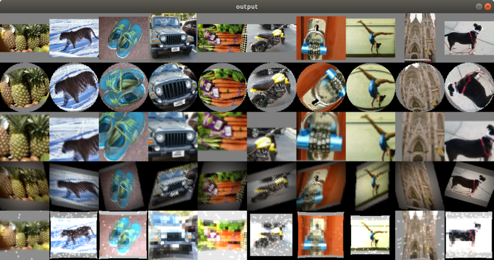

# Image Augmentation Application

This application demonstrates the basic usage of RALI's C API to load JPEG images from the disk and modify them in different possible ways and displays the output images.

<p align="center"></p>

## Build Instructions

### Pre-requisites

* Ubuntu Linux, [version `16.04` or later](https://www.microsoft.com/software-download/windows10)
* RALI library (Part of the MIVisionX toolkit)
* [OpenCV 3.4+](https://github.com/opencv/opencv/releases/tag/3.4.0)
* Radeon Performance Primitives (RPP)

### build

``` 
 export LD_LIBRARY_PATH=$LD_LIBRARY_PATH:/opt/rocm/mivisionx/lib
 export LD_LIBRARY_PATH=$LD_LIBRARY_PATH:/opt/rocm/rpp/lib
 mkdir build
 cd build
 cmake ../
 make 
```

### running the application 

``` 
 image_augmentation <path-to-image-dataset>
```
