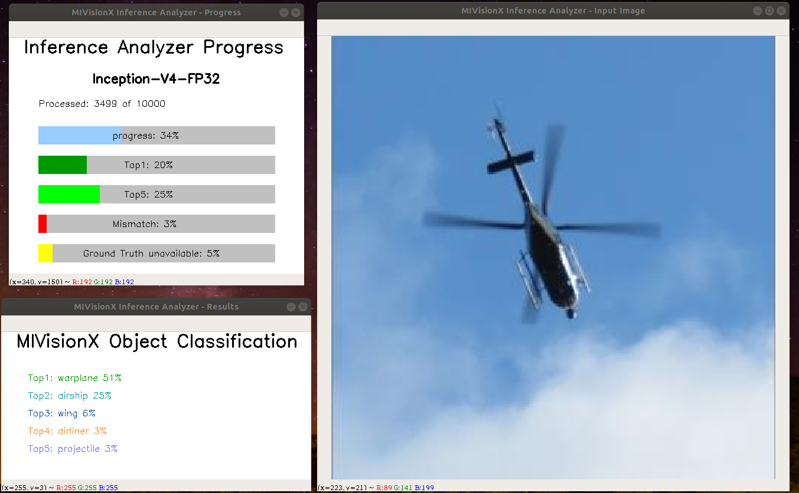
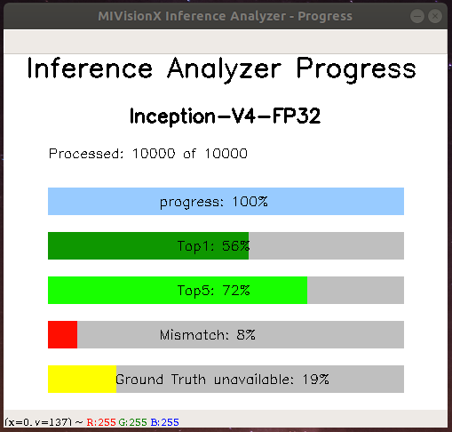
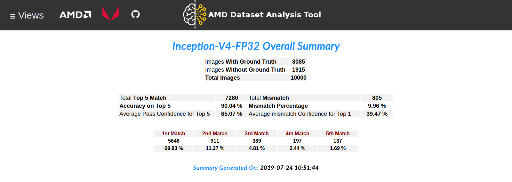
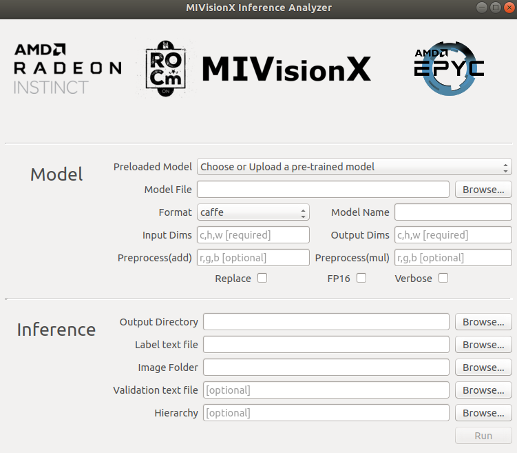
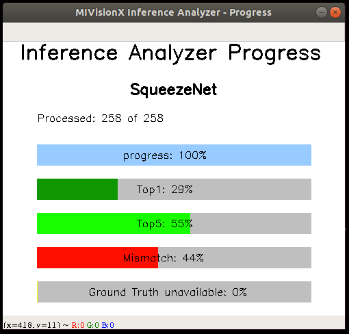
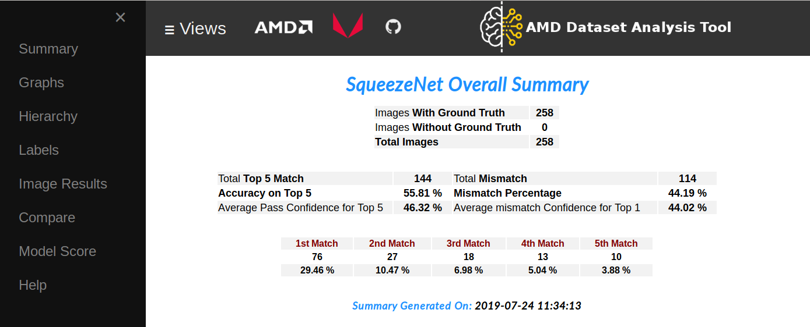
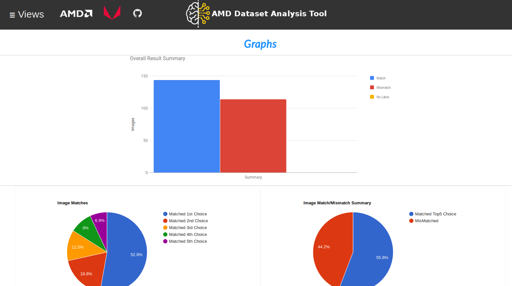
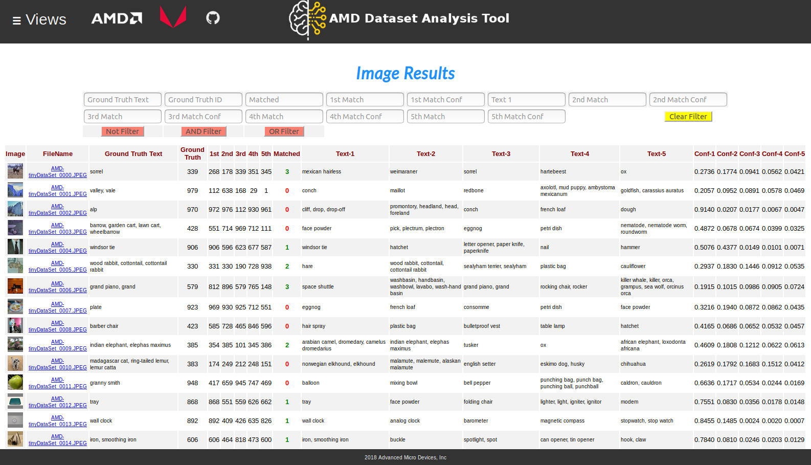
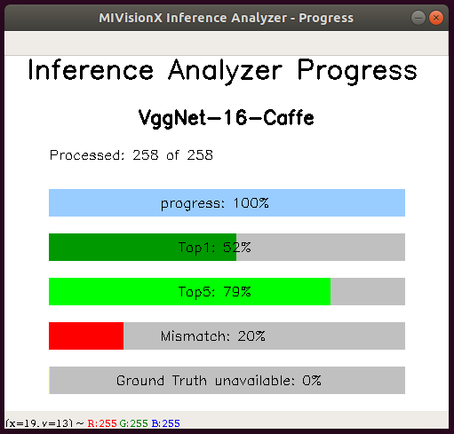
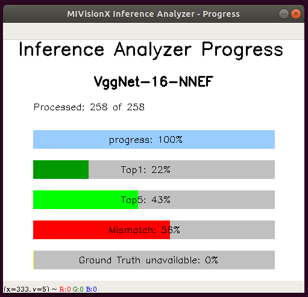

[](https://opensource.org/licenses/MIT)
[](https://lgtm.com/projects/g/kiritigowda/MIVisionX-inference-analyzer/context:python)

# MIVisionX Python Inference Analyzer

[MIVisionX](https://gpuopen-professionalcompute-libraries.github.io/MIVisionX/) Inference Analyzer Application using pre-trained `ONNX` / `NNEF` / `Caffe` models to analyze and summarize images.

<p align="center"></p>

Pre-trained models in [ONNX](https://onnx.ai/), [NNEF](https://www.khronos.org/nnef), & [Caffe](http://caffe.berkeleyvision.org/) formats are supported by MIVisionX. The app first converts the pre-trained models to AMD Neural Net Intermediate Representation (NNIR), once the model has been translated into AMD NNIR (AMD's internal open format), the Optimizer goes through the NNIR and applies various optimizations which would allow the model to be deployed on to target hardware most efficiently. Finally, AMD NNIR is converted into OpenVX C code, which is compiled and wrapped with a python API to run on any targeted hardware.

* MIVisionX Inference Analyzer - Processing Images

<p align="center"></p>

* MIVisionX Inference Analyzer - Processing Images Complete

<p align="center"></p>

* MIVisionX Inference Analyzer - Results

<p align="center"></p>

## Analyzer Index

* [MIVisionX Model Compiler & Optimizer](https://github.com/GPUOpen-ProfessionalCompute-Libraries/MIVisionX/tree/master/model_compiler#neural-net-model-compiler--optimizer)
* [Prerequisites](#prerequisites)
  + [Docker for MIVisionX Inference Analyzer](#use-mivisionx-docker)
* [Usage](#usage)
  + [Usage help](#usage-help)
* [Supported Pre-Trained Model Formats](#supported-pre-trained-model-formats)
* [Samples](#samples)
  + [Sample-1: Using Pre-Trained ONNX Model](#sample-1---using-pre-trained-onnx-model)
  + [Sample-2: Using Pre-Trained Caffe Model](#sample-2---using-pre-trained-caffe-model)
  + [Sample-3: Using Pre-Trained NNEF Model](#sample-3---using-pre-trained-nnef-model)

## Prerequisites

* Ubuntu `16.04` / `18.04` or CentOS `7.5` / `7.6`
* [ROCm supported hardware](https://rocm.github.io/ROCmInstall.html#hardware-support) 
  + AMD Radeon GPU or AMD APU required
* Latest [ROCm](https://github.com/RadeonOpenCompute/ROCm#installing-from-amd-rocm-repositories)
* Build & Install [MIVisionX](https://github.com/GPUOpen-ProfessionalCompute-Libraries/MIVisionX#linux-1)

### Use MIVisionX Docker

MIVisionX provides developers with [docker images](https://hub.docker.com/u/mivisionx) for [Ubuntu 16.04](https://hub.docker.com/r/mivisionx/ubuntu-16.04), [Ubuntu 18.04](https://hub.docker.com/r/mivisionx/ubuntu-18.04), [CentOS 7.5](https://hub.docker.com/r/mivisionx/centos-7.5), & [CentOS 7.6](https://hub.docker.com/r/mivisionx/centos-7.5). Using docker images developers can quickly prototype and build applications without having to be locked into a single system setup or lose valuable time figuring out the dependencies of the underlying software.

#### Docker with display option

* Check [docker prerequisites](https://github.com/GPUOpen-ProfessionalCompute-Libraries/MIVisionX#docker-workflow-sample-on-ubuntu-1604)

* Start docker with display

  ``` 
  % sudo docker pull mivisionx/ubuntu-16.04:latest
  % xhost +local:root
  % sudo docker run -it --device=/dev/kfd --device=/dev/dri --cap-add=SYS_RAWIO --device=/dev/mem --group-add video --network host --env DISPLAY=unix$DISPLAY --privileged --volume $XAUTH:/root/.Xauthority --volume /tmp/.X11-unix/:/tmp/.X11-unix mivisionx/ubuntu-16.04:latest
  ```

* Test display with MIVisionX sample

  ``` 
  % export PATH=$PATH:/opt/rocm/mivisionx/bin
  % export LD_LIBRARY_PATH=$LD_LIBRARY_PATH:/opt/rocm/mivisionx/lib
  % runvx /opt/rocm/mivisionx/samples/gdf/canny.gdf
  ```

* Run [Samples](#samples)

## Usage

### Command Line Interface (CLI)

``` 
usage: python3 mivisionx_inference_analyzer.py 	[-h]
												--model_format MODEL_FORMAT 
                                       			--model_name MODEL_NAME 
                                       			--model MODEL 
                                       			--model_input_dims MODEL_INPUT_DIMS 
                                       			--model_output_dims MODEL_OUTPUT_DIMS 
                                       			--label LABEL 
                                       			--output_dir OUTPUT_DIR 
                                       			--image_dir IMAGE_DIR
                                       			[--image_val IMAGE_VAL] 
                                       			[--hierarchy HIERARCHY]
                                       			[--add ADD] 
                                       			[--multiply MULTIPLY]
				       							[--fp16 FP16]
                                       			[--replace REPLACE] 
                                       			[--verbose VERBOSE]
```

#### Usage help

``` 
  -h, --help            show this help message and exit
  --model_format        pre-trained model format, options:caffe/onnx/nnef [required]
  --model_name          model name                                        [required]
  --model               pre_trained model file/folder                     [required]
  --model_input_dims    c,h,w - channel,height,width                      [required]
  --model_output_dims   c,h,w - channel,height,width                      [required]
  --label               labels text file                                  [required]
  --output_dir          output dir to store ADAT results                  [required]
  --image_dir           image directory for analysis                      [required]
  --image_val           image list with ground truth                      [optional]
  --hierarchy           AMD proprietary hierarchical file                 [optional]
  --add                 input preprocessing factor      [optional - default:[0,0,0]]
  --multiply            input preprocessing factor      [optional - default:[1,1,1]]
  --fp16                quantize model to FP16 		     [optional - default:no]
  --replace             replace/overwrite model              [optional - default:no]
  --verbose             verbose                              [optional - default:no]
```

### Graphical User Interface (GUI)

``` 
usage: python3 mivisionx_inference_analyzer.py
```

<p align="center"></p>

## Supported Pre-Trained Model Formats

<p align="center"></p>

* Caffe
* NNEF
* ONNX

## Samples

### Sample 1 - Using Pre-Trained ONNX Model

#### Run SqueezeNet on sample images

<p align="center"></p>

* **Step 1:** Clone MIVisionX Inference Analyzer Project

  ``` 
  % cd && mkdir sample-1 && cd sample-1
  % git clone https://github.com/GPUOpen-ProfessionalCompute-Libraries/MIVisionX
  % cd MIVisionX/apps/mivisionx_inference_analyzer/
  ```

  **Note:**

  + MIVisionX needs to be pre-installed
  + MIVisionX Model Compiler & Optimizer scripts are at `/opt/rocm/mivisionx/model_compiler/python/`
  + ONNX model conversion requires ONNX install using `pip install onnx` 	

* **Step 2:** Download pre-trained SqueezeNet ONNX model from [ONNX Model Zoo](https://github.com/onnx/models#open-neural-network-exchange-onnx-model-zoo) - [SqueezeNet Model](https://s3.amazonaws.com/download.onnx/models/opset_8/squeezenet.tar.gz)

  ``` 
  % wget https://s3.amazonaws.com/download.onnx/models/opset_8/squeezenet.tar.gz
  % tar -xvf squeezenet.tar.gz
  ```

  **Note:** pre-trained model - `squeezenet/model.onnx`
	
<p align="center"></p>

* **Step 3:** Use the command below to run the inference analyzer

  + View inference analyzer usage

    ``` 
    % cd ~/sample-1/MIVisionX-inference-analyzer/
    % python3 mivisionx_inference_analyzer.py -h
    ```

  + Run SqueezeNet Inference Analyzer

    ``` 
    % python3 mivisionx_inference_analyzer.py --model_format onnx --model_name SqueezeNet --model ~/sample-1/squeezenet/model.onnx --model_input_dims 3,224,224 --model_output_dims 1000,1,1 --label ./sample/labels.txt --output_dir ~/sample-1/ --image_dir ../../data/images/AMD-tinyDataSet/ --image_val ./sample/AMD-tinyDataSet-val.txt --hierarchy ./sample/hierarchy.csv --replace yes
    ```

<p align="center"></p>

<p align="center"></p>

### Sample 2 - Using Pre-Trained Caffe Model

### Run VGG 16 on sample images

<p align="center"></p>

* **Step 1:** Clone MIVisionX Inference Analyzer Project

  ``` 
  % cd && mkdir sample-2 && cd sample-2
  % git clone https://github.com/GPUOpen-ProfessionalCompute-Libraries/MIVisionX
  % cd MIVisionX/apps/mivisionx_inference_analyzer/
  ```

  **Note:**

  + MIVisionX needs to be pre-installed
  + MIVisionX Model Compiler & Optimizer scripts are at `/opt/rocm/mivisionx/model_compiler/python/`
 
* **Step 2:** Download pre-trained VGG 16 caffe model - [VGG_ILSVRC_16_layers.caffemodel](http://www.robots.ox.ac.uk/~vgg/software/very_deep/caffe/VGG_ILSVRC_16_layers.caffemodel)

  ``` 
  % wget http://www.robots.ox.ac.uk/~vgg/software/very_deep/caffe/VGG_ILSVRC_16_layers.caffemodel
  ```

* **Step 3:** Use the command below to run the inference analyzer

  + View inference analyzer usage

    ``` 
    % cd ~/sample-2/MIVisionX-inference-analyzer/
    % python3 mivisionx_inference_analyzer.py -h
    ```

  + Run VGGNet-16 Inference Analyzer

    ``` 
    % python3 mivisionx_inference_analyzer.py --model_format caffe --model_name VggNet-16-Caffe --model ~/sample-2/VGG_ILSVRC_16_layers.caffemodel --model_input_dims 3,224,224 --model_output_dims 1000,1,1 --label ./sample/labels.txt --output_dir ~/sample-2/ --image_dir ../../data/images/AMD-tinyDataSet/ --image_val ./sample/AMD-tinyDataSet-val.txt --hierarchy ./sample/hierarchy.csv --replace yes
    ```

<p align="center"></p>

## Sample 3 - Using Pre-Trained NNEF Model

### Run VGG 16 on sample images

<p align="center"></p>

* **Step 1:** Clone MIVisionX Inference Analyzer Project

  ``` 
  % cd && mkdir sample-3 && cd sample-3
  % git clone https://github.com/GPUOpen-ProfessionalCompute-Libraries/MIVisionX
  % cd MIVisionX/apps/mivisionx_inference_analyzer/
  ```

  **Note:**

  + MIVisionX needs to be pre-installed
  + MIVisionX Model Compiler & Optimizer scripts are at `/opt/rocm/mivisionx/model_compiler/python/`
  + NNEF model conversion requires [NNEF python parser](https://github.com/KhronosGroup/NNEF-Tools/tree/master/parser#nnef-parser-project) installed

* **Step 2:** Download pre-trained VGG 16 NNEF model

  ``` 
  % mkdir ~/sample-3/vgg16
  % cd ~/sample-3/vgg16
  % wget https://sfo2.digitaloceanspaces.com/nnef-public/vgg16.onnx.nnef.tgz
  % tar -xvf vgg16.onnx.nnef.tgz
  ```

* **Step 3:** Use the command below to run the inference analyzer

  + View inference analyzer usage

    ``` 
    % cd ~/sample-3/MIVisionX-inference-analyzer/
    % python3 mivisionx_inference_analyzer.py -h
    ```

  + Run VGGNet-16 Inference Analyzer

    ``` 
    % python3 mivisionx_inference_analyzer.py --model_format nnef --model_name VggNet-16-NNEF --model ~/sample-3/vgg16/ --model_input_dims 3,224,224 --model_output_dims 1000,1,1 --label ./sample/labels.txt --output_dir ~/sample-3/ --image_dir ../../data/images/AMD-tinyDataSet/ --image_val ./sample/AMD-tinyDataSet-val.txt --hierarchy ./sample/hierarchy.csv --replace yes
    ```

* **Preprocessing the model:** Use the --add/--multiply option to preprocess the input images

  ```
  % python3 mivisionx_inference_analyzer.py --model_format nnef --model_name VggNet-16-NNEF --model ~/sample-3/vgg16/ --model_input_dims 3,224,224 --model_output_dims 1000,1,1 --label ./sample/labels.txt --output_dir ~/sample-3/ --image_dir ../../data/images/AMD-tinyDataSet/ --image_val ./sample/AMD-tinyDataSet-val.txt --hierarchy ./sample/hierarchy.csv --replace yes --add [-2.1179,-2.0357,-1.8044] --multiply [0.0171,0.0175,0.0174]
  ```
