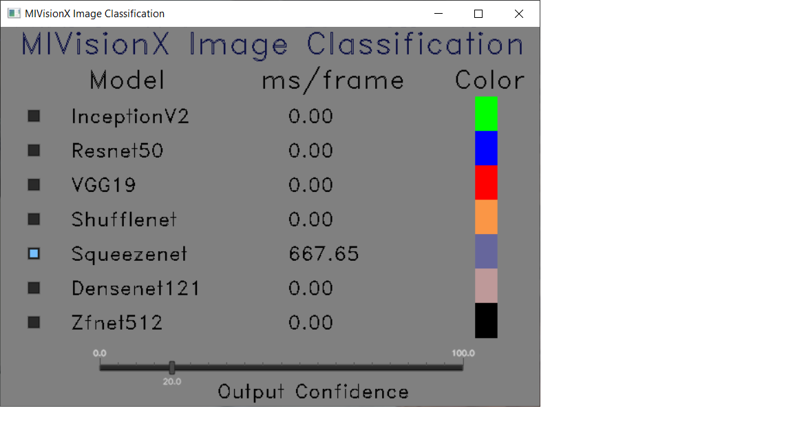

# Image Clasiification using AMD WinML Extension

This application implements a method to run WinML supported ONNX models using MIVisionX RunTime. This c/c++ implementation does image classification on live camera capture or pre-recorded video stream.

This application is a sample for developing windows application using MIVisionX WinML extension.

## Build Instructions

### Pre-requisites

* Windows 10, [version `1809` or later](https://www.microsoft.com/software-download/windows10)
* Windows SDK, build `17763` or later
* Visual Studio 2017, [version `15.7.4` or later](https://developer.microsoft.com/en-us/windows/downloads)
    - Visual Studio extension for C++/WinRT
* Install [OpenCL SDK](https://github.com/GPUOpen-LibrariesAndSDKs/OCL-SDK/releases/tag/1.0)
* [OpenCV 3.4+](https://github.com/opencv/opencv/releases/tag/3.4.0)
  + Set `OpenCV_DIR` environment variable to `OpenCV/build` folder
  + Add `OpenCV_DIR\x64\vc14\bin` or `OpenCV_DIR\x64\vc15\bin` to your `PATH`

### Build using `Visual Studio 2017` on 64-bit Windows 10

* Use `apps/mivisonx_winml_classifier/winml_classifier.sln` to build for x64 platform

## Run

### Step 1. Get ONNX model

* Get the WinML supported Classification ONNX models from [onnx github](https://github.com/onnx/models). ONNX version 1.3 is recommended.
* The supported models are: inceptionV2, resnet50, vgg19, shufflenet, squeezenet, densenet121, zfnet512. 

### Step 2. Build the app using winml_classifier.sln on Visual Studio.

### Step 3. Run tests

### Usage:

* Use Command Prompt or Windows Powershell to run the app

``` 
 .\winml_classifier.exe --inception  <FULL_PATH_TO\inception_v2\model.onnx> [OPTIONAL]  
                        --resnet50   <FULL_PATH_TO\resnet50\model.onnx>     [OPTIONAL] 
                        --vgg19      <FULL_PATH_TO\vgg19\model.onnx>        [OPTIONAL] 
                        --shufflenet <FULL_PATH_TO\shufflenet\model.onnx>   [OPTIONAL] 
                        --squeezenet <FULL_PATH_TO\squeezenet\model.onnx>   [OPTIONAL] 
                        --densenet   <FULL_PATH_TO\densenet\model.onnx>     [OPTIONAL] 
                        --zfnet      <FULL_PATH_TO\zfnet\model.onnx>        [OPTIONAL] 
                        --label FULL_PATH_TO\amd_openvx_extensions\amd_winml\samples\data\Labels.txt [REQUIRED]
                        --capture 0/ --video <video file>  [REQUIRED]
```

## MIVisionX Image Classification



## MIVisionX Image Classification using WinML


Example:

``` 
 .\winml_classifier.exe --inception FULL_PATH_TO\inception_v2\model.onnx
                        --resnet50  FULL_PATH_TO\resnet50\model.onnx 
                        --zfnet FULL_PATH_TO\zfnet\model.onnx 
                        --label FULL_PATH_TO\MIVisionX\amd_openvx_extensions\amd_winml\samples\data\Labels.txt
                        --capture 0
 ```
