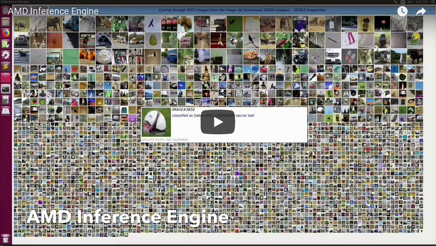
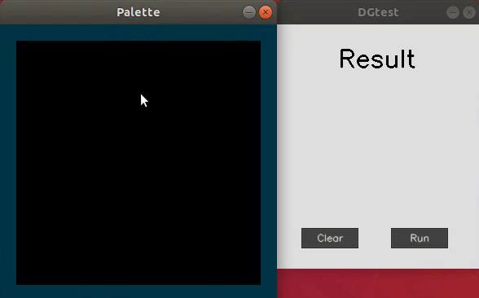
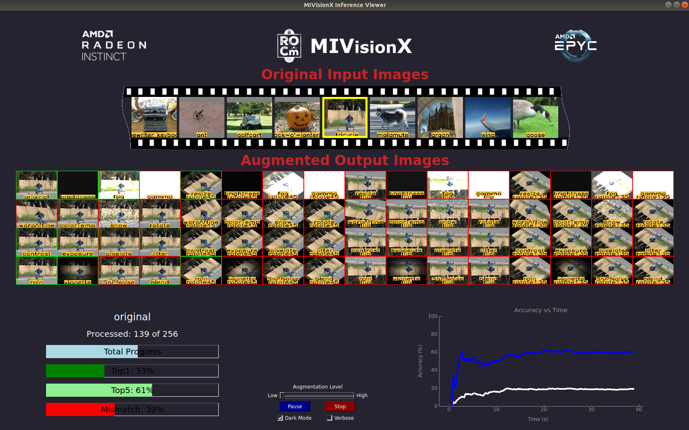

.. meta::
  :description: MIVisionX API
  :keywords: MIVisionX, ROCm, API, reference, data type, support

.. _applications:

******************************************
MIVisionX example applications
******************************************

MIVisionX has several applications built on top of OpenVX and its modules, it uses AMD optimized libraries to build applications that can be used as examples for developing your own applications.

Prerequisites
================

    * :doc:`MIVisionX Installation <../install/installation>`

Bubble Pop
==========

The `Bubble Pop application <https://github.com/ROCm/MIVisionX/blob/master/apps/bubble_pop/README.md>`_ creates bubbles and donuts to pop using OpenVX & OpenCV functionality.

.. image:: ../data/vx-pop-app.gif
    :alt: Image of person popping bubbles

Cloud Application
=================

The `Cloud application <https://github.com/ROCm/MIVisionX/blob/master/apps/cloud_inference/README.md>`_ performs inference using a client-server system.

DG Test
=======

The `DG test application <https://github.com/ROCm/MIVisionX/blob/master/apps/dg_test/README.md>`_ recognizes handwritten digits.

MIVisionX Inference Analyzer
============================

The `MIVisionX Inference Analyzer application <https://github.com/ROCm/MIVisionX/blob/master/apps/mivisionx_inference_analyzer/README.md>`_ uses pre-trained ONNX, NNEF, and Caffe models to analyze and summarize images.

.. image:: ../data/inference_analyzer.gif
    :alt: Varied images flashing on a display

MIVisionX OpenVX Classsifier
============================

The `MIVision OpenVX Classification application <https://github.com/ROCm/MIVisionX/blob/master/apps/mivisionx_openvx_classifier/README.md>`_ runs supported pre-trained Caffe models with MIVisionX RunTime.

.. image:: ../data/mivisionx_openvx_classifier_imageClassification.png
    :alt: Image of listed names and color spectrum

MIVisionX Validation Tool
=========================

The `MIVisionX ML Model Validation application <https://github.com/ROCm/MIVisionX/blob/master/apps/mivisionx_validation_tool/README.md>`_ uses pre-trained `ONNX` / `NNEF` / `Caffe` models to analyze, summarize, & validate images.

MIVisionX WinML Classifier
==============================

The `WinML Classification application <https://github.com/ROCm/MIVisionX/blob/master/apps/mivisionx_winml_classifier/README.md>`_ demonstrates running supported ONNX models with MIVisionX RunTime on Windows.

.. image:: https://raw.githubusercontent.com/ROCm/MIVisionX/master/apps/mivisionx_winml_classifier/images/MIVisionX-ImageClassification-WinML.png
    :alt: Image of coffee cup with data

MIVisionX WinML YoloV2
======================

The `WinML YoloV2 application <https://github.com/ROCm/MIVisionX/blob/master/apps/mivisionx_winml_yolov2/README.md>`_ shows how to run tiny yolov2(20 classes) with MIVisionX RunTime on Windows.

.. image:: https://raw.githubusercontent.com/ROCm/MIVisionX/master/apps/mivisionx_winml_yolov2/image/cat-yolo.jpg
    :alt: Image of two cats sitting together

Optical Flow
============

The `Optical Flow application <https://github.com/ROCm/MIVisionX/blob/master/apps/optical_flow/README.md>`_ creates an OpenVX graph to run Optical Flow on a video or live stream. This sample application uses OpenCV to decode input video and display the output.

.. image:: ../data/optical_flow_video.gif
    :alt: Video image of traffic at intersection with markers

External Applications
=====================

* `MIVisionX-Classifier <https://github.com/kiritigowda/MIVisionX-Classifier>`_ - This application runs CNN image classifiers on live or pre-recorded video stream.

* `YOLOv2 <https://github.com/kiritigowda/YoloV2NCS>`_ - Run tiny yolov2 (20 classes) with AMD's MIVisionX

* `Traffic Vision <https://github.com/srohit0/trafficVision#traffic-vision>`_ - This application detects cars and buses in live traffic at 50 frames/sec with HD resolution (1920x1080) using deep learning network Yolo-V2. The model used in the app is optimized for inferencing performance on AMD-GPUs using the MIVisionX toolkit.

.. image:: https://raw.githubusercontent.com/srohit0/trafficVision/master/media/traffic_viosion.gif
    :alt: Video image of traffic at intersection with markers

* `RGBDSLAMv2-MIVisionX <https://github.com/ICURO-AI-LAB/RGBDSLAMv2-MIVisionX>`_ - This is an implementation of RGBDSLAM_V2 using AMD MIVisionX for feature detection and ROCm OpenCL for offloading computations to Radeon GPUs. This application is used to create 3D maps using RGB-D Cameras.
