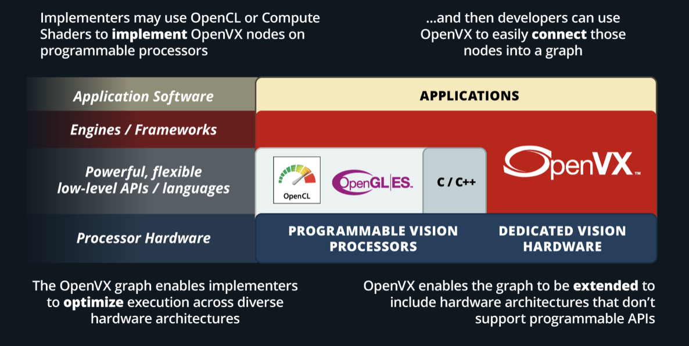

.. meta::
  :description: MIVisionX API
  :keywords: MIVisionX, ROCm, API, reference, data type, support

.. _amd-openvx:

******************************************
AMD OpenVX documentation
******************************************

AMD OpenVX is a highly optimized conformant open-source implementation of the `Khronos OpenVX Version 1.3 <https://www.khronos.org/registry/OpenVX/specs/1.3/html/OpenVX_Specification_1_3.html>`_ computer vision specification. Khronos OpenVX is an open, royalty-free standard for cross-platform acceleration of computer vision applications. It allows for rapid prototyping as well as fast execution on a wide range of computer hardware, including small embedded `AMD64` CPUs and large workstation discrete GPUs. OpenVX enables performance and power-optimized computer vision processing, especially important in embedded and real-time use cases such as face, body and gesture tracking, smart video surveillance, advanced driver assistance systems (ADAS), object and scene reconstruction, augmented reality, visual inspection, robotics and more.

|

* `Khronos OpenVX API <https://www.khronos.org/openvx/>`_ offers a set of optimized primitives for low-level image processing, computer vision, and neural net operators. The API provides a simple method to write optimized code that is portable across multiple hardware vendors and platforms.

* OpenVX allows for resource and execution abstractions, which enable hardware vendors to optimize their implementation for their platform, such as the AMD OpenVX library. Performance portability across CPUs, GPUs, and special-function hardware is one of the design goals of the OpenVX specification. 

* OpenVX is used to build, verify, and coordinate computer vision and neural network graph executions. The graph abstraction enables OpenVX implementation to optimize execution for the underlying hardware.  Using optimized OpenVX conformant implementation, software developers can spend more time on algorithmic innovations without worrying about the performance and portability of their applications.

* The standard defines graph conventions and execution semantics to address the needs of the developers. The advantage of the graphical interface is the ability of the underlying conformant implementation to optimize the whole graph pipeline instead of specific functions.

* OpenVX specification also defines the VXU or the immediate function library. VXU operators allow developers to use all the OpenVX operators as a directly callable C function without creating a graph first.

* Applications built using the VXU library do not benefit from the optimizations enabled by graph execution. The VXU library can be the simplest way to use OpenVX and is the first step in porting existing vision applications.

AMD OpenVX features
===================

* The code is highly optimized for both x86 CPU and OpenCL/HIP for GPU
* Supported hardware spans the range from low power embedded APUs, laptops, desktops, and workstation graphics
* Supports ``Windows``, ``Linux``, and ``macOS``
* Includes a ``graph optimizer`` that looks at the entire processing pipeline and removes/replaces/merges functions to improve performance and minimize bandwidth at runtime 
* Scripting support with `RunVX <https://github.com/ROCm/MIVisionX/tree/master/utilities/runvx>`_ allows for rapid prototyping, without re-compiling at production performance levels

.. note:: 
  The amd_openvx project includes the `AMD OpenVX Library <https://github.com/ROCm/MIVisionX/blob/master/amd_openvx/openvx/README.md>`_. 

Vision conformant feature set implementation
--------------------------------------------

The Vision conformant feature set includes all the functions and objects in the `base feature set`, plus the vision data objects and vision functions. 

Base feature set
^^^^^^^^^^^^^^^^

The purpose is to define a minimal subset of OpenVX features that enable the construction and execution of OpenVX graphs, but does not contain any specific vision-processing operations. The basic framework objects delivered include the following. Refer to `Basic framework Objects <https://www.khronos.org/registry/OpenVX/specs/1.3/html/OpenVX_Specification_1_3.html#sec_framework_objects>`_ for more information. 

* vx_reference
* vx_context
* vx_graph
* vx_kernel
* vx_node
* vx_parameter 
* vx_meta_format
* vx_delay

Vision conformance feature set
^^^^^^^^^^^^^^^^^^^^^^^^^^^^^^

Provides a basic set of vision processing functions roughly equivalent to the set of functions available in `version 1.1 <https://registry.khronos.org/OpenVX/specs/1.1/html/da/db6/group__group__vision__functions.html>`_ of the OpenVX specification. In addition to the framework objects included in the Base feature set, the Vision conformance feature set includes the following set of data objects that the Vision functions operate upon and produce. Refer to `Vision conformant data objects <https://www.khronos.org/registry/OpenVX/specs/1.3/html/OpenVX_Specification_1_3.html#sec_data_objects>`_ for more information. 

Vision conformance data objects
^^^^^^^^^^^^^^^^^^^^^^^^^^^^^^^

* vx_array
* vx_convolution
* vx_distribution
* vx_image
* vx_lut
* vx_matrix 
* vx_pyramid
* vx_remap
* vx_scalar
* vx_threshold 
* vx_object_array

.. _amd-openvx-functions:

Vision Conformance Functions
^^^^^^^^^^^^^^^^^^^^^^^^^^^^

Specific `Vision conformance functions <https://www.khronos.org/registry/OpenVX/specs/1.3/html/OpenVX_Specification_1_3.html#group_vision_functions>`_ in the feature set include the following: 

* `AbsDiff <https://registry.khronos.org/OpenVX/specs/1.3/html/OpenVX_Specification_1_3.html#group_vision_function_absdiff>`_
* `Add <https://registry.khronos.org/OpenVX/specs/1.3/html/OpenVX_Specification_1_3.html#group_vision_function_add>`_
* `And <https://registry.khronos.org/OpenVX/specs/1.3/html/OpenVX_Specification_1_3.html#group_vision_function_and>`_
* `Box3x3 <https://registry.khronos.org/OpenVX/specs/1.3/html/OpenVX_Specification_1_3.html#group_vision_function_box_image>`_
* `CannyEdgeDetector <https://registry.khronos.org/OpenVX/specs/1.3/html/OpenVX_Specification_1_3.html#group_vision_function_canny>`_ 
* `ChannelCombine <https://registry.khronos.org/OpenVX/specs/1.3/html/OpenVX_Specification_1_3.html#group_vision_function_channelcombine>`_
* `ChannelExtract <https://registry.khronos.org/OpenVX/specs/1.3/html/OpenVX_Specification_1_3.html#group_vision_function_channelextract>`_ 
* `ColorConvert <https://registry.khronos.org/OpenVX/specs/1.3/html/OpenVX_Specification_1_3.html#group_vision_function_colorconvert>`_ 
* `ConvertDepth <https://registry.khronos.org/OpenVX/specs/1.3/html/OpenVX_Specification_1_3.html#group_vision_function_convertdepth>`_
* `Convolve <https://registry.khronos.org/OpenVX/specs/1.3/html/OpenVX_Specification_1_3.html#group_vision_function_custom_convolution>`_
* `Dilate3x3 <https://registry.khronos.org/OpenVX/specs/1.3/html/OpenVX_Specification_1_3.html#group_vision_function_dilate_image>`_
* `EqualizeHist <https://registry.khronos.org/OpenVX/specs/1.3/html/OpenVX_Specification_1_3.html#group_vision_function_equalize_hist>`_
* `Erode3x3 <https://registry.khronos.org/OpenVX/specs/1.3/html/OpenVX_Specification_1_3.html#group_vision_function_erode_image>`_
* `FastCorners <https://registry.khronos.org/OpenVX/specs/1.3/html/OpenVX_Specification_1_3.html#group_vision_function_fast>`_
* `Gaussian3x3 <https://registry.khronos.org/OpenVX/specs/1.3/html/OpenVX_Specification_1_3.html#group_vision_function_gaussian_image>`_
* `GaussianPyramid <https://registry.khronos.org/OpenVX/specs/1.3/html/OpenVX_Specification_1_3.html#group_vision_function_gaussian_pyramid>`_
* `HarrisCorners <https://registry.khronos.org/OpenVX/specs/1.3/html/OpenVX_Specification_1_3.html#group_vision_function_harris>`_
* `HalfScaleGaussian <https://registry.khronos.org/OpenVX/specs/1.3/html/OpenVX_Specification_1_3.html#group_vision_function_gaussian_pyramid>`_
* `Histogram <https://registry.khronos.org/OpenVX/specs/1.3/html/OpenVX_Specification_1_3.html#group_vision_function_histogram>`_
* `IntegralImage <https://registry.khronos.org/OpenVX/specs/1.3/html/OpenVX_Specification_1_3.html#group_vision_function_integral_image>`_
* `LaplacianPyramid <https://registry.khronos.org/OpenVX/specs/1.3/html/OpenVX_Specification_1_3.html#group_vision_function_laplacian_pyramid>`_
* `LaplacianReconstruct <https://registry.khronos.org/OpenVX/specs/1.3/html/OpenVX_Specification_1_3.html#group_vision_function_laplacian_reconstruct>`_
* `Magnitude <https://registry.khronos.org/OpenVX/specs/1.3/html/OpenVX_Specification_1_3.html#group_vision_function_magnitude>`_
* `MeanStdDev <https://registry.khronos.org/OpenVX/specs/1.3/html/OpenVX_Specification_1_3.html#group_vision_function_meanstddev>`_
* `Median3x3 <https://registry.khronos.org/OpenVX/specs/1.3/html/OpenVX_Specification_1_3.html#group_vision_function_median_image>`_
* `MinMaxLoc <https://registry.khronos.org/OpenVX/specs/1.3/html/OpenVX_Specification_1_3.html#group_vision_function_minmaxloc>`_
* `Multiply <https://registry.khronos.org/OpenVX/specs/1.3/html/OpenVX_Specification_1_3.html#group_vision_function_mult>`_
* `NonLinearFilter <https://registry.khronos.org/OpenVX/specs/1.3/html/OpenVX_Specification_1_3.html#group_vision_function_nonlinear_filter>`_
* `Not <https://registry.khronos.org/OpenVX/specs/1.3/html/OpenVX_Specification_1_3.html#group_vision_function_not>`_
* `OpticalFlowPyrLK <https://registry.khronos.org/OpenVX/specs/1.3/html/OpenVX_Specification_1_3.html#group_vision_function_opticalflowpyrlk>`_
* `Or <https://registry.khronos.org/OpenVX/specs/1.3/html/OpenVX_Specification_1_3.html#group_vision_function_or>`_
* `Phase <https://registry.khronos.org/OpenVX/specs/1.3/html/OpenVX_Specification_1_3.html#group_vision_function_phase>`_
* `Remap <https://registry.khronos.org/OpenVX/specs/1.3/html/OpenVX_Specification_1_3.html#group_vision_function_remap>`_
* `ScaleImage <https://registry.khronos.org/OpenVX/specs/1.3/html/OpenVX_Specification_1_3.html#group_vision_function_scale_image>`_
* `Sobel3x3 <https://registry.khronos.org/OpenVX/specs/1.3/html/OpenVX_Specification_1_3.html#group_vision_function_sobel3x3>`_
* `Subtract <https://registry.khronos.org/OpenVX/specs/1.3/html/OpenVX_Specification_1_3.html#group_vision_function_sub>`_
* `TableLookup <https://registry.khronos.org/OpenVX/specs/1.3/html/OpenVX_Specification_1_3.html#group_vision_function_lut>`_
* `Threshold <https://registry.khronos.org/OpenVX/specs/1.3/html/OpenVX_Specification_1_3.html#group_vision_function_threshold>`_
* `WarpAffine <https://registry.khronos.org/OpenVX/specs/1.3/html/OpenVX_Specification_1_3.html#group_vision_function_warp_affine>`_
* `WarpPerspective <https://registry.khronos.org/OpenVX/specs/1.3/html/OpenVX_Specification_1_3.html#group_vision_function_warp_perspective>`_
* `WeightedAverage <https://registry.khronos.org/OpenVX/specs/1.3/html/OpenVX_Specification_1_3.html#group_vision_function_weighted_average>`_
* `Xor <https://registry.khronos.org/OpenVX/specs/1.3/html/OpenVX_Specification_1_3.html#group_vision_function_xor>`_

AMD OpenVX - Extensions
-----------------------

The OpenVX framework provides an extension mechanism to add new vision functions to OpenVX by 3rd party vendors. As described in `AMD OpenVX Extensions <https://github.com/ROCm/MIVisionX/blob/master/amd_openvx_extensions/README.md>`_, AMD provided extensions include the following: 

  * **amd_custom**: Custom node extension module 
  * **amd_loomsl**: Radeon LOOM stitching library for live 360-degree video applications
  * **amd_media**: Media extension module for video and JPG encoding and decoding
  * **amd_migraphx**: enables importing `MIGraphx library <https://github.com/ROCm/AMDMIGraphX>`_ into an OpenVX graph for inference
  * **amd_nn**: Neural network module built on top of `MIOpen library <https://github.com/ROCmSoftwarePlatform/MIOpen>`_
  * **amd_opencv**: OpenCV extension module to access OpenCV functionality as OpenVX kernels
  * **amd_rpp**: Extension to access RPP  `ROCm Performance Primitives (RPP) <https://github.com/ROCm/rpp>`_ functionality as OpenVX kernels
  * **amd_winml**: Module to access Windows Machine Learning (WinML) functionality as OpenVX kernels

.. note::
  OpenVX and the OpenVX logo are trademarks of the Khronos Group Inc.
