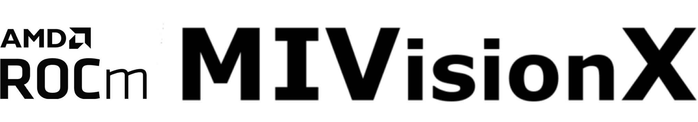

# MIVisionX

MIVisionX toolkit is a set of comprehensive computer vision and machine intelligence libraries, utilities, and applications bundled into a single toolkit. AMD MIVisionX delivers highly optimized conformant open-source implementation of the <a href="https://www.khronos.org/openvx/" target="_blank">Khronos OpenVX&trade;</a> and OpenVX&trade; Extensions along with Convolution Neural Net Model Compiler & Optimizer supporting <a href="https://onnx.ai/" target="_blank">ONNX</a>, and <a href="https://www.khronos.org/nnef" target="_blank">Khronos NNEF&trade;</a> exchange formats. The toolkit allows for rapid prototyping and deployment of optimized computer vision and machine learning inference workloads on a wide range of computer hardware, including small embedded x86 CPUs, APUs, discrete GPUs, and heterogeneous servers.

#### Latest Release

## Table of Contents
- [AMD OpenVX™](amd-openvx.md)
- [AMD OpenVX™ Extensions](amd-openvx-extensions.md)
- [Applications](applications.md)
- [Neural Net Model Compiler \& Optimizer](neural-net-model-compiler--optimizer.md)
- [rocAL](rocal.md)
- [Toolkit](toolkit.md)
- [Utilities](utilities.md)
- [Prerequisites](prerequisites.md)
- [Build \& Install MIVisionX](build--install-mivisionx.md)
- [Verify the Installation](verify-the-installation.md)
- [Docker](docker.md)
- [Technical Support](technical-support.md)
- [Release Notes](release-notes.md)
- [MIVisionX Dependency Map](mivisionx-dependency-map.md)

**NOTE:** OpenVX and the OpenVX logo are trademarks of the Khronos Group Inc.
