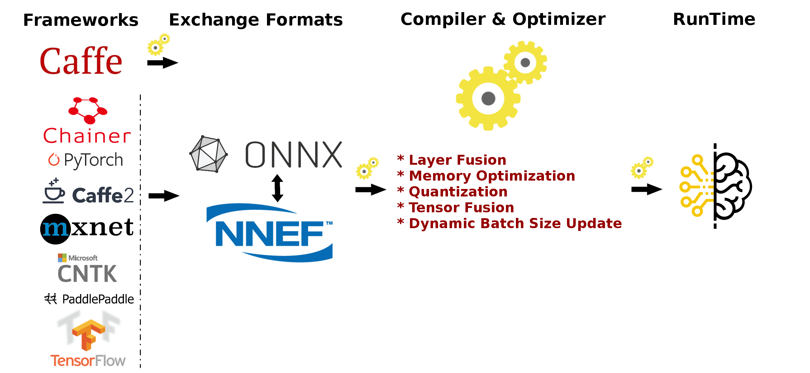
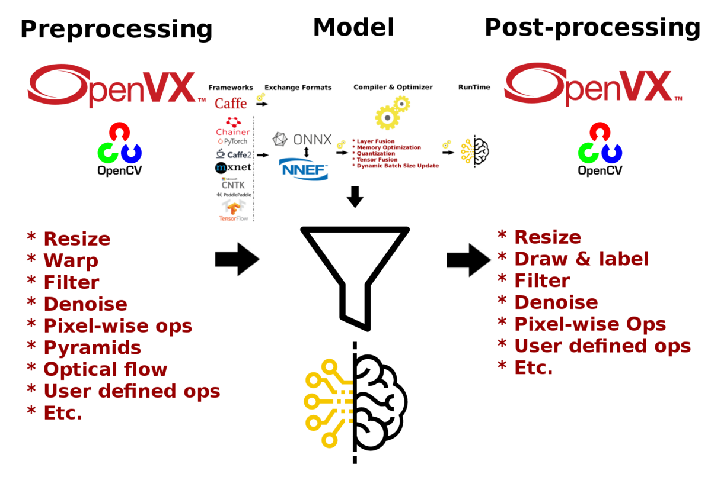
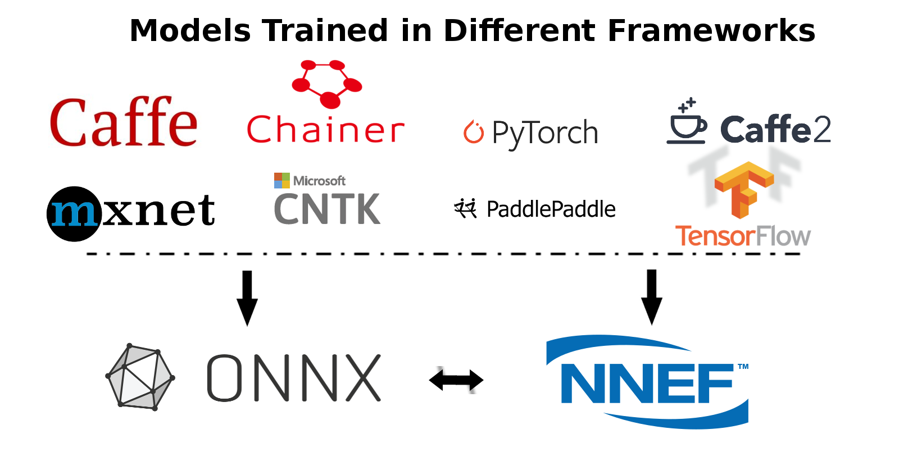

.. meta::
  :description: MIVisionX API
  :keywords: MIVisionX, ROCm, API, reference, data type, support

.. _index:

******************************************
Neural net model compiler & optimizer
******************************************

.. image:: ../data/modelCompilerWorkflow.png
    :alt: Diagram showing pretrained models compiled for use with MIVisionX runtime

The neural net model compiler & optimizer converts pre-trained neural network models to MIVisionX runtime code for optimized inference. Pre-trained models in `ONNX <https://onnx.ai/>`_, `NNEF <https://www.khronos.org/nnef>`_, & `Caffe <http://caffe.berkeleyvision.org/>`_ formats are supported by the model compiler & optimizer. 

The model compiler first converts the pre-trained models to AMD's internal open format called Neural Net Intermediate Representation (NNIR). Then the optimizer goes through the NNIR and applies various optimizations which allow the model to be deployed onto target hardware most efficiently. Finally, NNIR is converted into OpenVX C code which is compiled and deployed on the targeted AMD hardware.

 

MIVisionX runTime
=================

MIVisionX allows hundreds of different :doc:`AMD OpenVX <../amd_openvx/amd_openvx>`, and `OpenCV interop <https://github.com/ROCm/MIVisionX/blob/master/amd_openvx_extensions/amd_opencv/README.md#list-of-opencv-interop-kernels>`_ vision functions to be directly added into the OpenVX C code generated by the model compiler & optimizer for preprocessing the input to the neural network model and post-processing the model results, allowing users to create an end-to-end solution to be deployed on any targeted AMD hardware.

 
.. note::
    Setup the model compiler & optimizer as described in :ref:`model-compiler-install`

The sample applications available in `samples/model_compiler_samples <https://github.com/ROCm/MIVisionX/blob/master/samples/model_compiler_samples/README.md>`_, demonstrate how to run inference efficiently using AMD's open source implementation of OpenVX and OpenVX extensions. The samples review each step required to convert a pre-trained neural net model into an OpenVX graph and run this graph efficiently on the target hardware. 

* `Sample-1: Classification Using Pre-Trained ONNX Model <https://github.com/ROCm/MIVisionX/blob/master/samples/model_compiler_samples/README.md#sample-1---classification-using-pre-trained-onnx-model>`_
* `Sample-2: Detection Using Pre-Trained Caffe Model <https://github.com/ROCm/MIVisionX/blob/master/samples/model_compiler_samples/README.md#sample-2---detection-using-pre-trained-caffe-model>`_ 
* `Sample-3: Classification Using Pre-Trained NNEF Model <https://github.com/ROCm/MIVisionX/blob/master/samples/model_compiler_samples/README.md#sample-3---classification-using-pre-trained-nnef-model>`_
* `Sample-4: Classification Using Pre-Trained Caffe Model <https://github.com/ROCm/MIVisionX/blob/master/samples/model_compiler_samples/README.md#sample-4---classification-using-pre-trained-caffe-model>`_

Model compiler & optimizer usage
================================

The following steps describe the use of model compiler & optimizer to convert pre-trained 
neural net Caffe, ONNX, and NNEF models into AMD's intermediate NNIR format, optimize the NNIR, and then generate the OpenVX code.  

Step 1 - Convert Pre-trained model to NNIR
------------------------------------------

Caffe
^^^^^

To convert a pre-trained Caffe model into NNIR model:

.. code-block:: shell
    
    % python3 caffe_to_nnir.py <net.caffeModel> <nnirOutputFolder> --input-dims <n,c,h,w> [OPTIONS]

    OPTIONS:
        --verbose <0|1> [defualt: 0]
        --node_type_append <0|1> [default: 0; appends node type name to output names

ONNX
^^^^

To convert an ONNX model into NNIR model:

.. code-block:: shell
    
    % python3 onnx_to_nnir.py <model.onnx> <nnirModelFolder> [OPTIONS]

    OPTIONS:
        --input_dims n,c,h,w
        --node_type_append <0|1> [default: 0; appends node type name to output names]

NNEF
^^^^

To convert a NNEF model into NNIR model:

.. code-block:: shell
    
    % python3 nnef_to_nnir.py <nnefInputFolder> <nnirOutputFolder> [OPTIONS]

    OPTIONS:
        --node_type_append <0|1> [default: 0; appends node type name to output names]

.. note:: 
    If you want to create NNEF models from pre-trained caffe or tensorflow models, use `NNEF Converter <https://github.com/KhronosGroup/NNEF-Tools>`_ or try NNEF models at `NNEF Model Zoo <https://github.com/KhronosGroup/NNEF-Tools/tree/master/models#nnef-model-zoo>`_

Step 2 - Apply Optimizations
----------------------------

To update batch size in AMD NNIR model:

.. code-block:: shell
    
    % python3 nnir_update.py --batch-size <N> <nnirModelFolder> <nnirModelFolderN>

To fuse operations in AMD NNIR model (like batch normalization into convolution):

.. code-block:: shell
    
    % python3 nnir_update.py --fuse-ops <1> <nnirModelFolderN> <nnirModelFolderFused>

To quantize the model to float 16

.. code-block:: shell
    
    % python3 nnir_update.py --convert-fp16 <1> <nnirModelFolderN> <nnirModelFolderFused>

To workaround groups using slice and concat operations in AMD NNIR model:

.. code-block:: shell
    
    % python3 nnir_update.py --slice-groups <1> <nnirModelFolderFused> <nnirModelFolderSliced>

Step 3 - Convert NNIR to OpenVX C code
------------------------------------------

To convert an NNIR model into OpenVX C code:

.. code-block:: shell
    
    % python3 nnir_to_openvx.py --help

    Usage: python nnir_to_openvx.py [OPTIONS] <nnirInputFolder> <outputFolder>

    OPTIONS:
        --argmax UINT8                    -- argmax at the end with 8-bit output
        --argmax UINT16                   -- argmax at the end with 16-bit output
        --argmax <fileNamePrefix>rgb.txt  -- argmax at the end with RGB color mapping using LUT
        --argmax <fileNamePrefix>rgba.txt -- argmax at the end with RGBA color mapping using LUT
        --help                            -- show this help message

    LUT File Format (RGB): 8-bit R G B values one per each label in text format
        R0 G0 B0
        R1 G1 B1
        ...

    LUT File Format (RGBA): 8-bit R G B A values one per each label in text format
        R0 G0 B0 A0
        R1 G1 B1 A1
        ...

Example of model compiler workflow
==================================

The following demonstrates converting a trained Caffe model to NNIR, and then to OpenVX graph. 

* Step 1: Convert net.caffemodel into NNIR model using the following command

.. code-block:: shell
    
    % python3 caffe_to_nnir.py <net.caffeModel> <nnirOutputFolder> --input-dims n,c,h,w [--verbose 0|1]

* Step 2: Compile NNIR model into OpenVX C code with ``CMakelists.txt`` for compiling and building inference library

.. code-block:: shell
    
    % python3 nnir_to_openvx.py <nnirModelFolder> <nnirModelOutputFolder>

* Step 3: cmake and make the project inside the nnirModelOutputFolder

.. code-block:: shell
    
    % cd nnirModelOutputFolder
    % cmake .
    % make

* Step 4: Run ``anntest`` application for testing the inference with input and output tensor

.. code-block:: shell
    
    % ./anntest weights.bin

* Step 5: The shared C library (``libannmodule.so``) can be used in any customer application

Examples for OpenVX C code generation
=====================================

Generate OpenVX and test code that can be used dump and compare raw tensor data:

.. code-block:: shell
    
    % python3 nnir_to_openvx.py nnirInputFolderFused openvxCodeFolder
    % mkdir openvxCodeFolder/build
    % cd openvxCodeFolder/build
    % cmake ..
    % make
    % ./anntest

    Usage: anntest <weights.bin> [<input-data-file(s)> [<output-data-file(s)>]]<--add ADD> <--multiply MULTIPLY>]

    <input-data-file>: is filename to initialize tensor
        .jpg or .png: decode and initialize for 3 channel tensors
            (use %04d in fileName to when batch-size > 1: batch index starts from 0)
        other: initialize tensor with raw data from the file

    <output-data-file>[,<reference-for-compare>,<maxErrorLimit>,<rmsErrorLimit>]:
        <referece-to-compare> is raw tensor data for comparision
        <maxErrorLimit> is max absolute error allowed
        <rmsErrorLimit> is max RMS error allowed
        <output-data-file> is filename for saving output tensor data
        '-' to ignore
        other: save raw tensor into the file
        
    <add>: input preprocessing factor [optional - default:[0,0,0]]
    
    <multiply>: input preprocessing factor [optional - default:[1,1,1]]

    % ./anntest ../weights.bin input.f32 output.f32,reference.f32,1e-6,1e-9 --add -2.1,-2.07,-1.8 --multiply 0.017,0.017,0.017
    ...

Generate OpenVX and test code with argmax that can be used dump and compare 16-bit argmax output tensor:

.. code-block:: shell
    
    % python3 nnir_to_openvx.py --argmax UINT16 nnirInputFolderFused openvxCodeFolder
    % mkdir openvxCodeFolder/build
    % cd openvxCodeFolder/build
    % cmake ..
    % make
    % ./anntest

    Usage: anntest <weights.bin> [<input-data-file(s)> [<output-data-file(s)>]]]

    <input-data-file>: is filename to initialize tensor
        .jpg or .png: decode and initialize for 3 channel tensors
            (use %04d in fileName to when batch-size > 1: batch index starts from 0)
        other: initialize tensor with raw data from the file

    <output-data-file>[,<reference-for-compare>,<percentErrorLimit>]:
        <referece-to-compare> is raw tensor data of argmax output for comparision
        <percentMismatchLimit> is max mismatch (percentage) allowed
        <output-data-file> is filename for saving output tensor data
        '-' to ignore
        other: save raw tensor into the file

    % ./anntest ../weights.bin input-%04d.png output.u16,reference.u16,0.01
    ...

Generate OpenVX and test code with argmax and LUT that is designed for semantic segmentation use cases. You can dump output in raw format or PNGs and additionally compare with reference data in raw format.

.. code-block:: shell
    
    % python3 nnir_to_openvx.py --argmax lut-rgb.txt nnirInputFolderFused openvxCodeFolder
    % mkdir openvxCodeFolder/build
    % cd openvxCodeFolder/build
    % cmake ..
    % make
    % ./anntest

    Usage: anntest <weights.bin> [<input-data-file(s)> [<output-data-file(s)>]]]

    <input-data-file>: is filename to initialize tensor
        .jpg or .png: decode and initialize for 3 channel tensors
            (use %04d in fileName to when batch-size > 1: batch index starts from 0)
        other: initialize tensor with raw data from the file

    <output-data-file>[,<reference-for-compare>,<percentErrorLimit>]:
        <referece-to-compare> is raw tensor data of LUT output for comparision
        <percentMismatchLimit> is max mismatch (percentage) allowed
        <output-data-file> is filename for saving output tensor data
        .png: save LUT output as PNG file(s)
            (use %04d in fileName when batch-size > 1: batch index starts from 0)
        '-' to ignore
        other: save raw tensor into the file

    % ./anntest ../weights.bin input-%04d.png output.rgb,reference.rgb,0.01
    ...
    % ./anntest ../weights.bin input-%04d.png output-%04d.png,reference.rgb,0.01
    ...

Test code with preprocessing add / multiply values to normalize the input tensor. Some models(e.g. Inception v4) require input tensor to be normalized. You can pass the preprocessing values using --add & --multiply option.

.. code-block:: shell
    
    % ./anntest ../weights.bin input.f32 output.f32 --add -2.1,-2.07,-1.8 --multiply 0.017,0.017,0.017
    ...

Supported models & operators
============================

The following tables list the models and operators supported by different frameworks in the current release of MIVisionX. 

Models
------

    

.. |blue-sq| image:: https://raw.githubusercontent.com/ROCm/MIVisionX/master/docs/data/blue_square.png
    :alt: Blue Square

.. csv-table::
  :widths: 2, 1, 1, 1

    **Networks**, **Caffe**, **ONNX**, **NNEF**
    AlexNet, ,|blue-sq|, |blue-sq|
    Caffenet, , |blue-sq|,  
    DenseNet, , |blue-sq| 						
    Googlenet, |blue-sq| , |blue-sq| , |blue-sq| 		
    Inception-V1, , |blue-sq| , |blue-sq| 		
    Inception-V2, , |blue-sq| , |blue-sq| 			
    Inception-V3, , , 			
    Inception-V4, |blue-sq| , , 			
    MNIST, |blue-sq| , , |blue-sq| 		
    Mobilenet, , |blue-sq| , |blue-sq| 		
    MobilenetV2, , , |blue-sq| 
    ResNet-18, , , |blue-sq| 			
    ResNet-34, , , |blue-sq| 			
    ResNet-50, |blue-sq| , |blue-sq| , |blue-sq| 			
    ResNet-101, |blue-sq| , , |blue-sq| 		
    ResNet-152, |blue-sq| , , |blue-sq| 			
    ResNetV2-18, , , |blue-sq| 			
    ResNetV2-34, , , |blue-sq| 		
    ResNetV2-50, , , |blue-sq| 		
    ResNetV2-101, , , |blue-sq| 			
    Squeezenet, , |blue-sq| , |blue-sq| 			
    Tiny-Yolo-V2, |blue-sq| , , 			
    VGGNet-16, |blue-sq| , , |blue-sq| 			
    VGGNet-19, |blue-sq| , |blue-sq| , |blue-sq| 			
    Yolo-V3, |blue-sq| , , 			
    ZFNet, , |blue-sq| , 

.. note::
    MIVisionX supports `ONNX models <https://github.com/onnx/models>`_ with `release 1.1` and `release 1.3` tags

Operators
---------

.. csv-table::
  :widths: 2, 1, 1, 1

    **Layers**, **Caffe**, **ONNX**, **NNEF**
    Add, ,|blue-sq|, |blue-sq| 
    Argmax, ,|blue-sq|,|blue-sq| 
    AveragePool,,|blue-sq|,|blue-sq| 
    BatchNormalization,|blue-sq|,|blue-sq|,|blue-sq| 
    Cast,,|blue-sq|,
    Clamp,,,|blue-sq| 
    Clip,,|blue-sq|,
    Concat,|blue-sq|,|blue-sq|,|blue-sq| 
    Constant,,|blue-sq|,
    Conv,|blue-sq|,|blue-sq|,|blue-sq| 
    ConvTranspose,|blue-sq|,|blue-sq|,|blue-sq| 
    Copy,,|blue-sq|,|blue-sq| 
    Crop,|blue-sq|,,
    CropAndResize,,,
    Deconv,|blue-sq|,|blue-sq|,|blue-sq| 
    DetectionOutput,|blue-sq|,,
    Div,,|blue-sq|,|blue-sq| 
    Dropout,,,
    Eltwise,|blue-sq|,,
    Exp,,|blue-sq|,|blue-sq| 
    Equal,,|blue-sq|,
    Flatten,|blue-sq|,,
    Gather,,|blue-sq|,
    GEMM,|blue-sq|,|blue-sq|,|blue-sq| 
    GlobalAveragePool,,|blue-sq|,|blue-sq| 
    Greater,,|blue-sq|,
    GreaterOrEqual,,|blue-sq|,
    InnerProduct,|blue-sq|,,
    Interp,|blue-sq|,,
    LeakyRelu,,|blue-sq|,|blue-sq| 
    Less,,|blue-sq|,
    LessOrEqual,,|blue-sq|,
    Linear,,,|blue-sq| 
    Log,,|blue-sq|,|blue-sq| 
    LRN,|blue-sq|,|blue-sq|,|blue-sq| 
    Matmul,,|blue-sq|,|blue-sq| 
    Max,,|blue-sq|,|blue-sq| 
    MaxPool,,|blue-sq|,|blue-sq| 
    MeanReduce,,,|blue-sq| 
    Min,,|blue-sq|,|blue-sq| 
    Mul,,|blue-sq|,|blue-sq| 
    MulAdd,,,
    NonMaxSuppression,,|blue-sq|,
    Permute,|blue-sq|,,|blue-sq| 
    PriorBox,|blue-sq|,,
    ReduceMin,,|blue-sq|,
    Relu,|blue-sq|,|blue-sq|,|blue-sq| 
    Reshape,|blue-sq|,|blue-sq|,|blue-sq| 
    Shape,,|blue-sq|,
    Sigmoid,,|blue-sq|,|blue-sq| 
    Slice,,|blue-sq|,|blue-sq| 
    Split,|blue-sq|,,
    Softmax,|blue-sq|,|blue-sq|,|blue-sq| 
    SoftmaxWithLoss||blue-sq| ||
    Squeeze,,|blue-sq|,|blue-sq| 
    Sub,,|blue-sq|,|blue-sq| 
    Sum,,|blue-sq|,
    Tile,,|blue-sq|,
    TopK,,|blue-sq|,
    Transpose,,|blue-sq|,|blue-sq| 
    Unsqueeze,,|blue-sq|,|blue-sq| 
    Upsample,|blue-sq|,,|blue-sq| 

