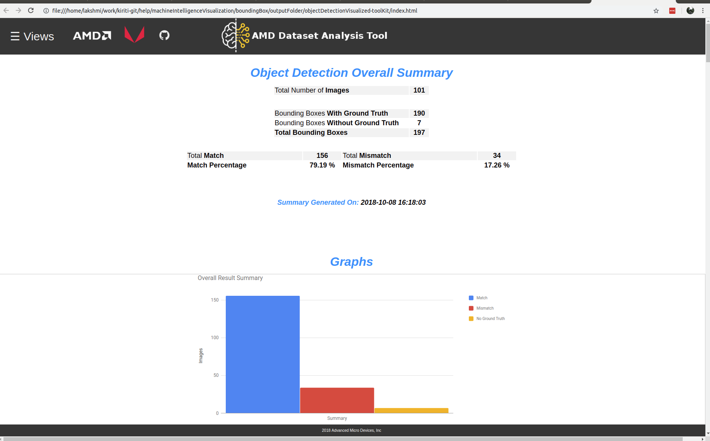

.. meta::
  :description: MIVisionX API
  :keywords: MIVisionX, ROCm, API, reference, data type, support

.. _toolkit:

******************************************
MIVisionX toolkit documentation
******************************************

AMD MIVisionX toolkit contains tools for neural net creation, development, training, and deployment. The toolkit provides you with tools to design, develop, quantize, prune, retrain, and infer your neural network work in any supported framework. MIVisionX provides you with tools for accomplishing your tasks throughout the whole neural net life-cycle, from creating a model to deploying them for your target platforms.

AMD data analysis toolkit
=========================

The `AMD data analysis toolkit (ADAT) <https://github.com/ROCm/MIVisionX/tree/master/toolkit/amd_data_analysis_toolkit>`_ is available for image classification and object detection. Features such as label summary, hierarchy, image summary, an advanced method of scoring, and many other insightful features can be viewed using this toolkit.

AMD data generation toolkit
===========================

The `AMD data generation toolkit (ADGT) <https://github.com/ROCm/MIVisionX/tree/master/toolkit/amd_data_generation_toolkit>`_ creates an image resize and validation list for a given image database and label set. The images in the dataset are assumed to have the correct labels in their metadata. The tools help to rename the dataset, resize the images, pad the images with a value(0-255) if they are resized to a square image to keep the aspect ratio, extract the labels from the metadata, and generate logs to indicate errors and mismatches in the dataset.
