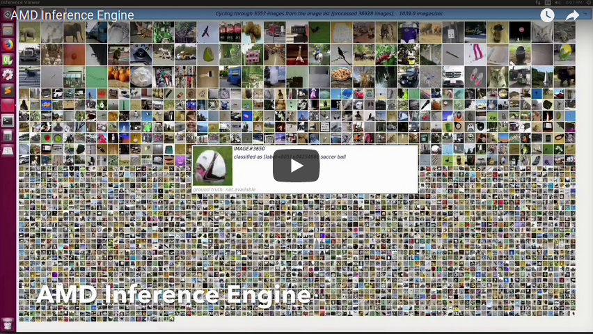
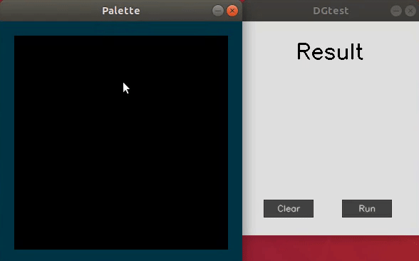
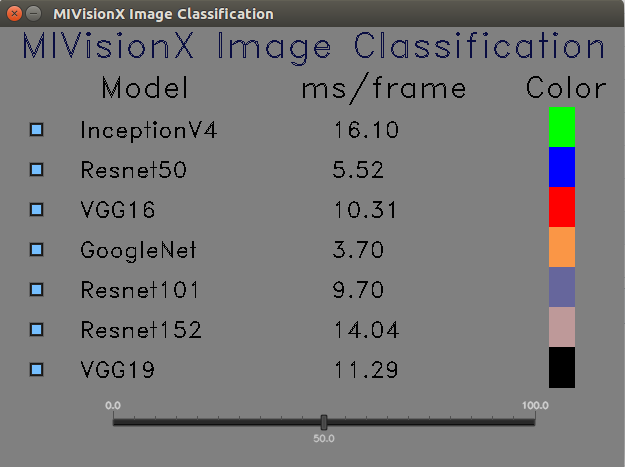
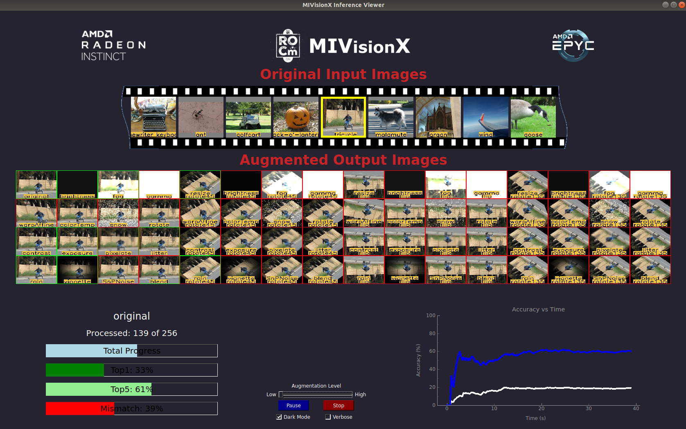

.. meta::
  :description: MIVisionX API
  :keywords: MIVisionX, ROCm, API, reference, data type, support

.. _mivisionx-apps:

******************************************
MIVisionX applications
******************************************

MIVisionX has several applications built on top of OpenVX and its modules, it uses AMD optimized libraries to build applications that can be used as prototypes or used as models to develop products.

Prerequisites
=============

* MIVisionX :ref:`installation`

Bubble pop
==========

The `Bubble Pop application <https://github.com/ROCm/MIVisionX/tree/master/apps/bubble_pop>`_ creates bubbles and donuts to pop using OpenVX & OpenCV functionality.

.. image:: ../data/vx-pop-app.gif
    :alt: Image of person popping bubbles

Cloud application
=================

The `Cloud application <https://github.com/ROCm/MIVisionX/tree/master/apps/cloud_inference>`_ does inference using a client-server system.

DG test
=======

This `DG Test application <https://github.com/ROCm/MIVisionX/blob/master/apps/dg_test>`_ is used to recognize hand written digits.

MIVisionX inference analyzer
============================

The `MIVisionX Inference Analyzer <https://github.com/ROCm/MIVisionX/tree/master/apps/mivisionx_inference_analyzer>`_ application uses pre-trained ONNX, NNEF, and Caffe models to analyze and summarize images.

.. image:: ../data/inference_analyzer.gif
    :alt: Image of flashing images

MIVisionX OpenVX classsification
================================

The `MIVision OpenVX Classification <https://github.com/ROCm/MIVisionX/tree/master/apps/mivisionx_openvx_classifier>`_ application runs supported pre-trained Caffe models with MIVisionX RunTime.

MIVisionX validation tool
=========================

The `MIVisionX ML Model Validation application <https://github.com/ROCm/MIVisionX/tree/master/apps/mivisionx_validation_tool>`_ uses pre-trained ONNX, NNEF, and Caffe models to analyze, summarize, & validate images.

MIVisionX WinML classification
==============================

The `WinML Classification application <https://github.com/ROCm/MIVisionX/tree/master/apps/mivisionx_winml_classifier>`_ demonstrates running supported ONNX models with MIVisionX RunTime on Windows.

.. image:: https://raw.githubusercontent.com/ROCm/MIVisionX/master/apps/mivisionx_winml_classifier/images/MIVisionX-ImageClassification-WinML.png
    :alt: Image of coffee cup 

MIVisionX WinML YoloV2
======================

The `WinML YoloV2 application <https://github.com/ROCm/MIVisionX/tree/master/apps/mivisionx_winml_yolov2>`_ shows how to run tiny yolov2(20 classes) with MIVisionX RunTime on Windows.

.. image:: https://raw.githubusercontent.com/ROCm/MIVisionX/master/apps/mivisionx_winml_yolov2/image/cat-yolo.jpg
    :alt: Image of two cats sitting together 

Optical Flow
============

The Optical Flow application creates an OpenVX graph to run Optical Flow on a video or live stream. This sample application uses `OpenCV <https://en.wikipedia.org/wiki/OpenCV>`_ to decode input video and display the output.

.. image:: ../data/optical_flow_video.gif
    :alt: Image of street traffic with object markers 

External Application
====================

* `MIVisionX-Classifier <https://github.com/kiritigowda/MIVisionX-Classifier>`_ - This application runs CNN image classifiers on live or pre-recorded video stream. 

* `YoloV2 <https://github.com/kiritigowda/YoloV2NCS>`_ - Run tiny yolov2 (20 classes) with AMD's MIVisionX. 

* `Traffic Vision <https://github.com/srohit0/trafficVision#traffic-vision>`_ - This application detects cars and buses in live traffic at 50 frames/sec with HD resolution (1920x1080) using deep learning network Yolo-V2. The model used in the app is optimized for inferencing performance on AMD-GPUs using the MIVisionX toolkit.

.. image:: https://raw.githubusercontent.com/srohit0/trafficVision/master/media/traffic_viosion.gif
    :alt: Image of street traffic with object markers 

* `RGBDSLAMv2-MIVisionX <https://github.com/ICURO-AI-LAB/RGBDSLAMv2-MIVisionX>`_ - This is an implementation of RGBDSLAM_V2 using AMD MIVisionX for feature detection and ROCm OpenCL for offloading computations to Radeon GPUs. This application is used to create 3D maps using RGB-D Cameras.
