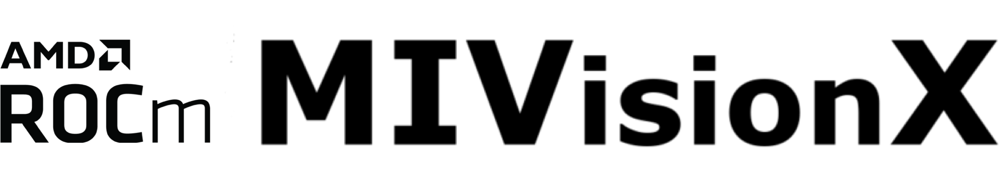
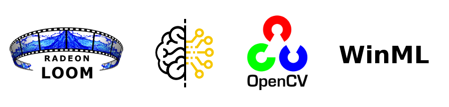
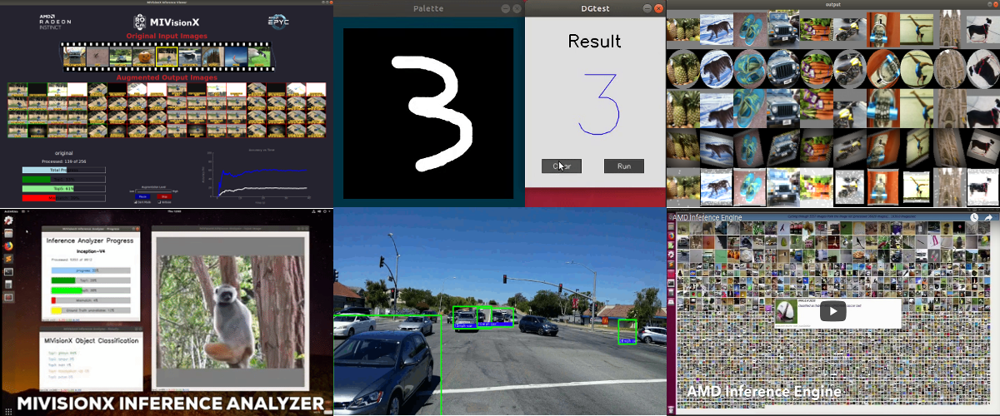
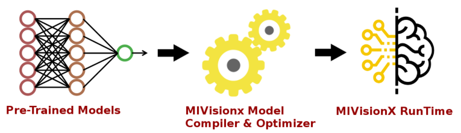

.. meta::
  :description: MIVisionX API
  :keywords: MIVisionX, ROCm, API, reference, data type, support

.. _what-is-mivisionx:

******************************************
What is MIVisionX
******************************************

AMD MIVisionX toolkit is a comprehensive set of computer vision and machine intelligence libraries, utilities, and applications bundled into a single toolkit. MIVisionX delivers highly optimized conformant open-source implementation of the `Khronos OpenVX Extensions <https://www.khronos.org/openvx/>`_ along with Convolution Neural Net Model Compiler & Optimizer supporting `ONNX <https://onnx.ai/>`_, and `Khronos NNEF <https://www.khronos.org/nnef>`_ exchange formats. The MIVisionX toolkit allows for rapid prototyping and deployment of optimized computer vision and machine learning inference workloads on a wide range of computer hardware, including small embedded x86 CPUs, APUs, discrete GPUs, and heterogeneous servers. 

AMD OpenVX
===================

:doc:`AMD OpenVX <./how-to/amd_openvx>` is a highly optimized conformant open source implementation of the `OpenVX Specification Version 1.3 <https://www.khronos.org/registry/OpenVX/specs/1.3/html/OpenVX_Specification_1_3.html>`_ computer vision specification. It allows for rapid prototyping as well as fast execution on a wide range of computer hardware, including small embedded x86 CPUs and large workstation discrete GPUs.

.. note::
   The `Khronos OpenVX 1.0.1 <https://www.khronos.org/registry/OpenVX/specs/1.0.1/html/index.html>`_ is available in `MIVisionX Lite <https://github.com/ROCm/MIVisionX/tree/openvx-1.0.1>`_. 

AMD OpenVX Extensions
======================================

The OpenVX framework provides a mechanism to add new vision functionality to OpenVX by vendors. This project has the following `OpenVX extension modules <https://github.com/ROCm/MIVisionX/tree/master/amd_openvx_extensions>`_ and utilities to extend AMD OpenVX, which contains the AMD OpenVX core engine.

* `amd_loomsl <https://github.com/ROCm/MIVisionX/tree/master/amd_openvx_extensions/amd_loomsl>`_: AMD Loom stitching library for live 360 degree video applications
* `amd_media <https://github.com/ROCm/MIVisionX/tree/master/amd_openvx_extensions/amd_media>`_: AMD media extension module is for encode and decode applications
* `amd_migraphx <https://github.com/ROCm/MIVisionX/tree/master/amd_openvx_extensions/amd_migraphx>`_: AMD MIGraphX extension integrates the `MIGraphx <https://github.com/ROCmSoftwarePlatform/AMDMIGraphX>`_ into an OpenVX graph. This extension allows developers to combine the vision functions in OpenVX with the MIGraphX and build an end-to-end application for inference.
* `amd_nn <https://github.com/ROCm/MIVisionX/tree/master/amd_openvx_extensions/amd_nn>`_: OpenVX neural network module
* `amd_opencv <https://github.com/ROCm/MIVisionX/tree/master/amd_openvx_extensions/amd_opencv>`_: OpenVX module that implements a mechanism to access OpenCV functionality as OpenVX kernels
* `amd_rpp <https://github.com/ROCm/MIVisionX/tree/master/amd_openvx_extensions/amd_rpp>`_: OpenVX extension providing an interface to some of the `ROCm Performance Primitives (RPP) <https://github.com/ROCm/rpp>`_ functions. This extension enables `rocAL <https://github.com/ROCm/rocAL>`_ to perform image augmentation.
* `amd_winml <https://github.com/ROCm/MIVisionX/tree/master/amd_openvx_extensions/amd_winml>`_: AMD WinML extension lets developers import a pre-trained ONNX model into an OpenVX graph and add hundreds of different pre & post-processing vision, generic, and user-defined functions. The functions are available in OpenVX and OpenCV interop, and can be added to the input and output of the neural net model. This extension intends to help developers build an end-to-end application for inference.

Applications
=================

MIVisionX has several :doc:`example applications <./tutorials/mivisionx-apps>` built on top of OpenVX modules. These applications can serve as excellent prototypes and samples for developers to build upon.

Neural network model compiler and optimizer
====================================================

:doc:`Neural net model compiler and optimizer <./how-to/model-compiler>` converts pre-trained neural net models to MIVisionX runtime code for optimized inference.

Toolkit
=================

:doc:`Toolkit <./reference/toolkit>` is a comprehensive set of helpful tools for neural net creation, development, training, and deployment. The Toolkit provides useful tools to design, develop, quantize, prune, retrain, and infer your neural network work in any framework. The Toolkit has been designed to help you deploy your work on any AMD or 3rd party hardware, from embedded to servers.

MIVisionX toolkit provides tools for accomplishing your tasks throughout the whole neural net life-cycle, from creating a model to deploying them for your target platforms.

Utilities
===============

* :doc:`loom_shell <./reference/utilities-loom_shell>`: an interpreter to prototype 360 degree video stitching applications using a script
* :doc:`mv_deploy <./reference/utilities-mv_deploy>`: consists of a model-compiler and necessary header/.cpp files which are required to run inference for a specific NeuralNet model
* :doc:`RunCL <./reference/utilities-runcl>`: command-line utility to build, execute, and debug OpenCL programs
* :doc:`RunVX <./reference/utilities-runvx>`: command-line utility to execute OpenVX graph described in GDF text file

Documentation
======================

Run the steps below to build documentation locally.

* sphinx documentation

.. code-block:: shell

    cd docs
    pip3 install -r sphinx/requirements.txt
    python3 -m sphinx -T -E -b html -d _build/doctrees -D language=en . _build/html

* Doxygen 
.. code-block:: shell

    doxygen .Doxyfile

Technical support
===========================

Please email `mivisionx.support@amd.com` for questions, and feedback on MIVisionX.

Please submit your feature requests, and bug reports on the `GitHub issues <https://github.com/ROCm/MIVisionX/issues>`_ page.
