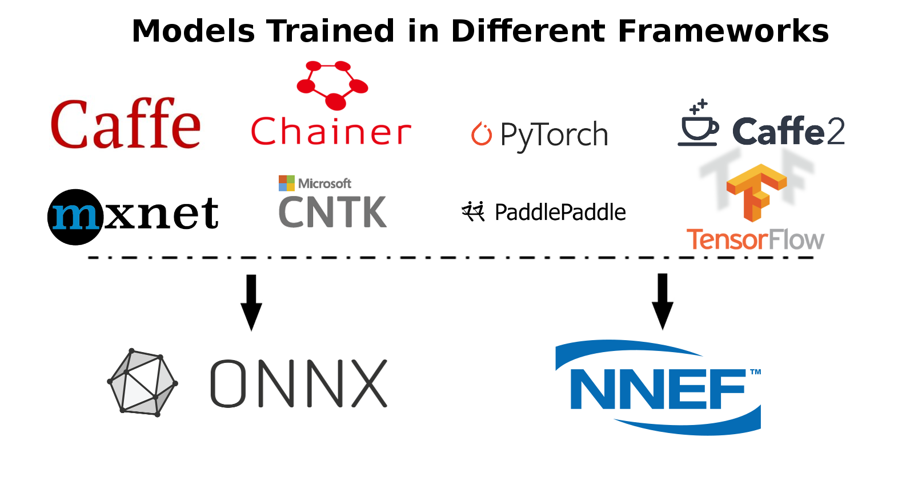
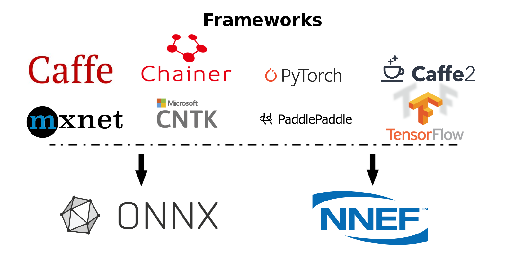

# Neural Net Model Compiler & Optimizer

<p align="center"></p>

Neural Net Model Compiler & Optimizer converts pre-trained neural network models to MIVisionX runtime code for optimized inference.

* [MIVisionX RunTime](#mivisionx-runtime)
* [Pre-requisites](#pre-requisites)
* [Model Compiler & Optimizer Usage](#model-compiler--optimizer-usage)
* [Sample workflow for Model Compiler](#sample-workflow-for-model-compiler)
* [Examples for OpenVX C code generation](#examples-for-openvx-c-code-generation)
* [Models & Operators currently supported](#models--operators-currently-supported)
* [Contributing to Model Compiler](#contributing-to-model-compiler)

Pre-trained models in [ONNX](https://onnx.ai/), [NNEF](https://www.khronos.org/nnef), & [Caffe](http://caffe.berkeleyvision.org/) formats are supported by the model compiler & optimizer. The model compiler first converts the pre-trained models to AMD Neural Net Intermediate Representation (NNIR), once the model has been translated into AMD NNIR (AMD's internal open format), the Optimizer goes through the NNIR and applies various optimizations which would allow the model to be deployed on to target hardware most efficiently. Finally, AMD NNIR is converted into OpenVX C code, which could be compiled and deployed on any targeted AMD hardware.

<p align="center"></p>

## MIVisionX RunTime

MIVisionX allows hundreds of different [OpenVX](https://www.khronos.org/registry/OpenVX/specs/1.0/html/da/db6/group__group__vision__functions.html) and [OpenCV interop](../amd_openvx_extensions/amd_opencv#list-of-opencv-interop-kernels) vision functions to be directly added into the OpenVX C code generated by the model compiler & optimizer for preprocessing the input to the neural network model and post-processing the model results, hence allowing users to create an end to end solution to be deployed on any targeted AMD hardware.

<p align="center"></p>

### Pre-requisites

* Ubuntu `16.04` / `18.04` or CentOS `7.5` / `7.6`
* [MIVisionX](https://github.com/GPUOpen-ProfessionalCompute-Libraries/MIVisionX#build--install-mivisionx) - Install MIVisionX 
* python3
```
% apt-get install protobuf-compiler libprotoc-dev
% pip3 install pytz numpy future
```

**Note:** MIVisionX installs model compiler scripts at `/opt/rocm/mivisionx/model_compiler/python/`
**Note:** Model compiler supports Python3. Anyone using python2 might face an issue during the model conversion

#### Caffe

* python3
* numpy
* protobuf
* google

```
% pip3 install google
% pip3 install protobuf
% pip3 install numpy
```


#### ONNX

* python3
* numpy
* onnx

``` 
% pip3 install onnx 
% pip3 install numpy
```

**Note:** ONNX Models are available at [ONNX Model Zoo](https://github.com/onnx/models)

#### NNEF

* python3
* numpy
* [nnef-parser](https://github.com/KhronosGroup/NNEF-Tools) - Build the nnef python module

``` 
% pip3 install numpy
```

**Note:** NNEF Models are available at [NNEF Model Zoo](https://github.com/KhronosGroup/NNEF-Tools/tree/master/models#nnef-model-zoo)
**Note:** NNEF Parser is compatible with python3. Anyone using python2 might face an issue during the model conversion


## Model Compiler Samples - Run Efficient Inference

In this [sample](../samples/model_compiler_samples#mivisionx-model-compiler-samples), we will learn how to run inference efficiently using OpenVX and OpenVX Extensions. The sample will go over each step required to convert a pre-trained neural net model into an OpenVX Graph and run this graph efficiently on any target hardware. In this [sample](../samples/model_compiler_samples#mivisionx-model-compiler-samples), we will also learn about AMD MIVisionX which delivers open source implementation of OpenVX and OpenVX Extensions along with MIVisionX Neural Net Model Compiler & Optimizer.

* [Sample-1: Classification Using Pre-Trained ONNX Model](../samples/model_compiler_samples#sample-1---classification-using-pre-trained-onnx-model)
* [Sample-2: Detection Using Pre-Trained Caffe Model](../samples/model_compiler_samples#sample-2---detection-using-pre-trained-caffe-model) 
* [Sample-3: Classification Using Pre-Trained NNEF Model](../samples/model_compiler_samples#sample-3---classification-using-pre-trained-nnef-model)
* [Sample-4: Classification Using Pre-Trained Caffe Model](../samples/model_compiler_samples#sample-4---classification-using-pre-trained-caffe-model)

## Model Compiler & Optimizer Usage

### Step 1 - Convert Pre-trained model to AMD NNIR

#### Caffe

To convert a pre-trained caffemodel into AMD NNIR model:

``` 
% python3 caffe_to_nnir.py <net.caffeModel> <nnirOutputFolder> --input-dims <n,c,h,w> [OPTIONS]

OPTIONS:
	--verbose <0|1> [defualt: 0]
	--node_type_append <0|1> [default: 0; appends node type name to output names
```

#### ONNX

To convert an ONNX model into AMD NNIR model:

``` 
% python3 onnx_to_nnir.py <model.onnx> <nnirModelFolder> [OPTIONS]

OPTIONS:
	--input_dims n,c,h,w
	--node_type_append <0|1> [default: 0; appends node type name to output names]
```

#### NNEF

To convert a NNEF model into AMD NNIR model:

``` 
% python3 nnef_to_nnir.py <nnefInputFolder> <nnirOutputFolder> [OPTIONS]

OPTIONS:
	--node_type_append <0|1> [default: 0; appends node type name to output names]
```

**Note:** If you want to create NNEF models from pre-trained caffe or tensorflow models, use [NNEF Converter](https://github.com/KhronosGroup/NNEF-Tools) or try NNEF models at [NNEF Model Zoo](https://github.com/KhronosGroup/NNEF-Tools/tree/master/models#nnef-model-zoo)

### Step 2 - Apply Optimizations

To update batch size in AMD NNIR model:

``` 
% python3 nnir_update.py --batch-size <N> <nnirModelFolder> <nnirModelFolderN>
```

To fuse operations in AMD NNIR model (like batch normalization into convolution):

``` 
% python3 nnir_update.py --fuse-ops <1> <nnirModelFolderN> <nnirModelFolderFused>
```

To quantize the model to float 16

``` 
% python3 nnir_update.py --convert-fp16 <1> <nnirModelFolderN> <nnirModelFolderFused>
```

To workaround groups using slice and concat operations in AMD NNIR model:

``` 
% python3 nnir_update.py --slice-groups <1> <nnirModelFolderFused> <nnirModelFolderSliced>
```

### Step 3 - Convert AMD NNIR to OpenVX C code

To convert an AMD NNIR model into OpenVX C code:

``` 
% python3 nnir_to_openvx.py --help

Usage: python nnir_to_openvx.py [OPTIONS] <nnirInputFolder> <outputFolder>

  OPTIONS:
    --argmax UINT8                    -- argmax at the end with 8-bit output
    --argmax UINT16                   -- argmax at the end with 16-bit output
    --argmax <fileNamePrefix>rgb.txt  -- argmax at the end with RGB color mapping using LUT
    --argmax <fileNamePrefix>rgba.txt -- argmax at the end with RGBA color mapping using LUT
    --help                            -- show this help message

  LUT File Format (RGB): 8-bit R G B values one per each label in text format
    R0 G0 B0
    R1 G1 B1
    ...

  LUT File Format (RGBA): 8-bit R G B A values one per each label in text format
    R0 G0 B0 A0
    R1 G1 B1 A1
    ...
```

## Sample workflow for Model Compiler

### Trained Caffe Model conversion to AMD NNIR to OpenVX Graph

* Step 1: Convert net.caffemodel into NNIR model using the following command

``` 
% python3 caffe_to_nnir.py <net.caffeModel> <nnirOutputFolder> --input-dims n,c,h,w [--verbose 0|1]
```

* Step 2: Compile NNIR model into OpenVX C code with CMakelists.txt for compiling and building inference library

``` 
% python3 nnir_to_openvx.py <nnirModelFolder> <nnirModelOutputFolder>
```

* Step 3: cmake and make the project inside the nnirModelOutputFolder

``` 
% cd nnirModelOutputFolder
% cmake .
% make
```

* Step 4: Run anntest application for testing the inference with input and output tensor

``` 
% ./anntest weights.bin
```

* Step 5: The shared C library (libannmodule.so) can be used in any customer application

## Examples for OpenVX C code generation

Generate OpenVX and test code that can be used dump and compare raw tensor data:

``` 
% python3 nnir_to_openvx.py nnirInputFolderFused openvxCodeFolder
% mkdir openvxCodeFolder/build
% cd openvxCodeFolder/build
% cmake ..
% make
% ./anntest

Usage: anntest <weights.bin> [<input-data-file(s)> [<output-data-file(s)>]]<--add ADD> <--multiply MULTIPLY>]

   <input-data-file>: is filename to initialize tensor
     .jpg or .png: decode and initialize for 3 channel tensors
         (use %04d in fileName to when batch-size > 1: batch index starts from 0)
     other: initialize tensor with raw data from the file

   <output-data-file>[,<reference-for-compare>,<maxErrorLimit>,<rmsErrorLimit>]:
     <referece-to-compare> is raw tensor data for comparision
     <maxErrorLimit> is max absolute error allowed
     <rmsErrorLimit> is max RMS error allowed
     <output-data-file> is filename for saving output tensor data
       '-' to ignore
       other: save raw tensor into the file
       
   <add>: input preprocessing factor [optional - default:[0,0,0]]
   
   <multiply>: input preprocessing factor [optional - default:[1,1,1]]

% ./anntest ../weights.bin input.f32 output.f32,reference.f32,1e-6,1e-9 --add -2.1,-2.07,-1.8 --multiply 0.017,0.017,0.017
...
```

Generate OpenVX and test code with argmax that can be used dump and compare 16-bit argmax output tensor:

``` 
% python3 nnir_to_openvx.py --argmax UINT16 nnirInputFolderFused openvxCodeFolder
% mkdir openvxCodeFolder/build
% cd openvxCodeFolder/build
% cmake ..
% make
% ./anntest

Usage: anntest <weights.bin> [<input-data-file(s)> [<output-data-file(s)>]]]

   <input-data-file>: is filename to initialize tensor
     .jpg or .png: decode and initialize for 3 channel tensors
         (use %04d in fileName to when batch-size > 1: batch index starts from 0)
     other: initialize tensor with raw data from the file

   <output-data-file>[,<reference-for-compare>,<percentErrorLimit>]:
     <referece-to-compare> is raw tensor data of argmax output for comparision
     <percentMismatchLimit> is max mismatch (percentage) allowed
     <output-data-file> is filename for saving output tensor data
       '-' to ignore
       other: save raw tensor into the file

% ./anntest ../weights.bin input-%04d.png output.u16,reference.u16,0.01
...
```

Generate OpenVX and test code with argmax and LUT that is designed for semantic segmentation use cases. You can dump output in raw format or PNGs and additionally compare with reference data in raw format.

``` 
% python3 nnir_to_openvx.py --argmax lut-rgb.txt nnirInputFolderFused openvxCodeFolder
% mkdir openvxCodeFolder/build
% cd openvxCodeFolder/build
% cmake ..
% make
% ./anntest

Usage: anntest <weights.bin> [<input-data-file(s)> [<output-data-file(s)>]]]

   <input-data-file>: is filename to initialize tensor
     .jpg or .png: decode and initialize for 3 channel tensors
         (use %04d in fileName to when batch-size > 1: batch index starts from 0)
     other: initialize tensor with raw data from the file

   <output-data-file>[,<reference-for-compare>,<percentErrorLimit>]:
     <referece-to-compare> is raw tensor data of LUT output for comparision
     <percentMismatchLimit> is max mismatch (percentage) allowed
     <output-data-file> is filename for saving output tensor data
       .png: save LUT output as PNG file(s)
         (use %04d in fileName when batch-size > 1: batch index starts from 0)
       '-' to ignore
       other: save raw tensor into the file

% ./anntest ../weights.bin input-%04d.png output.rgb,reference.rgb,0.01
...
% ./anntest ../weights.bin input-%04d.png output-%04d.png,reference.rgb,0.01
...
```

Test code with preprocessing add / multiply values to normalize the input tensor. Some models(e.g. Inception v4) require input tensor to be normalized. You can pass the preprocessing values using --add & --multiply option.

``` 
% ./anntest ../weights.bin input.f32 output.f32 --add -2.1,-2.07,-1.8 --multiply 0.017,0.017,0.017
...
```

## Models & Operators currently supported

###  Models

<p align="center"></p>

|Networks|Caffe|ONNX|NNEF|
|--------|-----|----|----|
|AlexNet||&#9745; |&#9745; |
|Caffenet||&#9745; ||
|DenseNet||&#9745; ||						
|Googlenet|&#9745; |&#9745; |&#9745; |		
|Inception-V1||&#9745; |&#9745; |			
|Inception-V2||&#9745; |&#9745; |			
|Inception-V3||||			
|Inception-V4|&#9745; |||			
|MNIST|&#9745; ||&#9745; |		
|Mobilenet||&#9745; |&#9745; |		
|MobilenetV2|||&#9745; |
|ResNet-18|||&#9745; |			
|ResNet-34|||&#9745; |			
|ResNet-50|&#9745; |&#9745; |&#9745; |			
|ResNet-101|&#9745; ||&#9745; |			
|ResNet-152|&#9745; ||&#9745; |			
|ResNetV2-18|||&#9745; |			
|ResNetV2-34|||&#9745; |			
|ResNetV2-50|||&#9745; |			
|ResNetV2-101|||&#9745; |			
|Squeezenet||&#9745; |&#9745; |			
|Tiny-Yolo-V2|&#9745; |||			
|VGGNet-16|&#9745; ||&#9745; |			
|VGGNet-19|&#9745; |&#9745; |&#9745; |			
|Yolo-V3|&#9745; |||			
|ZFNet||&#9745; ||

**Note:**

* Currently supporting [ONNX models](https://github.com/onnx/models) with `release 1.1` and `release 1.3` tags

### Operators

<p align="center"></p>

|Layers|Caffe|ONNX|NNEF|
|-------|----|----|----|
|Add||&#9745; |&#9745; |
|Argmax||&#9745; |&#9745; |
|AveragePool||&#9745; |&#9745; |
|BatchNormalization|&#9745; |&#9745; |&#9745; |
|Cast||&#9745; ||
|Clamp|||&#9745; |
|Clip||&#9745; ||
|Concat|&#9745; |&#9745; |&#9745; |
|Constant||&#9745; ||
|Conv|&#9745; |&#9745; |&#9745; |
|ConvTranspose|&#9745; |&#9745; |&#9745; |
|Copy||&#9745; |&#9745; |
|Crop|&#9745; |||
|CropAndResize||||
|Deconv|&#9745; |&#9745; |&#9745; |
|DetectionOutput|&#9745; |||
|Div||&#9745; |&#9745; |
|Dropout||||
|Eltwise|&#9745; |||
|Exp||&#9745; |&#9745; |
|Flatten|&#9745; |||
|Gather||&#9745; ||
|GEMM|&#9745; |&#9745; |&#9745; |
|GlobalAveragePool||&#9745; |&#9745; |
|InnerProduct|&#9745; |||
|Interp|&#9745; |||
|LeakyRelu||&#9745; |&#9745; |
|Linear|||&#9745; |
|Log||&#9745; |&#9745; |
|LRN|&#9745; |&#9745; |&#9745; |
|Matmul||&#9745; |&#9745; |
|Max||&#9745; |&#9745; |
|MaxPool||&#9745; |&#9745; |
|MeanReduce|||&#9745; |
|Min||&#9745; |&#9745; |
|Mul||&#9745; |&#9745; |
|MulAdd||||
|NonMaxSuppression||&#9745; ||
|Permute|&#9745; ||&#9745; |
|PriorBox|&#9745; |||
|ReduceMin||&#9745; ||
|Relu|&#9745; |&#9745; |&#9745; |
|Reshape|&#9745; |&#9745; |&#9745; |
|Shape||&#9745; ||
|Sigmoid||&#9745; |&#9745; |
|Slice||&#9745; |&#9745; |
|Split|&#9745; |||
|Softmax|&#9745; |&#9745; |&#9745; |
|SoftmaxWithLoss|&#9745; |||
|Squeeze||&#9745; |&#9745; |
|Sub||&#9745; |&#9745; |
|Sum||&#9745; ||
|Tile||&#9745; ||
|TopK||&#9745; ||
|Transpose||&#9745; |&#9745; |
|Unsqueeze||&#9745; |&#9745; |
|Upsample|&#9745; ||&#9745; |

## Contributing to Model Compiler

We welcome contributions to Model Compiler to extend the functionalities and add support to more layers and models. When contributing to this repository, please first discuss the changes you wish to make via issues and then submit a pull request.
