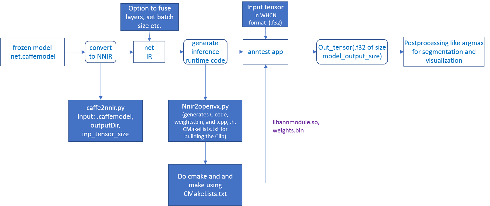

# Model Compiler

## Using Model Compiler

### caffe2nnir & nnir2openvx - Trained Caffe Model conversion to Neural Net Intermediate Representation (NNIR) to OpenVX Graph



1. Convert net.caffemodel into NNIR model using the following command
   ````
	    python caffe2nnir.py <net.caffeModel> <nnirOutputFolder> --input-dims n,c,h,w [--verbose 0|1]
   ````
2. Compile NNIR model into OpenVX C code with CMakelists.txt for compiling and building inference library
   ````
	    python nnir2openvx.py <nnirModelFolder> <nnirModelOutputFolder>
   ````
3. cmake and make the project inside the nnirModelOutputFolder
4. Run anntest application for testing inference with input and output tensor
5. The shared C library (libannmodule.so) can be used in customer application as well

### Convert Neural Net models into AMD NNIR and OpenVX Code

This tool converts [ONNX](https://onnx.ai/) or [Caffe](http://caffe.berkeleyvision.org/) models to AMD NNIR format and OpenVX code.

You need MIVisionX libraries to be able to build and run the generated OpenVX code.

## Dependencies

* numpy
* onnx (0.2.1+)

## How to use?

To convert an ONNX model into AMD NNIR model:

```
% python onnx2nnir.py model.pb nnirModelFolder
```

To convert a caffemodel into AMD NNIR model:

```
% python caffe2nnir.py <net.caffeModel> <nnirOutputFolder> --input-dims n,c,h,w [--verbose 0|1]
```

To update batch size in AMD NNIR model:
````
% python nnir-update.py --batch-size N nnirModelFolder nnirModelFolderN
````

To fuse operations in AMD NNIR model (like batch normalization into convolution):
````
% python nnir-update.py --fuse-ops 1 nnirModelFolderN nnirModelFolderFused
````

To workaround groups using slice and concat operations in AMD NNIR model:
````
% python nnir-update.py --slice-groups 1 nnirModelFolderFused nnirModelFolderSliced
````

To convert an AMD NNIR model into OpenVX C code:

````
% python --help

Usage: python nnir2openvx.py [OPTIONS] <nnirInputFolder> <outputFolder>

  OPTIONS:
    --argmax UINT8                    -- argmax at the end with 8-bit output
    --argmax UINT16                   -- argmax at the end with 16-bit output
    --argmax <fileNamePrefix>rgb.txt  -- argmax at the end with RGB color mapping using LUT
    --argmax <fileNamePrefix>rgba.txt -- argmax at the end with RGBA color mapping using LUT
    --help                            -- show this help message

  LUT File Format (RGB): 8-bit R G B values one per each label in text format
    R0 G0 B0
    R1 G1 B1
    ...

  LUT File Format (RGBA): 8-bit R G B A values one per each label in text format
    R0 G0 B0 A0
    R1 G1 B1 A1
    ...

````

### Here are few examples of OpenVX C code generation

Generate OpenVX and test code that can be used dump and compare raw tensor data:
````
% python nnir2openvx.py nnirInputFolderFused openvxCodeFolder
% mkdir openvxCodeFolder/build
% cd openvxCodeFolder/build
% cmake ..
% make
% ./anntest

Usage: anntest <weights.bin> [<input-data-file(s)> [<output-data-file(s)>]]]

   <input-data-file>: is filename to initialize tensor
     .jpg or .png: decode and initialize for 3 channel tensors
         (use %04d in fileName to when batch-size > 1: batch index starts from 0)
     other: initialize tensor with raw data from the file

   <output-data-file>[,<reference-for-compare>,<maxErrorLimit>,<rmsErrorLimit>]:
     <referece-to-compare> is raw tensor data for comparision
     <maxErrorLimit> is max absolute error allowed
     <rmsErrorLimit> is max RMS error allowed
     <output-data-file> is filename for saving output tensor data
       '-' to ignore
       other: save raw tensor into the file

% ./anntest ../weights.bin input.f32 output.f32,reference.f32,1e-6,1e-9
...
````

Generate OpenVX and test code with argmax that can be used dump and compare 16-bit argmax output tensor:
````
% python nnir2openvx.py --argmax UINT16 nnirInputFolderFused openvxCodeFolder
% mkdir openvxCodeFolder/build
% cd openvxCodeFolder/build
% cmake ..
% make
% ./anntest

Usage: anntest <weights.bin> [<input-data-file(s)> [<output-data-file(s)>]]]

   <input-data-file>: is filename to initialize tensor
     .jpg or .png: decode and initialize for 3 channel tensors
         (use %04d in fileName to when batch-size > 1: batch index starts from 0)
     other: initialize tensor with raw data from the file

   <output-data-file>[,<reference-for-compare>,<percentErrorLimit>]:
     <referece-to-compare> is raw tensor data of argmax output for comparision
     <percentMismatchLimit> is max mismatch (percentage) allowed
     <output-data-file> is filename for saving output tensor data
       '-' to ignore
       other: save raw tensor into the file

% ./anntest ../weights.bin input-%04d.png output.u16,reference.u16,0.01
...
````

Generate OpenVX and test code with argmax and LUT that is designed for semantic segmentation use cases. You can dump output in raw format or PNGs and additionally compare with reference data in raw format.
````
% python nnir2openvx.py --argmax lut-rgb.txt nnirInputFolderFused openvxCodeFolder
% mkdir openvxCodeFolder/build
% cd openvxCodeFolder/build
% cmake ..
% make
% ./anntest

Usage: anntest <weights.bin> [<input-data-file(s)> [<output-data-file(s)>]]]

   <input-data-file>: is filename to initialize tensor
     .jpg or .png: decode and initialize for 3 channel tensors
         (use %04d in fileName to when batch-size > 1: batch index starts from 0)
     other: initialize tensor with raw data from the file

   <output-data-file>[,<reference-for-compare>,<percentErrorLimit>]:
     <referece-to-compare> is raw tensor data of LUT output for comparision
     <percentMismatchLimit> is max mismatch (percentage) allowed
     <output-data-file> is filename for saving output tensor data
       .png: save LUT output as PNG file(s)
         (use %04d in fileName when batch-size > 1: batch index starts from 0)
       '-' to ignore
       other: save raw tensor into the file

% ./anntest ../weights.bin input-%04d.png output.rgb,reference.rgb,0.01
...
% ./anntest ../weights.bin input-%04d.png output-%04d.png,reference.rgb,0.01
...
````

## Currently supported
### Models
Support the below models from https://github.com/onnx/models
 - resnet
 - inception
 - alexnet
 - densenet
 - sqeezenet

### Operators
Supported ONNX operators are:

- Conv
- Relu
- MaxPool
- AveragePool
- GlobalAveragePool
- LRN
- BatchNormalization
- Concat
- Sum
- Add
- Sub
- Mul
- Softmax
- Dropout

## License
Copyright (c) 2018 Advanced Micro Devices, Inc. All rights reserved.

Use of this source code is governed by the MIT License that can be found in the LICENSE file.
