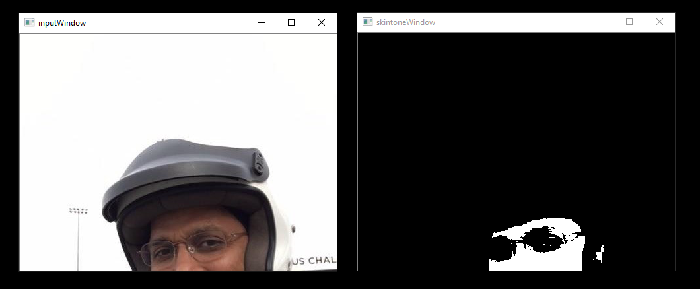

# Samples

MIVisionX samples using OpenVX and OpenVX extension libraries

## GDF - Graph Description Format

MIVisionX samples using [RunVX](../utilities/runvx#amd-runvx)

**Note:** 
* To run the samples we need to put MIVisionX executables and libraries into the system path

````
export PATH=$PATH:/opt/rocm/mivisionx/bin
export LD_LIBRARY_PATH=$LD_LIBRARY_PATH:/opt/rocm/mivisionx/lib
````
* To get help on RunVX, use `-h` option

````
runvx -h
````

### skintonedetect.gdf

<p align="center"></p>

usage:

````
runvx gdf/skintonedetect.gdf
````
### canny.gdf

<p align="center"></p>

usage:

````
runvx gdf/canny.gdf
````
### skintonedetect-LIVE.gdf
Using live camera

usage:

````
runvx -frames:live gdf/skintonedetect-LIVE.gdf
````
### canny-LIVE.gdf
Using live camera

usage:

````
runvx -frames:live gdf/canny-LIVE.gdf
````
### OpenCV_orb-LIVE.gdf
Using live camera

usage:

````
runvx -frames:live gdf/OpenCV_orb-LIVE.gdf
````

## C / C++ Samples

MIVisionX samples IN C / C++

### Canny

usage:

````
cmake .
make
./cannyDetect --image <imageName> 
./cannyDetect --live
````
### Orb Detect
usage:

````
cmake .
make
./orbDetect
````
