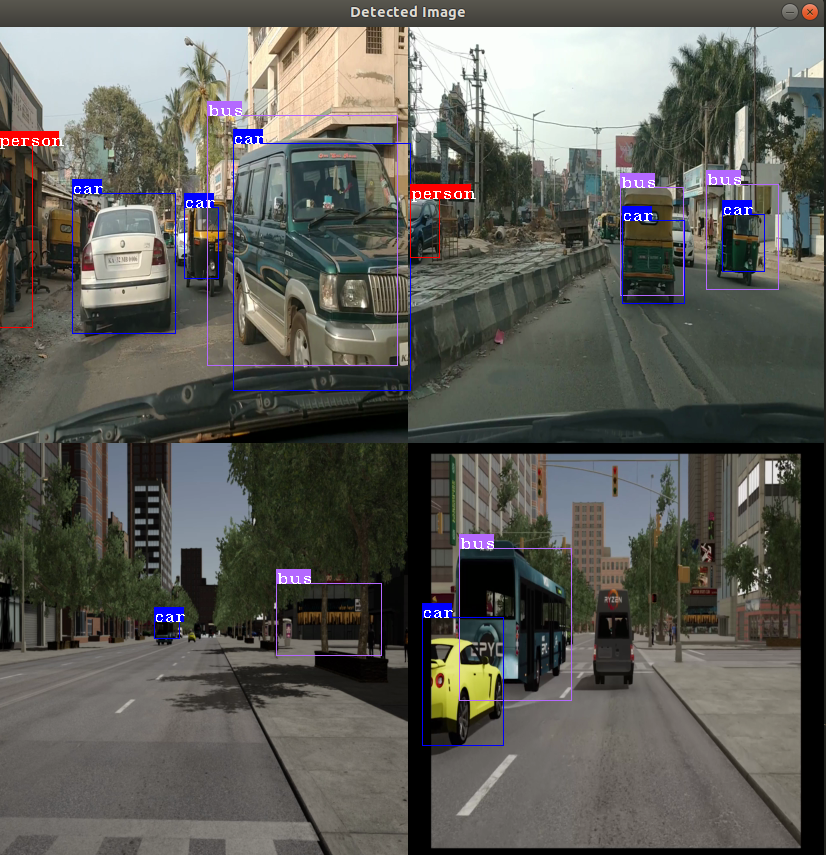

## 1. Sample: Object detection with video decoding overview
*This project shows how to run video decoding and object detection using simple pretrained Caffe model, yolov2*

The sample demonstrates the use of mv_compile utility to do video decoding and inference.
The sample has two .cpp files, ``mvobjdetect.cpp and visualize.cpp``. But it needs extra header files, .cpp files, and inference deployment library which is generated by mv_compile utility to completely build and execute the application.


## Prerequisites

* Ubuntu `16.04`/`18.04` or CentOS `7.5`/`7.6`
* [ROCm supported hardware](https://rocm.github.io/ROCmInstall.html#hardware-support) 
	* AMD Radeon GPU or APU required
* [ROCm](https://github.com/RadeonOpenCompute/ROCm#installing-from-amd-rocm-repositories)
* Build & Install [MIVisionX](https://github.com/GPUOpen-ProfessionalCompute-Libraries/MIVisionX#linux-1)
	* MIVisionX installs model compiler at `/opt/rocm/mivisionx`
  * mv_compile installs at `/opt/rocm/mivisionx/bin` and mvdeploy_api.h installs at `/opt/rocm/mivisionx/include` 


### Step 1. Download pre-trained YoloV2 caffe model - [yoloV2Tiny20.caffemodel](https://github.com/kiritigowda/YoloV2NCS/raw/master/models/caffemodels/yoloV2Tiny20.caffemodel) 
```
wget https://github.com/kiritigowda/YoloV2NCS/raw/master/models/caffemodels/yoloV2Tiny20.caffemodel
```

### Step 2. compile model for OPENCL-ROCm-OpenVX backend using mv_compile utility
The mv_compile utility generates deployment library, header files, and .cpp files required to run inference for the specified model.

* Usage:
```
mv_compile   --model 	        <model_name: name of the trained model with path> 		[required]
	     --install_folder   <install_folder:  the location for compiled model> 		[required]
	     --input_dims 	<input_dims: n,c,h,w - batch size, channels, height, width> 	[required]
	     --backend 	        <backend: name of the backend for compilation> 	  		[optional - default:OpenVX_Rocm_GPU]
	     --fuse_cba 	<fuse_cba: enable or disable Convolution_bias_activation fuse mode (0/1)> [optional - default: 0]
	     --quant_mode       <quant_mode: fp32/fp16 - quantization_mode for the model: if enabled the model and weights would be converted [optional -default: fp32]
```

* Sample:
```
mv_compile --model yoloV2Tiny20.caffemodel --install_folder mvdeploy --input_dims 1,3,416,416
```
There will be a file libmv_deploy.so (under ./lib), weights.bin and mvtestdeploy sample app (under ./bin).
Also there will be mv_extras folder for extra post-processing helper functions.
Open mvdeploy_api.h to go through API functions supported for inference deployment. 

### Step 3. Make sure mvtestdeploy utility runs
mvtestdeploy is a pre-generated application built in Step 3 which shows how to deploy inference for an input image file

* Usage:
```
./bin/mvtestdeploy 	<input data file: image/video>					[required]
			<output file - (.bin)>						[required]
			--install_folder <folder name or '.' for current folder>	[required]
			--t <N: number of iterations>					[required]
```

* Sample:
```	
cd mvdeploy
./bin/mvtestdeploy ../data/images/img_04.JPG output.bin --install_folder . --t 100
```
This runs inference for an input file and generate output for N number of iterations.

### Step 4. Build mvobjdetect example
* mvobjdetect is built on top of all the files generated in Step 4. Basically it shows how to add preprocessing OpenVX nodes for video decoding and image_to_tensor conversion. 
* Go through mvobjdetect.cpp file. 
* This exercise uses a single or multiple video streams for input. 
* The second part of the tutorial shows how to run it through multiple video files.

TODO:
* copy all files in cloned sample folder (mvobjdetect.cpp, visualize.cpp, visualize.h and CMakeLists.txt) into mvdeploy folder. This  brings all the files into a single folder to build and run the sample.


```
cp ../mvobjdetect.cpp ../visualize.cpp ../visualize.h ../CMakeLists.txt .
```

### Step 5. cmake and make mvobjdetect
```
mkdir mv_build
cd mv_build
cmake ../
make -j
```
Note: if build directory exists from previous build, name the new build directly differently (eg: mv_build).

### Step 6. Run object detection with video/image
* Usage:
```
Usage: mvobjdetect <options>
	<input-data-file: .jpg, .png, .mp4, .m4v>: is filename(s) to initialize input tensor         	[required]
	<output-data-file/- >: for video all frames will be output to single file OR '-'for no output	[required]
	--install_folder <install_folder> : the location for compiled module                         	[required]
	--bb <channels, threshold_c threshold_nms> bounding box detection parameters                 	[required]
	--frames <#num/eof/loop> : num of frames to process inference         	[optional: default till eof, loop: loop the video]
	--backend <backend>: is the name of the backend for compilation  	[optional: default OpenVX_Rocm_GPU]
	--argmax <topK> : give argmax output in vec<label,prob>          	[optional: default no argmax]
	--t <num of interations> to run for performance                  	[optional: default 1]
	--hwdec <1/0>:use hwaccel for decoding                            [optional: default cpu decoding, 1:hwdec 0:cpu dec]
	--label <labels.txt>                                             	[optional: default use yolo_v2 20 classes]
	--v :if specified visualize the result on the input image        	[optional: default no visualization]

```

* Sample
```
cd ..
./mv_build/mvobjdetect <input_image.JPG> - --install_folder . --bb 20 0.2 0.4 --v
./mv_build/mvobjdetect <input_video.mp4> - --install_folder . --bb 20 0.2 0.4 --v
```
Note: Make sure the input image and video file exist and specified with full path

### Step 7. Run object detection with multiple video streams (e.g batch 4, 8 and 16)
Go through steps 3 to 6, this time compiling the model for a batch of 4.  
Also this sample can do batch of 8 and 16 decoding as well.  
For batch 8, --input_dims 8,3,416,416  and create Videos_8.txt file with 8 input streams  
For batch 16, --input_dims 16,3,416,416 and create Videos_16.txt file with 16 input streams

```
cd ..
mv_compile --model yoloV2Tiny20.caffemodel --install_folder mvdeploy_batch4 --input_dims 4,3,416,416
cd mvdeploy_batch4
cp ../mvobjdetect.cpp ../visualize.cpp ../visualize.h ../CMakeLists.txt .
mkdir mv_build4
cd mv_build4
cmake ../
make -j
cd ..
./mv_build4/mvobjdetect <Videos_4.txt> - --install_folder . --bb 20 0.2 0.4 --v
```
Note: Where Videos_4.txt has the names of input video files with full path.    
e.g: Use the ../data/Videos/Videos_4.txt file. Modify it to specify your input files.  
The last bit (:0 / :1) chooses software or hardware mode for decoding.

### Step 10. Sample output for multiple video object detection
<p align="center"></p>

# License
This project is licensed under the MIT License - see the LICENSE.md file for details

# Author
Rajy Rawther - `mivisionx.support@amd.com`
