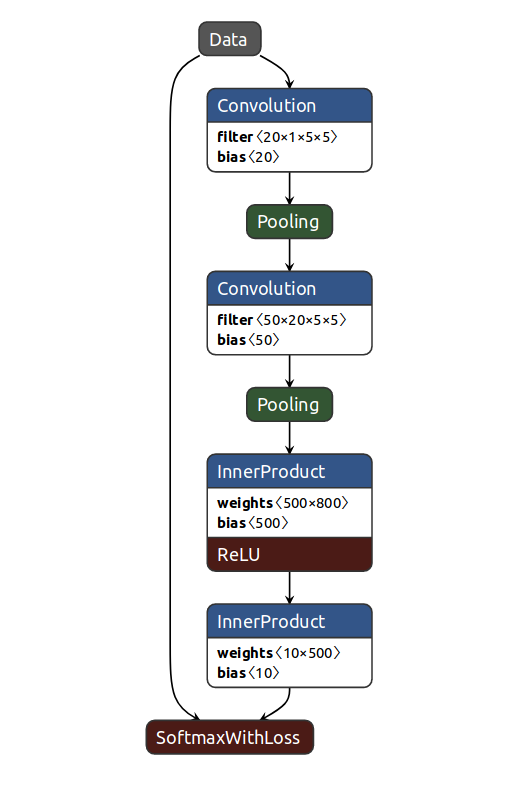
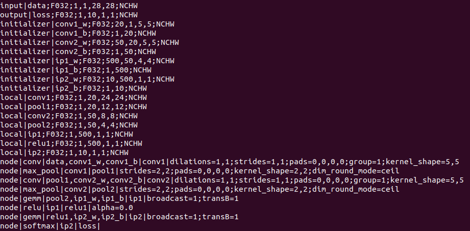
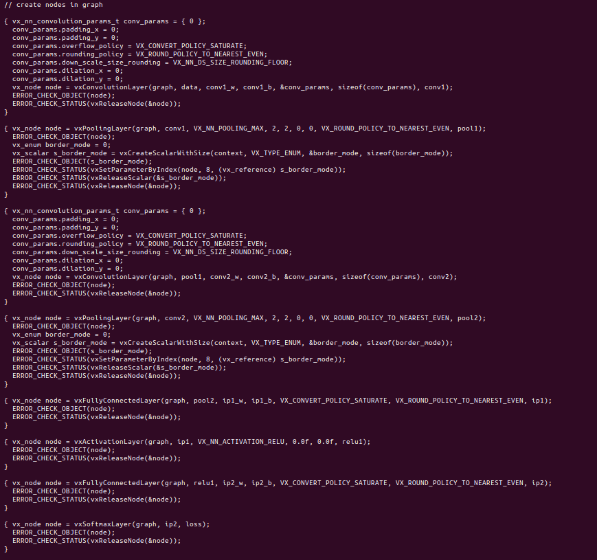
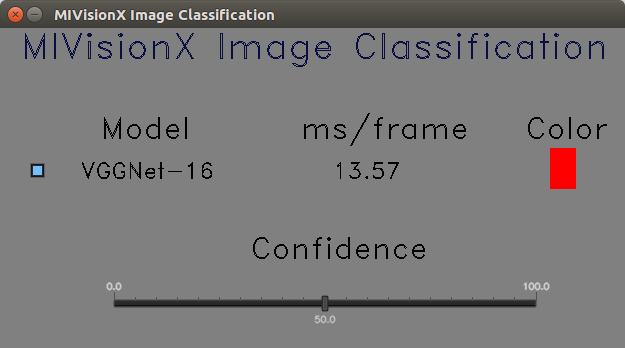
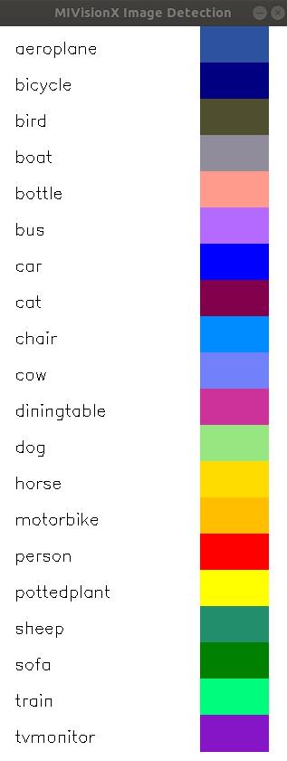
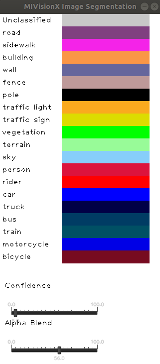
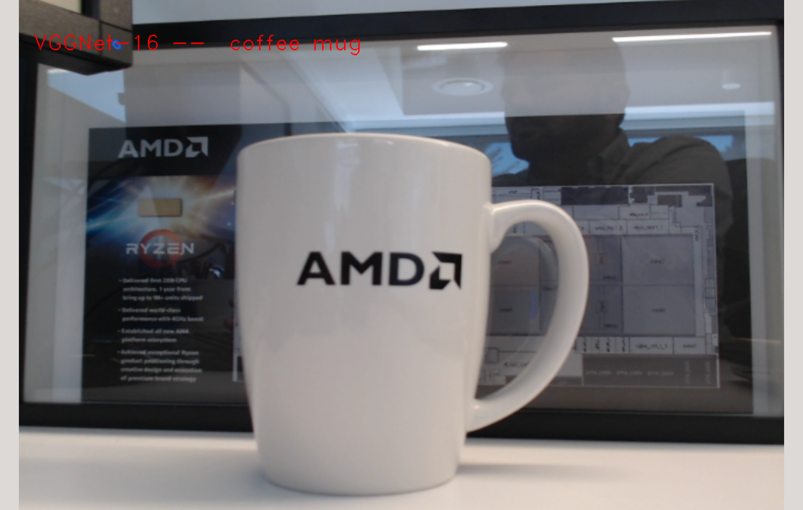
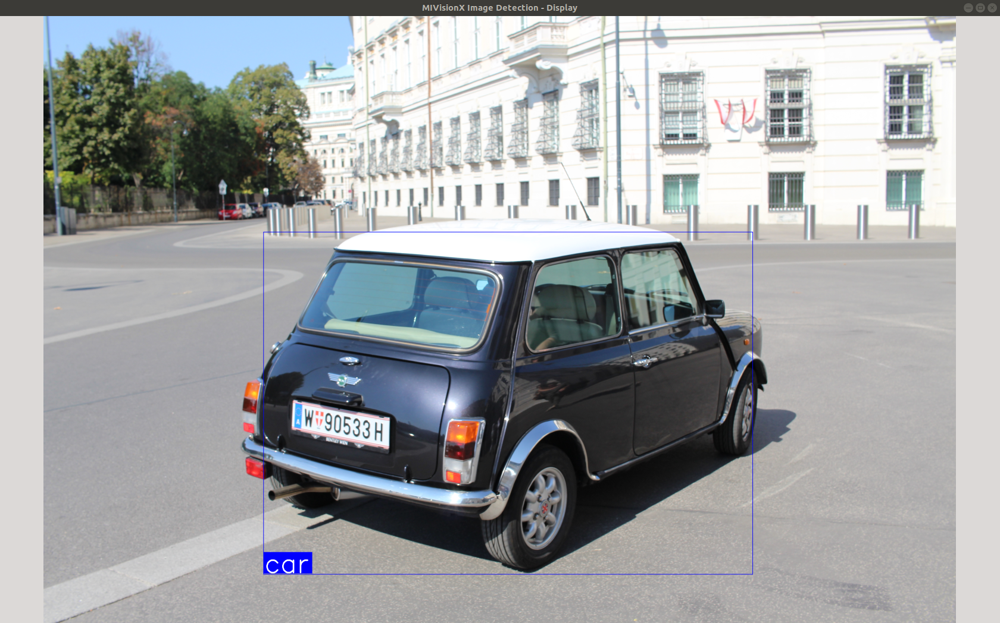
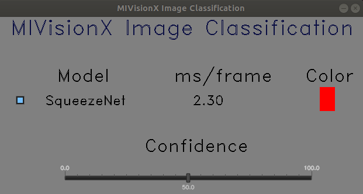
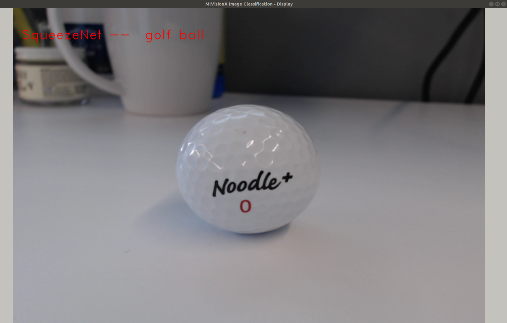

## MIVisionX Model Compiler Samples

<p align="center"></p>

In this sample, we will learn how to run inference efficiently using [OpenVX](https://www.khronos.org/openvx/) and [OpenVX Extensions](https://www.khronos.org/registry/OpenVX/extensions/vx_khr_nn/1.2/html/index.html). The sample will go over each step required to convert a pre-trained neural net model into an OpenVX Graph and run this graph efficiently on any target hardware. In this sample, we will also learn about AMD MIVisionX which delivers open source implementation of OpenVX and OpenVX Extensions along with MIVisionX Neural Net Model Compiler & Optimizer.

* [MIVisionX Model Compiler & Optimizer](https://github.com/GPUOpen-ProfessionalCompute-Libraries/MIVisionX/tree/master/model_compiler#neural-net-model-compiler--optimizer)
* [Prerequisites](#prerequisites)
* [Usage](#usage)
	* [Convert Pre-Trained Models into OpenVX](#convert-pre-trained-models-into-openvx)
	* [Build Inference Application](#build---inference-application)
	* [Run Inference Application](#run)
* [Supported Pre-Trained Model Formats](#supported-pre-trained-model-formats)
* [Sample-1: Classification Using Pre-Trained ONNX Model](#sample-1---classification-using-pre-trained-onnx-model)
* [Sample-2: Detection Using Pre-Trained Caffe Model](#sample-2---detection-using-pre-trained-caffe-model)
* [Sample-3: Classification Using Pre-Trained NNEF Model](#sample-3---classification-using-pre-trained-nnef-model)
* [Sample-4: Classification Using Pre-Trained Caffe Model](#sample-4---classification-using-pre-trained-caffe-model)

[Neural Net Model Compiler & Optimizer](https://github.com/GPUOpen-ProfessionalCompute-Libraries/MIVisionX/tree/master/model_compiler#neural-net-model-compiler--optimizer) converts pre-trained neural network models to MIVisionX runtime code for optimized inference.

<p align="center"></p>

Pre-trained models in [ONNX](https://onnx.ai/), [NNEF](https://www.khronos.org/nnef), & [Caffe](http://caffe.berkeleyvision.org/) formats are supported by the model compiler & optimizer. The model compiler first converts the pre-trained models to AMD Neural Net Intermediate Representation (NNIR), once the model has been translated into AMD NNIR (AMD's internal open format), the Optimizer goes through the NNIR and applies various optimizations which would allow the model to be deployed on to target hardware most efficiently. Finally, AMD NNIR is converted into OpenVX C code, which could be compiled and deployed on any targeted hardware.

<p align="center"></p>

### Prerequisites

* Ubuntu `16.04`/`18.04` or CentOS `7.5`/`7.6`
* [ROCm supported hardware](https://rocm.github.io/ROCmInstall.html#hardware-support) 
	* AMD Radeon GPU or AMD APU required
* Latest [ROCm](https://github.com/RadeonOpenCompute/ROCm#installing-from-amd-rocm-repositories)
* Build & Install [MIVisionX](https://github.com/GPUOpen-ProfessionalCompute-Libraries/MIVisionX#linux-1)

#### Docker for Samples

MIVisionX provides developers with [docker images](https://hub.docker.com/u/mivisionx) for [Ubuntu 16.04](https://hub.docker.com/r/mivisionx/ubuntu-16.04), [Ubuntu 18.04](https://hub.docker.com/r/mivisionx/ubuntu-18.04), [CentOS 7.5](https://hub.docker.com/r/mivisionx/centos-7.5), & [CentOS 7.6](https://hub.docker.com/r/mivisionx/centos-7.5). Using docker images developers can quickly prototype and build applications without having to be locked into a single system setup or lose valuable time figuring out the dependencies of the underlying software.

##### Docker with display option for the samples

* Check [docker prerequisites](https://github.com/GPUOpen-ProfessionalCompute-Libraries/MIVisionX#docker-workflow-sample-on-ubuntu-1604)

* Start docker with display
````
% sudo docker pull mivisionx/ubuntu-16.04:tutorial
% xhost +local:root
% sudo docker run -it --device=/dev/kfd --device=/dev/dri --cap-add=SYS_RAWIO --device=/dev/mem --group-add video --network host --env DISPLAY=unix$DISPLAY --privileged --volume $XAUTH:/root/.Xauthority --volume /tmp/.X11-unix/:/tmp/.X11-unix mivisionx/ubuntu-16.04:tutorial
````
* Test display with MIVisionX sample
````
% export PATH=$PATH:/opt/rocm/mivisionx/bin
% export LD_LIBRARY_PATH=$LD_LIBRARY_PATH:/opt/rocm/mivisionx/lib
% runvx /opt/rocm/mivisionx/samples/gdf/canny.gdf
````

## Usage

### Convert Pre-Trained Models into OpenVX

Use MIVisionX [Neural Net Model Compiler & Optimizer](https://github.com/GPUOpen-ProfessionalCompute-Libraries/MIVisionX/tree/master/model_compiler#neural-net-model-compiler--optimizer) to generate OpenVX code from your pre-trained neural net model. The model compiler generates annmodule.cpp & annmodule.h during the OpenVX code generation. The whole process of inference from a pre-trained neural net model will be shown in 3 different samples [below](#sample-1---classification-using-pre-trained-onnx-model).

1. Download or train your own `Caffe Model`/`ONNX Model`/`NNEF Model`.

<p align="center"></p>

2. Use [MIVisionX Model Compiler](https://github.com/GPUOpen-ProfessionalCompute-Libraries/MIVisionX/tree/master/model_compiler#neural-net-model-compiler--optimizer) to generate OpenVX C Code from the pre-trained models.

	**Note:** MIVisionX installs all the model compiler scripts in `/opt/rocm/mivisionx/model_compiler/python/` folder

* Convert the pre-trained models into AMD NNIR model:

<p align="center"></p>


	* Caffe Models

	````
	% python /opt/rocm/mivisionx/model_compiler/python/caffe_to_nnir.py <net.caffeModel> <nnirOutputFolder> --input-dims <n,c,h,w> [--verbose <0|1>]
	````
	
	* ONNX Models

	````
	% python /opt/rocm/mivisionx/model_compiler/python/onnx_to_nnir.py <onnxModel> <nnirOutputFolder> [--input_dims n,c,h,w (optional)]
	````
	
	* NNEF Models

	````
	% python /opt/rocm/mivisionx/model_compiler/python/nnef_to_nnir.py <nnefInputFolder> <outputFolder>
	````
	
* Convert an AMD NNIR model into OpenVX C code:

<p align="center"></p>

	````
	% python /opt/rocm/mivisionx/model_compiler/python/nnir_to_openvx.py <nnirModelFolder> <nnirModelOutputFolder>
	````

### Build - Inference Application
Classification | Detection | Segmentation
:-------------------------:|:-------------------------:|:-------------------------:
 |  | 

Once the OpenVX code is generated(annmodule.cpp & annmodule.h), follow the instructions below to build the project.

* Copy the files (annmodule.cpp & annmodule.h) generated by the model compiler into this samples module_files folder.
````
% cp PATH/To/annmodule.h   PATH/To/MIVisionX/samples/model_compiler_samples/module_files/
% cp PATH/To/annmodule.cpp PATH/To/MIVisionX/samples/model_compiler_samples/module_files/
````

* Build this project
````
% mkdir build
% cd build
% cmake PATH/To/MIVisionX/samples/model_compiler_samples/
% make
````

### Run

Classification |  Detection 
:-------------------------:|:-------------------------:
 | 

```
./classifier	--mode				<1/2/3 - 1:classification 2:detection 3:segmentation>	[required]
		--video/--capture/--image	<video file>/<0>/<image file>				[required]
		--model_weights			<model_weights.bin>					[required]
		--label				<label text>						[required]
		--model_input_dims		<c,h,w - channel,height,width>				[required]
		--model_output_dims		<c,h,w - channel,height,width>				[required]

		--model_name			<model name>					[optional - default:NN_ModelName]
		--add				<Ax,Ay,Az - input preprocessing factor>		[optional - default:0,0,0]
		--multiply			<Mx,My,Mz - input preprocessing factor>		[optional - default:1,1,1]


[usage help]	--help/--h

```
#### label < path to labels file >

Use [Classification labels](data/sample_classification_labels.txt) or [Detection labels](data/sample_detection_labels.txt) or [Segmentation Labels](data/sample_segmentation_labels.txt) files in the data folder depending on the type of model you are converting to OpenVX

#### video < path to video file >

Run inference on pre-recorded video with this option.

#### image < path to image file >

Run inference on an image with this option.

#### capture <0>

Run inference on the live camera feed with this option.

**Note:** --video/--capture/--image options are not supported concurrently

# Supported Pre-Trained Model Formats
* Caffe
* NNEF
* ONNX

<p align="center"></p>

## Sample 1 - Classification Using Pre-Trained ONNX Model

### Run SqueezeNet on Video/Image

<p align="center"></p>

* **Step 1:** Clone MIVisionX Inference Tutorial Project

	````
	% cd && mkdir sample-1 && cd sample-1
	% git clone https://github.com/kiritigowda/MIVisionX-Inference-Tutorial.git
	````

	**Note:**
	* MIVisionX needs to be pre-installed
	* MIVisionX Model Compiler & Optimizer scripts are at `/opt/rocm/mivisionx/model_compiler/python/`
	* ONNX model conversion requires ONNX install using `pip install onnx`	

* **Step 2:** Download pre-trained SqueezeNet ONNX model from [ONNX Model Zoo](https://github.com/onnx/models#open-neural-network-exchange-onnx-model-zoo) - [SqueezeNet Model](https://s3.amazonaws.com/download.onnx/models/opset_8/squeezenet.tar.gz)
	````
	% wget https://s3.amazonaws.com/download.onnx/models/opset_8/squeezenet.tar.gz
	% tar -xvf squeezenet.tar.gz
	````
	**Note:** pre-trained model - `squeezenet/model.onnx` 

* **Step 3:** Use MIVisionX Model Compiler to generate OpenVX files from the pre-trained ONNX model


	* Convert .onnx to NNIR

	````
	% python /opt/rocm/mivisionx/model_compiler/python/onnx_to_nnir.py squeezenet/model.onnx squeezenet-nnir
	````

	* Convert NNIR to OpenVX

	````
	% python /opt/rocm/mivisionx/model_compiler/python/nnir_to_openvx.py squeezenet-nnir/ squeezenet-openvx
	````
	**Note:** 
	* annmodule.cpp & annmodule.h generated in squeezenet-openvx folder
	* weights.bin generated in squeezenet-openvx folder is used for the classifier --model_weights option
	
* **Step 4:** Copy the annmodule.cpp & annmodule.h files into module_files folder. CMake and build this project

	* Copy OpenVX generated code
	````
	% cp ~/sample-1/squeezenet-openvx/annmodule.h ~/sample-1/MIVisionX-Inference-Tutorial/module_files/
	% cp ~/sample-1/squeezenet-openvx/annmodule.cpp ~/sample-1/MIVisionX-Inference-Tutorial/module_files/
	````
	* CMake and build
	````
	% mkdir ~/sample-1/build
	% cd ~/sample-1/build/
	% cmake ../MIVisionX-Inference-Tutorial/
	% make
	````
	
	<p align="center"></p>
	
* **Step 5:** Use the command below to run the classifier

	* View classifier usage
	```
	% ./classifier --help
	```
	
	* Run SqueezeNet Classifier
	```
	% ./classifier --mode 1 --video ../MIVisionX-Inference-Tutorial/data/images/img_05.JPG --model_weights ../squeezenet-openvx/weights.bin --label ../MIVisionX-Inference-Tutorial/data/sample_classification_labels.txt --model_input_dims 3,224,224 --model_output_dims 1000,1,1 --model_name SqueezeNet_ONNX
	```

## Sample 2 - Detection Using Pre-Trained Caffe Model

### Run Tiny YoloV2 on an Image/Video

<p align="center"></p>

* **Step 1:** Clone MIVisionX Inference Tutorial Project

	````
	% cd && mkdir sample-2 && cd sample-2
	% git clone https://github.com/kiritigowda/MIVisionX-Inference-Tutorial.git
	````

	**Note:**
	* MIVisionX needs to be pre-installed
	* MIVisionX Model Compiler & Optimizer scripts are at `/opt/rocm/mivisionx/model_compiler/python/`

* **Step 2:** Download pre-trained Tiny YoloV2 caffe model - [yoloV2Tiny20.caffemodel](https://github.com/kiritigowda/YoloV2NCS/raw/master/models/caffemodels/yoloV2Tiny20.caffemodel)
	````
	% wget https://github.com/kiritigowda/YoloV2NCS/raw/master/models/caffemodels/yoloV2Tiny20.caffemodel
	````

* **Step 3:** Use MIVisionX Model Compiler to generate OpenVX files from the pre-trained caffe model

	* Convert .caffemodel to NNIR

	````
	% python /opt/rocm/mivisionx/model_compiler/python/caffe_to_nnir.py yoloV2Tiny20.caffemodel yoloV2-nnir --input-dims 1,3,416,416
	````

	* Convert NNIR to OpenVX

	````
	% python /opt/rocm/mivisionx/model_compiler/python/nnir_to_openvx.py yoloV2-nnir yoloV2-openvx
	````
	**Note:** 
	* annmodule.cpp & annmodule.h generated in yoloV2-openvx folder
	* weights.bin generated in yoloV2-openvx folder is used for the classifier --model_weights option
	
* **Step 4:** Copy the annmodule.cpp & annmodule.h files into module_files folder. CMake and build this project

	* Copy OpenVX generated code
	````
	% cp ~/sample-2/yoloV2-openvx/annmodule.h ~/sample-2/MIVisionX-Inference-Tutorial/module_files/
	% cp ~/sample-2/yoloV2-openvx/annmodule.cpp ~/sample-2/MIVisionX-Inference-Tutorial/module_files/
	````
	* CMake and build
	````
	% mkdir ~/sample-2/build
	% cd ~/sample-2/build/
	% cmake ../MIVisionX-Inference-Tutorial/
	% make
	````
	
	<p align="center"></p>
	
* **Step 5:** Use the command below to run the classifier

	* View classifier usage
	```
	% ./classifier --help
	```
	
	* Run YoloV2 Classifier
	```
	% ./classifier --mode 2 --video ../MIVisionX-Inference-Tutorial/data/videos/amd_video_01.mp4 --model_weights ../yoloV2-openvx/weights.bin --label ../MIVisionX-Inference-Tutorial/data/sample_detection_labels.txt --model_input_dims 3,416,416 --model_output_dims 125,12,12 --model_name YoloV2_Caffe --multiply 0.003922,0.003922,0.003922
	```	
	**Note:** 
	* Tiny YoloV2 input needs to be preprocessed
	* Use the `--multiply` option to preprocess the input by a factor `1/255` 


## Sample 3 - Classification Using Pre-Trained NNEF Model

### Run VGG 16 on a Video

<p align="center"></p>

* **Step 1:** Clone MIVisionX Inference Tutorial Project

	````
	% cd && mkdir sample-3 && cd sample-3
	% git clone https://github.com/kiritigowda/MIVisionX-Inference-Tutorial.git
	````

	**Note:**
	* MIVisionX needs to be pre-installed
	* MIVisionX Model Compiler & Optimizer scripts are at `/opt/rocm/mivisionx/model_compiler/python/`
	* NNEF model conversion requires [NNEF python parser](https://github.com/KhronosGroup/NNEF-Tools/tree/master/parser#nnef-parser-project) installed

* **Step 2:** Download pre-trained VGG 16 NNEF model
	````
	% mkdir ~/sample-3/vgg16
	% cd ~/sample-3/vgg16
	% wget https://sfo2.digitaloceanspaces.com/nnef-public/vgg16.onnx.nnef.tgz
	% tar -xvf vgg16.onnx.nnef.tgz
	% cd ~/sample-3/
	````

* **Step 3:** Use MIVisionX Model Compiler to generate OpenVX files from the pre-trained caffe model

	* Convert .nnef to NNIR

	````
	% python /opt/rocm/mivisionx/model_compiler/python/nnef_to_nnir.py vgg16/ vgg16-nnir
	````
	
	* Convert NNIR to OpenVX

	````
	% python /opt/rocm/mivisionx/model_compiler/python/nnir_to_openvx.py vgg16-nnir/ vgg16-openvx
	````
	**Note:** 
	* annmodule.cpp & annmodule.h generated in vgg16-openvx folder
	* weights.bin generated in vgg16-openvx folder is used for the classifier --model_weights option
	
* **Step 4:** Copy the annmodule.cpp & annmodule.h files into module_files folder. CMake and build this project

	* Copy OpenVX generated code
	````
	% cp ~/sample-3/vgg16-openvx/annmodule.h ~/sample-3/MIVisionX-Inference-Tutorial/module_files/
	% cp ~/sample-3/vgg16-openvx/annmodule.cpp ~/sample-3/MIVisionX-Inference-Tutorial/module_files/
	````
	* CMake and build
	````
	% mkdir ~/sample-3/build
	% cd ~/sample-3/build/
	% cmake ../MIVisionX-Inference-Tutorial/
	% make
	````
	
	<p align="center"></p>
	
* **Step 5:** Use the command below to run the classifier

	* View classifier usage
	```
	% ./classifier --help
	```
	
	* Run VGG-16 Classifier
	```
	% ./classifier --mode 1 --video ../MIVisionX-Inference-Tutorial/data/images/img_01.JPG --model_weights ../vgg16-openvx/weights.bin --label ../MIVisionX-Inference-Tutorial/data/sample_classification_labels.txt --model_input_dims 3,224,224 --model_output_dims 1000,1,1 --model_name VGG16_NNEF
	```
	
## Sample 4 - Classification Using Pre-Trained Caffe Model

### Run VGG 16 on Live Video

<p align="center"></p>

* **Step 1:** Clone MIVisionX Inference Tutorial Project

	````
	% cd && mkdir sample-4 && cd sample-4
	% git clone https://github.com/kiritigowda/MIVisionX-Inference-Tutorial.git
	````

	**Note:**
	* MIVisionX needs to be pre-installed
	* MIVisionX Model Compiler & Optimizer scripts are at `/opt/rocm/mivisionx/model_compiler/python/`

* **Step 2:** Download pre-trained VGG 16 caffe model - [VGG_ILSVRC_16_layers.caffemodel](http://www.robots.ox.ac.uk/~vgg/software/very_deep/caffe/VGG_ILSVRC_16_layers.caffemodel)
	````
	% wget http://www.robots.ox.ac.uk/~vgg/software/very_deep/caffe/VGG_ILSVRC_16_layers.caffemodel
	````

* **Step 3:** Use MIVisionX Model Compiler to generate OpenVX files from the pre-trained caffe model


	* Convert .caffemodel to NNIR

	````
	% python /opt/rocm/mivisionx/model_compiler/python/caffe_to_nnir.py VGG_ILSVRC_16_layers.caffemodel vgg16-nnir --input-dims 1,3,224,224
	````
	
	* Convert NNIR to OpenVX

	````
	% python /opt/rocm/mivisionx/model_compiler/python/nnir_to_openvx.py vgg16-nnir vgg16-openvx
	````
	**Note:** 
	* annmodule.cpp & annmodule.h generated in vgg16-openvx folder
	* weights.bin generated in vgg16-openvx folder is used for the classifier --model_weights option
	
* **Step 4:** Copy the annmodule.cpp & annmodule.h files into module_files folder. CMake and build this project

	* Copy OpenVX generated code
	````
	% cp ~/sample-4/vgg16-openvx/annmodule.h ~/sample-4/MIVisionX-Inference-Tutorial/module_files/
	% cp ~/sample-4/vgg16-openvx/annmodule.cpp ~/sample-4/MIVisionX-Inference-Tutorial/module_files/
	````
	* CMake and build
	````
	% mkdir ~/sample-4/build
	% cd ~/sample-4/build/
	% cmake ../MIVisionX-Inference-Tutorial/
	% make
	````
	
	<p align="center"></p>
	
* **Step 5:** Use the command below to run the classifier

	* View classifier usage
	```
	% ./classifier --help
	```
	
	* Run VGG-16 Classifier
	```
	% ./classifier --mode 1 --capture 0 --model_weights ../vgg16-openvx/weights.bin --label ../MIVisionX-Inference-Tutorial/data/sample_classification_labels.txt --model_input_dims 3,224,224 --model_output_dims 1000,1,1 --model_name VGG16_Caffe
	```
