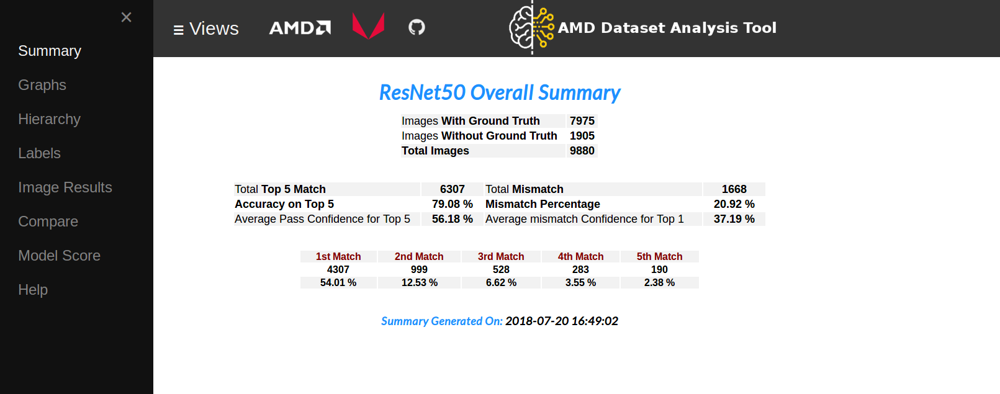
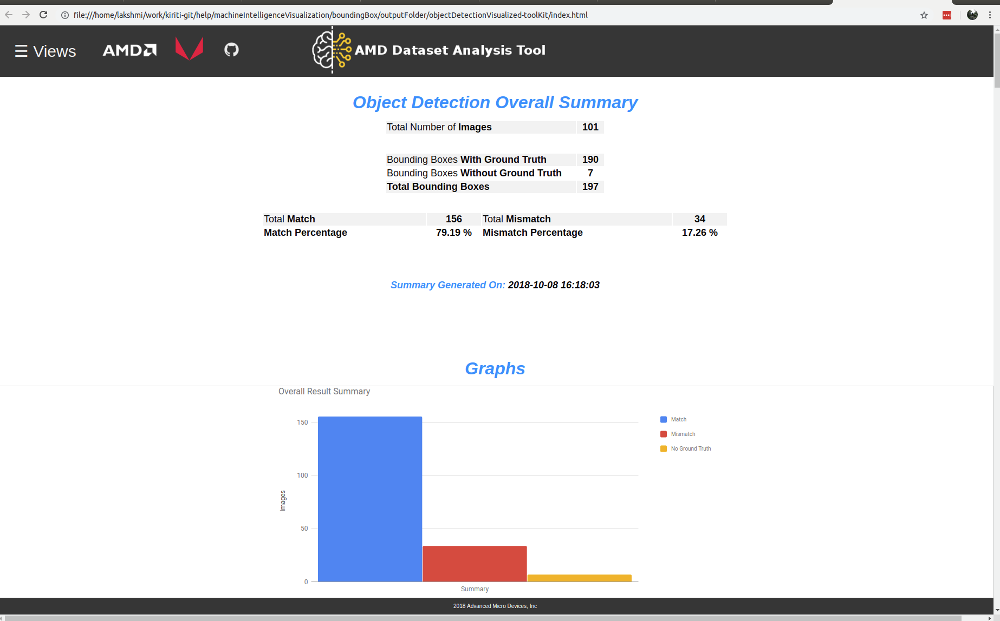

# MIVisionX Toolkit

AMD MIVisionX Toolkit, is a comprehensive set of help tools for neural net creation, development, training and deployment. The Toolkit provides you with help tools to design, develop, quantize, prune, retrain, and infer your neural network work in any framework. The Toolkit is designed to help you deploy your work to any AMD or 3rd party hardware, from embedded to servers.

MIVisionX provides you with tools for accomplishing your tasks throughout the whole neural net life-cycle, from creating a model to deploying them for your target platforms.

## Analysis & Visualization

The toolset is available for both [classification](analysis_and_visualization/classification#mivisionx---classification-visualization) and [detetction](analysis_and_visualization/bounding_box#mivisionx---object-detection-visualization). Features such as hierarchy, label , image summary etc can be viewed using this toolset.

