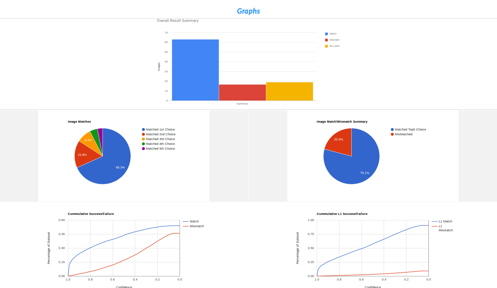

[](https://opensource.org/licenses/MIT)

# ADAT - Image Classification Visualization

## Usage

### ADAT - Visualization Tool Generation Script Usage

### Script Help 

``` 
python generate-visualization.py -h
```

### Script Inputs:

``` 
usage: generate-visualization.py  [-h/--help] 
                                  --inference_results INFERENCE_RESULTS
                                  --label LABEL
                                  [--image_dir IMAGE_DIR ]
                                  [--hierarchy HIERARCHY]
                                  [--model_name MODEL_NAME] 
                                  --output_dir OUTPUT_DIR 
                                  --output_name OUTPUT_NAME
```

#### Input Help

``` 
 -h, --help           show this help message and exit
 --inference_results  input inference results CSV file [required] (File Format:ImgFileName, GroundTruth, L1, L2, L3, L4, L5, P1, P2, P3, P4, P5)
 --label              input labels text file [required]
 --image_dir          input image directory used in inference [optional]
 --hierarchy          input AMD proprietary hierarchical file [optional]
 --model_name         input inferece model name [optional]
 --output_dir         output dir to store ADAT results [required]
 --output_name        output ADAT file name [required]
```

* --inference_results : **Result CSV File** 

| Image File Name | Ground Truth Label | Output Label 1 | Output Label 2 | Output Label 3 | Output Label 4 | Output Label 5 | Prob 1 | Prob 2 | Prob 3 | Prob 4 | Prob 5 |
| --------------- | ------------------ | -------------- | -------------- | -------------- | -------------- | -------------- | ------ | ------ | ------ | ------ | ------ |

**NOTE:** The  `"Image File Name"` field can have the full path of image and does not need `image_dir` argument to be specified. This also avoids the copying of images to the ADAT results directory.

If the images are to be copied to the local ADAT results directory, `image_dir` argument needs to be specified. 

## Sample 

``` 
python generate-visualization.py --inference_results sample/inceptionV4-results.csv --image_dir ../../data/images/AMD-tinyDataSet/ --label sample/labels.txt --hierarchy sample/hierarchy.csv --model_name inceptionV4 --output_dir outputFolder --output_name classificationVisualized 
```

## List of Features Available in this release

* Overall Summary
* Graphs
* Hierarchy
* Labels
* Image Results
* Compare
* Model Score
* Help

### Overall Summary

<p align="center"></p>

This section summarizes the results for the current session, with information on the dataset and the model. The section classifies the dataset into images with or without ground truth and only considers images with ground truth for analysis to avoid skewing the results.

The summary calculates all the metrics to evaluate the current run session, helps evaluate the quality of the data set, the accuracy of the current version of the model, and links all the high-level results to individual images to help the user quickly analyze and detect if there are any problems.

The summary also timestamps the results to avoid confusion with different iterations.

### Graphs

<p align="center"></p>

The graph section allows the user to visualize the dataset and model accurately. The graphs can help detect any anomalies with the data or the model from a higher level. The graphs can be saved or shared with others.

### Hierarchy

This section has AMD proprietary hierarchical result analysis. Please contact us to get more information.

### Labels

The label section is the summary of all the classes the model has been trained to detect. The Label Summary presents the highlights of all the classes of images available in the database. The summary reports if the classes are found or not found.

Click on any of the label description and zoom into all the images from that class in the database.

### Image Results

The Image results have all the low-level information about each of the individual images in the database. It reports on the results obtained for the image in the session and allows a quick view of the image.

### Compare

This section compares the results of a database or the model between different sessions. If the database was tested with different models, this section reports and compares results among them.

### Model Score 

The section does an experimental scoring for the given model.
