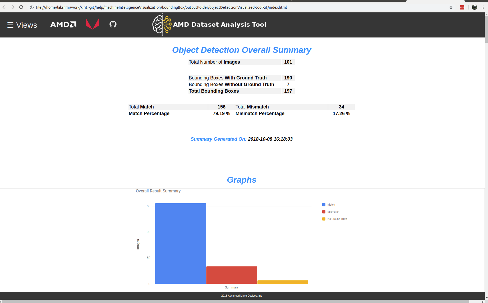
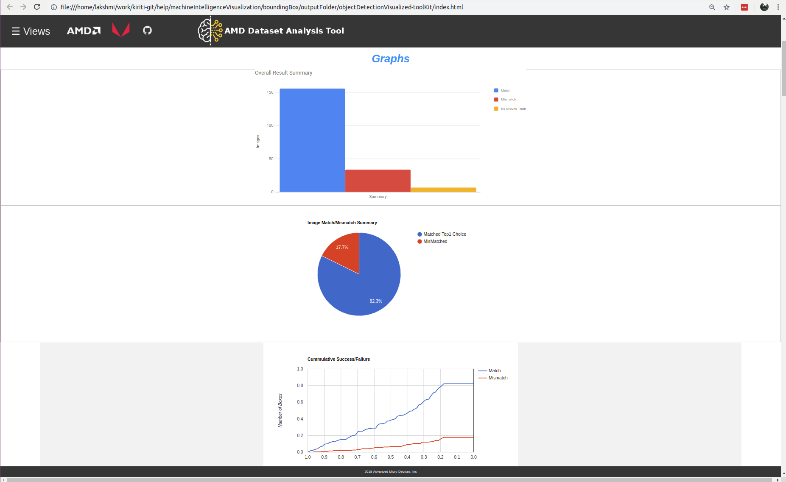

[](https://opensource.org/licenses/MIT)

# ADAT - Object Detection Visualization

## Usage
### ADAT - Visualization Tool Generation Script
````
python generate-visualization.py
````
### Script Inputs:
````
-i [input Result CSV File - required](File Format:ImgFileName, L,R,L,R,L,R,L,R)[L:Label R:Result]\n'\
-d [input Image Directory - required]\n'\
-o [output Directory - required]\n'\
-l [input Label File      - required]\n'\
-f [output file name - required]\n'\
-g [ground truth File - required]\n'\
-t [bounding box tool output file - required]\n')
````
* -i : **Result CSV File**

| Image File Name | Label | Result | Label | Result | Label | Result | Label | Result | Label | Result |
| -- | -- | -- | -- | -- | -- | -- | -- | -- | -- | -- |

* -d    : **Input Image Directory**
* -o    : **Output Directory**
* -l    : **Input Label File**
* -f    : **Output File Name**
* -g    : **Input Ground Truth File**
* -g    : **Input Bounding Box Tool Truth File**

## Sample 

````
python generate-visualization.py -i sample/boundingBoxCompare-results.csv -d ../../data/images/AMD-dataSet-416X416/ -o outputFolder/ -l sample/labels.csv -f objectDetectionVisualized -g sample/groundTruthFile.csv -t boundingBoxToolFile.csv

````

## List of Features Available in this release

* Overall Summary
* Graphsgraph
* Labels
* Image Results
* Compare
* Model Score
* Help

### Overall Summary



This section summarizes the results for the current session, with information on the dataset and the model. The section classifies the dataset into images with or without ground truth and only considers the images with ground truth for analysis to avoid skewing the results.

The summary calculates all the metrics to evaluate the current run session, helps evaluate the quality of the data set, accuracy of the current version of the model and links all the high level result to individual images to help the user to quickly analyze and detect if there are any problems.

The summary also timestamps the results to avoid confusion with different iterations.

### Graphs



The graph section allows the user to visualize the dataset and model accurately. The graphs can help detect any anomalies with the data or the model from a higher level. The graphs can be saved or shared with others.

### Labels

Label section is the summary of all the classes the model has been trained to detect. The Label Summary presents the highlights of all the classes of images available in the database. The summary reports if the classes are found or not found.

Click on any of the label description and zoom into all the images from that class in the database.

### Image Results

The Image results has all the low level information about each of the individual images in the database. It reports on the results obtained for the image in the session and allows quick view of the image.

### Compare

This section compares the results of a database or the model between different sessions. If the database was tested with different models, this section reports and compares results among them.

### Model Score 

The section does an experimental scoring for the given model.
