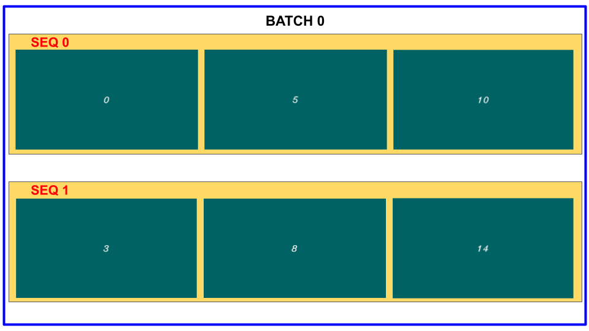
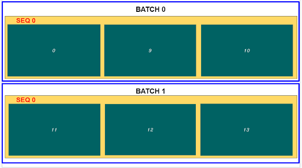
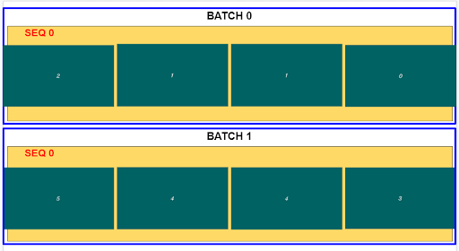

# rocAL Video Unit Tests
This application can be used to verify the functionality of the video API offered by rocAL.

## Build Instructions

### Pre-requisites
* Ubuntu Linux, version - `18.04` / `20.04`
* rocAL library (Part of the MIVisionX toolkit)
* [OpenCV 4.6.0](https://github.com/opencv/opencv/releases/tag/4.6.0)
* [FFmpeg n4.4.2](https://github.com/FFmpeg/FFmpeg/releases/tag/n4.4.2)
* Radeon Performance Primitives (RPP)

### Running the application
Executing the below command will build and run the application for the specified test case.

````
./testScript.sh <path_to_video/path_to_directory/path_to_text_file> <test-case>
````

The arguments passed to the Video Pipeline can be modified in the bash script [testScript.sh](./testScript.sh).

The outputs will be dumped inside the build/output_frames folder.

The sample video files and folder are available in the In the following path : [video and sequence samples](https://github.com/GPUOpen-ProfessionalCompute-Libraries/MIVisionX-data/tree/main/rocal_data/video_and_sequence_samples).

The data samples can be downloaded from the MIVisionX-data repository.

```
git clone https://github.com/GPUOpen-ProfessionalCompute-Libraries/MIVisionX-data.git
```

## Description

### Test Cases

The following test cases are supported in this unittest:
1. Video Reader - Reads the video file/folder and returns a sequence of frames.
2. Video Reader Resize (reader followed by resize augmentation)  - Reads the video file/folder and returns a sequence of re-sized frames.
3. Sequence Reader - Reads the folder of images and returns a sequence of images.

### Arguments used in test script

INPUT_PATH : Input passed by the user. It can be a video file path, folder path containing videos or a text file.

  NOTE:

  * Inputs for cases 1 and 2 - Video file / folder containing videos
  * Input for case 3 - Folder containing sequence of images [sample folder](https://github.com/GPUOpen-ProfessionalCompute-Libraries/MIVisionX-data/tree/main/rocal_data/video_and_sequence_samples/sequence)

READER_CASE : Value passed can be 1/2/3 depending upon the selected reader (default value : 1).

SAVE_FRAMES : Saves the output frames or avi files in the build/output_frames folder.

DEVICE : CPU:0/GPU:1 device is supported.

HARDWARE_DECODE_MODE : Uses Hardware decoder if set to true. 

SHUFFLE : Shuffles the sequences if set to true.

BATCH SIZE : Number of sequences in a batch.

SEQUENCE LENGTH : Number of frames in a sequence.

STEP : The frame interval between sequences.

STRIDE : The frame interval between frames within a sequence.

RESIZE_WIDTH : Resize width value.

RESIZE_HEIGHT : Resize height value.

FILELIST_FRAMENUM : If set to true the inputs from text file will be considered as frame numbers otherwise they will be considered as timestamps.

ENABLE_METADATA : If set to true, prints the labels and names of the associated frames in the sequence.

ENABLE_FRAME_NUMBER : If set to true, prints the starting frame number of the sequences.

ENABLE_TIMESTAMPS : If set to true, prints the timestamp of each frame in the sequences.

ENABLE_SEQUENCE_REARRANGE : If set to true, the frames in each sequence will be rearranged in the order specified by the user. The order should contain values in the range of [0, sequence_length)

## Test case examples

**Example 1: Video Reader**

> ./testScript.sh <[path/to/test_frame_num.mp4](https://github.com/GPUOpen-ProfessionalCompute-Libraries/MIVisionX-data/blob/main/rocal_data/video_and_sequence_samples/test_frame/test_frame_num.mp4)> 1

Arguments to be modified in testScript.sh to get the following output:

- BATCH_SIZE=2
- SEQUENCE_LENGTH= 3
- STEP=3
- STRIDE=5



To test with VideoReaderResize pass reader_case as 2:
> ./testScript.sh <path_to_video_file/folder> 2

Also RESIZE_WIDTH and RESIZE_HEIGHT can be changed in testScript.sh

<br>

**Example 2: Sequence Reader**

> ./testScript.sh <[path/to/sequence_folder](https://github.com/GPUOpen-ProfessionalCompute-Libraries/MIVisionX-data/tree/main/rocal_data/video_and_sequence_samples/sequence)> 3 



NOTE :

The input to the sequence reader should be a directory of images.

The output of Sequence Reader may be different from the Video Reader because the names of the images from the input directory are sorted in lexicographic order and then split into sequences.

<br>

**Example 3: Sequence Rearrange**

> ./testScript.sh <path/to/test_frame_num.mp4> 1

Arguments to be modified in testScript.sh to enable sequence rearrange:

ENABLE_SEQUENCE_REARRANGE=1



New Sequence order : (2, 1, 1, 0), The order can be changed directly in rocAL_video_unittests.cpp file. The values specified in the order can only be in the range [0,sequence_length)

**NOTE**:

The outputs frames will be dumped inside the build/output_frames folder. The above images are for illustration purpose only.
